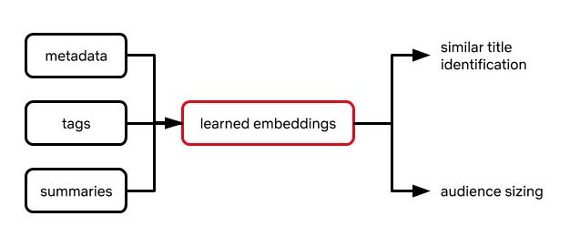
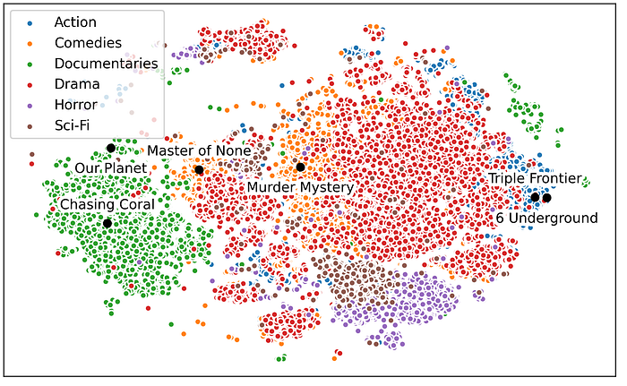
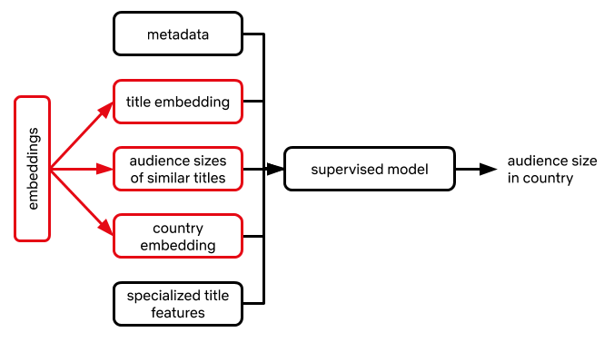
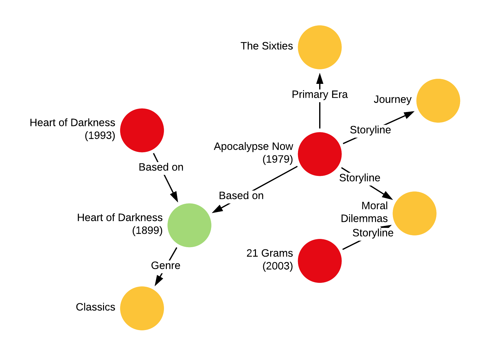
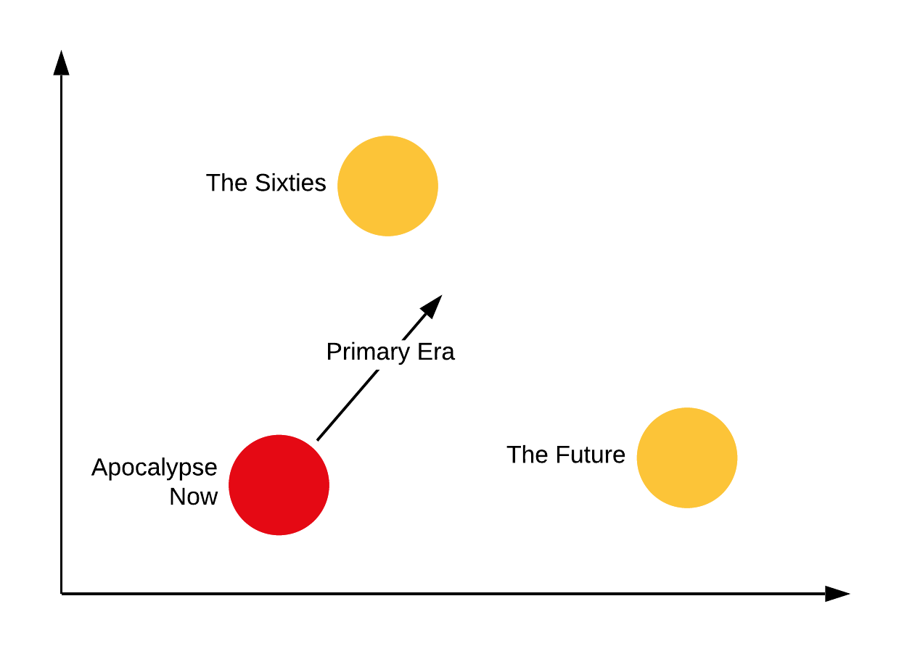

# Supporting content decision makers with machine learning

by [Melody Dye](https://www.linkedin.com/in/melodydye/)*, [Chaitanya Ekanadham](https://www.linkedin.com/in/chaitue/)*, [Avneesh Saluja](https://www.linkedin.com/in/avneesh/)*, [Ashish Rastogi](https://www.linkedin.com/in/ashish-rastogi-11362a/)  
* contributed equally

Netflix is pioneering content creation at an unprecedented scale. Our catalog of thousands of films and series caters to 195M+ members in over 190 countries who span a broad and diverse range of tastes. Content, marketing, and studio production executives make the key decisions that aspire to maximize each series’ or film’s potential to bring joy to our subscribers as it progresses from pitch to play on our service. Our job is to support them.

The commissioning of a series or film, which we refer to as a _title_, is a creative decision. Executives consider many factors including narrative quality, relation to the current societal context or zeitgeist, creative talent relationships, and audience composition and size, to name a few. The stakes are high (content is expensive!) as is the uncertainty of the outcome (it is difficult to predict which shows or films will become hits). To mitigate this uncertainty, executives throughout the entertainment industry have always consulted historical data to help characterize the potential audience of a title using comparable titles, if they exist. Two key questions in this endeavor are:

- Which existing titles are comparable and in what ways?
- What audience size can we expect and in which regions?

The increasing vastness and diversity of what our members are watching make answering these questions particularly challenging using conventional methods, which draw on a limited set of comparable titles and their respective performance metrics (e.g., box office, Nielsen ratings). This challenge is also an opportunity. In this post we explore how machine learning and statistical modeling can aid creative decision makers in tackling these questions at a global scale. The key advantage of these techniques is twofold. First, they draw on a much wider range of historical titles (spanning global as well as niche audiences). Second, they leverage each historical title more effectively by isolating the components (e.g., thematic elements) that are relevant for the title in question.

**Our approach is rooted in ****[transfer learning](https://ruder.io/transfer-learning/)****, whereby performance on a ****_target task_**** is improved by leveraging model parameters learned on a separate but related ****_source task_**. We define a set of source tasks that are loosely related to the target tasks represented by the two questions above. For each source task, we learn a model on a _large _set of historical titles, leveraging information such as title metadata (e.g., genre, runtime, series or film) as well as tags or text summaries curated by [domain experts](https://www.linkedin.com/pulse/how-editorial-creative-sparks-joy-discovery-netflix-members-mcilwain/) describing thematic/plot elements. Once we learn this model, we extract model parameters constituting a numerical representation or _embedding_ of the title. These embeddings are then used as inputs to downstream models specialized on the target tasks for a _smaller_ set of titles directly relevant for content decisions (Figure 1). All models were developed and deployed using [metaflow](https://metaflow.org/), Netflix’s open source framework for bringing models into production.

To assess the usefulness of these embeddings, we look at two indicators: 1) Do they improve the performance on the target task via downstream models? And just as importantly, 2) Are they useful to our creative partners, i.e. do they lend insight or facilitate apt comparisons (e.g., revealing that a pair of titles attracts similar audiences, or that a pair of countries have similar viewing behavior)? These considerations are key in informing subsequent lines of research and innovation.

*Figure 1: Similar title identification and audience sizing can be supported by a common learned title embedding.*

## Similar titles

In entertainment, it is common to contextualize a new project in terms of existing titles. For example, a creative executive developing a title might wonder: Does this teen movie have more of the wholesome, romantic vibe of _To All the Boys I’ve Loved Before_ or more of the dark comedic bent of _The End of the F***ing World_? Similarly, a marketing executive refining her “elevator pitch” might summarize a title with: “The existential angst of _Eternal Sunshine of the Spotless Mind_ meets the surrealist flourishes of _The One I Love_.”

To make these types of comparisons even richer we “embed” titles in a high-dimensional space or “similarity map,” wherein more similar titles appear closer together with respect to a spatial distance metric such as Euclidean distance. We can then use this similarity map to identify clusters of titles that share common elements (Figure 2), as well as surface candidate similar titles for an unlaunched title.

Notably, there is no “ground truth” about what is similar: embeddings optimized on different source tasks will yield different similarity maps. For example, if we derive our embeddings from a model that classifies genre, the resulting map will minimize the distance between titles that are thematically similar (Figure 2). By contrast, embeddings derived from a model that predicts audience size will align titles with similar performance characteristics. By offering multiple views into how a given title is situated within the broader content universe, these similarity maps offer a valuable tool for ideation and exploration for our creative decision makers.

*Figure 2: T-SNE visualization of embeddings learned from content categorization task.*

## Transfer learning for audience sizing

Another crucial input for content decision makers is an estimate of how large the potential audience will be (and ideally, how that audience breaks down geographically). For example, knowing that a title will likely drive a primary audience in Spain along with sizable audiences in Mexico, Brazil, and Argentina would aid in deciding how best to promote it and what [localized assets](https://netflixtechblog.com/studio-production-data-science-646ee2cc21a1) (subtitles, dubbings) to create ahead of time.

Predicting the potential audience size of a title is a complex problem in its own right, and we leave a more detailed treatment for the future. Here, we simply highlight how embeddings can be leveraged to help tackle this problem. We can include any combination of the following as features in a supervised modeling framework that predicts audience size in a given country:

- Embedding of a title
- Embedding of a country we’d like to predict audience size in
- Audience sizes of past titles with similar embeddings (or some aggregation of them)

*Figure 3: How we can use transfer-learned embeddings to help with demand prediction.*

As an example, if we are trying to predict the audience size of a dark comedic title in Brazil, we can leverage the aforementioned similarity maps to identify similar dark comedies with an observed audience size in Brazil. We can then include these observed audience sizes (or some weighted average based on similarity) as features. These features are interpretable (they are associated with known titles and one can reason/debate about whether those titles’ performances should factor into the prediction) and significantly improve prediction accuracy.

## Learning embeddings

How do we produce these embeddings? The first step is to identify source tasks that will produce useful embeddings for downstream model consumption. Here we discuss two types of tasks: supervised and self-supervised.

### Supervised

A major motivation for transfer learning is to “pre-train” model parameters by first learning them on a related source task for which we have more training data. Inspecting the data we have on hand, we find that for any title on our service with sufficient viewing data, we can (1) categorize the title based on who watched it (a.k.a. “content category”) and (2) observe how many subscribers watched it in each country (“audience size”). From this title-level information, we devise the following supervised learning tasks:

- {metadata, tags, summaries} → content category
- {metadata, tags, summaries, country} → audience size in country

When implementing specific solutions to these tasks, two important modeling decisions we need to make are selecting a) a suitable method (“**encoder**”) for converting title-level features (metadata, tags, summaries) into an amenable representation for a predictive model and b) a model (“**predictor**”) that predicts labels (content category, audience size) given an encoded title. Since our goal is to learn somewhat general-purpose embeddings that can plug into multiple use cases, we generally prefer parameter-rich models for the encoder and simpler models for the predictor.

Our choice of encoder (Figure 4) depends on the type of input. For text-based summaries, we leverage pre-trained models like [BERT](https://arxiv.org/abs/1810.04805) to provide context-dependent word embeddings that are then run through a recurrent neural network style architecture, such as a bidirectional [LSTM](https://dl.acm.org/doi/10.1162/neco.1997.9.8.1735) or [GRU](https://arxiv.org/abs/1409.0473). For tags, we directly learn tag representations by considering each title as a tag collection, or a “bag-of-tags”. For audience size models where predictions are country-specific, we also directly learn country embeddings and concatenate the resulting embedding to the tag or summary-based representation. Essentially, conversion of each tag and country to its resulting embedding is done via a lookup table.

Likewise, the predictor depends on the task. For category prediction, we train a linear model on top of the encoder representation, apply a softmax operation, and minimize the negative log likelihood. For audience size prediction, we use a single hidden-layer feedforward neural network to minimize the mean squared error for a given title-country pair. Both the encoder and predictor models are optimized via backpropagation, and the representation produced by the optimized encoder is used in downstream models.

*Figure 4: encoder architectures to handle various kinds of title-related inputs. For text summaries, we first convert each word to its context-dependent representation via BERT or a related model, followed by a biGRU to convert the sequence of embeddings to a single (final-state) representation. For tags, we compute the average tag representation (since each title is associated with multiple tags).*

### Self-supervised

[Knowledge graphs](https://arxiv.org/abs/2003.02320) are abstract graph-based data structures which encode relations (edges) between entities (nodes). Each edge in the graph, i.e. head-relation-tail triple, is known as a fact, and in this way a set of facts (i.e. “knowledge”) results in a graph. However, the real power of the graph is the information contained in the relational structure.

At Netflix, we apply this concept to the knowledge contained in the content universe. Consider a simplified graph whose nodes consist of three entity types: {titles, books, metadata tags} and whose edges encode relationships between them (e.g., “_Apocalypse Now_ is based on _Heart of Darkness_” ; “_21 Grams_ has a storyline around moral dilemmas”) as illustrated in Figure 5. These facts can be represented as triples **(h, r, t)**, e.g. (Apocalypse Now, based_on, Heart of Darkness), (21 Grams, storyline, moral dilemmas). Next, we can craft a self-supervised learning task where we randomly select edges in the graph to form a test set, and condition on the rest of the graph to predict these missing edges. This task, also known as link prediction, allows us to learn embeddings for **all **entities in the graph. There are a number of approaches to extract embeddings and our current approach is based on the TransE algorithm. TransE learns an embedding **F** that minimizes the average Euclidean distance between **(F(h) + F(r))** and **F(t)**.

*Figure 5: Left: Illustration of a graph relating titles, books, and thematic elements to each other. Right: Illustration of translational embeddings in which the sum of the head and relation embeddings approximates the tail embedding.*

The self-supervision is crucial since it allows us to train on titles both on and off our service, expanding the training set considerably and unlocking more gains from transfer learning. The resulting embeddings can then be used in the aforementioned similarity models and audience sizing models models.

## Epilogue

Making great content is hard. It involves many different factors and requires considerable investment, all for an outcome that is very difficult to predict. The success of our titles is ultimately determined by our members, and we must do our best to serve their needs given the tools and data we have. We identified two ways to support content decision makers: surfacing similar titles and predicting audience size, drawing from various areas such as transfer learning, embedding representations, natural language processing, and supervised learning. Surfacing these types of insights in a scalable manner is becoming ever more crucial as both our subscriber base and catalog grow and become increasingly diverse. If you’d like to be a part of this effort, please [contact us](mailto:cdm-blog@netflix.com)!.

---
**Tags:** Machine Learning · Data Science · Netflix · Film · TV Series
