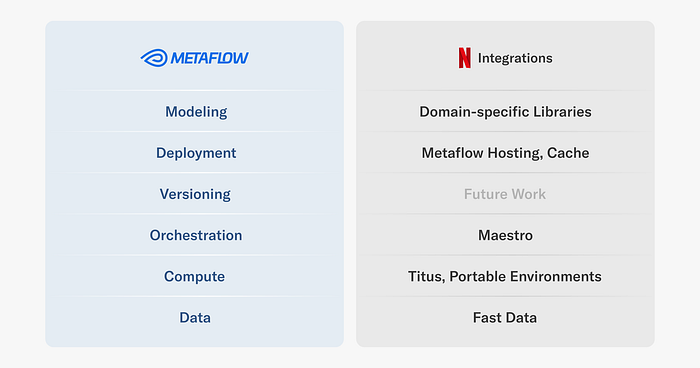
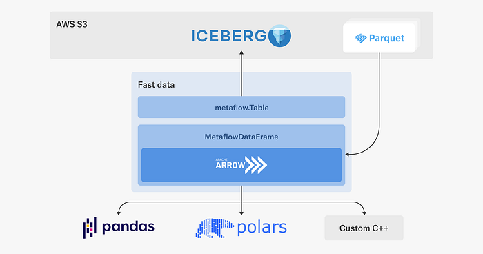
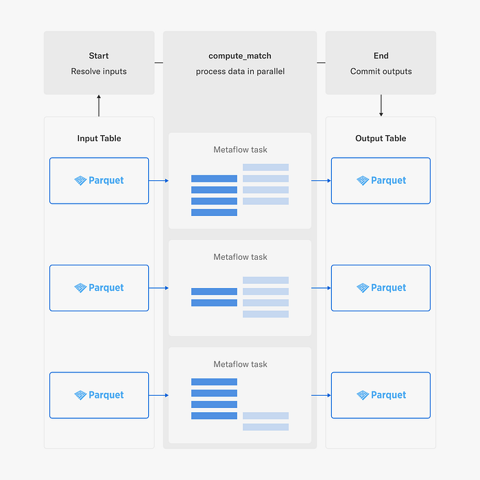
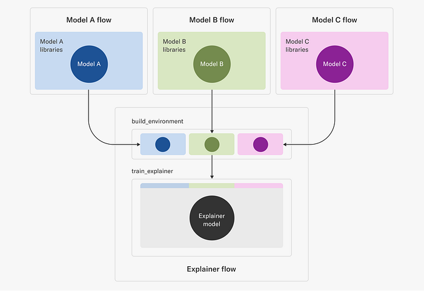
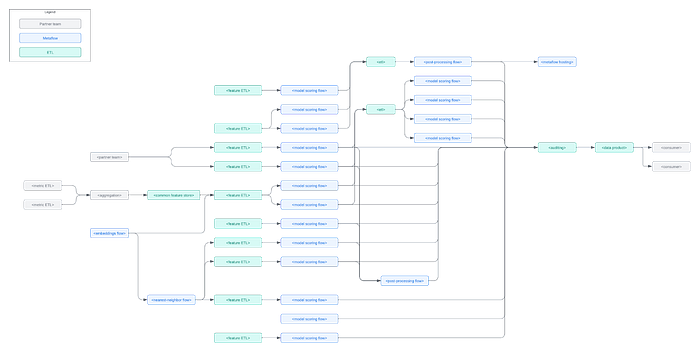
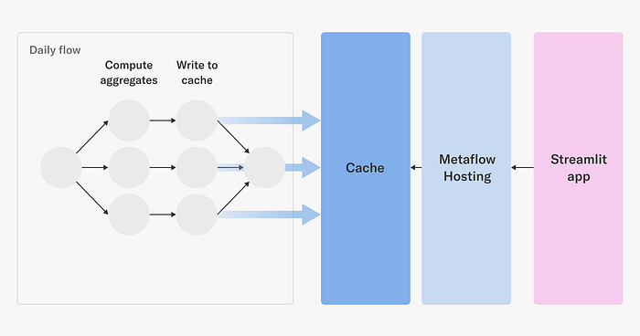
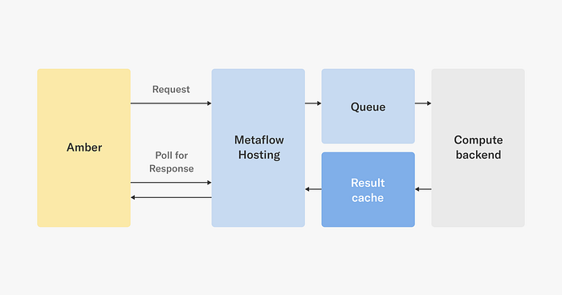

# Supporting Diverse ML Systems at Netflix

[_David J. Berg_](https://www.linkedin.com/in/david-j-berg/)_, _[_Romain Cledat_](https://www.linkedin.com/in/romain-cledat-4a211a5/)_, _[_Kayla Seeley_](https://www.linkedin.com/in/seeleykayla/)_, _[_Shashank Srikanth_](https://www.linkedin.com/in/shashanksrikanth/)_, _[_Chaoying Wang_](https://www.linkedin.com/in/chaoying-wang/)_, _[_Darin Yu_](https://www.linkedin.com/in/zitingyu/)

Netflix uses data science and machine learning across all facets of the company, powering a wide range of business applications from [our internal infrastructure](./evolving-from-rule-based-classifier-machine-learning-powered-auto-remediation-in-netflix-data-039d5efd115b.md) and [content demand modeling](./supporting-content-decision-makers-with-machine-learning-995b7b76006f.md) to [media understanding](./scaling-media-machine-learning-at-netflix-f19b400243.md). The Machine Learning Platform (MLP) team at Netflix provides an entire ecosystem of tools around [Metaflow](https://metaflow.org/), an open source machine learning infrastructure framework we started, to empower data scientists and machine learning practitioners to build and manage a variety of ML systems.

[Since its inception](./open-sourcing-metaflow-a-human-centric-framework-for-data-science-fa72e04a5d9.md), Metaflow has been designed to provide a human-friendly API for building data and ML (and today AI) applications and deploying them in our production infrastructure frictionlessly. While human-friendly APIs are delightful, it is really the integrations to our production systems that give Metaflow its superpowers. Without these integrations, projects would be stuck at the prototyping stage, or they would have to be maintained as outliers outside the systems maintained by our engineering teams, incurring unsustainable operational overhead.

Given the very diverse set of ML and AI use cases we support — today we have hundreds of Metaflow projects deployed internally — we don’t expect all projects to follow the same path from prototype to production. Instead, we provide a robust foundational layer with integrations to our company-wide data, compute, and orchestration platform, as well as various paths to deploy applications to production smoothly. On top of this, teams have built their own domain-specific libraries to support their specific use cases and needs.

In this article, we cover a few key integrations that we provide for various layers of the Metaflow stack at Netflix, as illustrated above. We will also showcase real-life ML projects that rely on them, to give an idea of the breadth of projects we support. Note that all projects leverage multiple integrations, but we highlight them in the context of the integration that they use most prominently. Importantly, all the use cases were engineered by practitioners themselves.

These integrations are implemented through [Metaflow’s extension mechanism](https://github.com/Netflix/metaflow-extensions-template) which is publicly available but subject to change, and hence not a part of Metaflow’s stable API yet. If you are curious about implementing your own extensions, get in touch with us on [the Metaflow community Slack](http://chat.metaflow.org/).

Let’s go over the stack layer by layer, starting with the most foundational integrations.

## Data: Fast Data

Our main data lake is [hosted on S3, organized as Apache Iceberg tables](https://www.youtube.com/watch?v=jMFMEk8jFu8). For ETL and other heavy lifting of data, we mainly rely on Apache Spark. In addition to Spark, we want to support last-mile data processing in Python, addressing use cases such as feature transformations, batch inference, and training. Occasionally, these use cases involve terabytes of data, so we have to pay attention to performance.

To enable fast, scalable, and robust access to the Netflix data warehouse, we have developed a _Fast Data_ library for Metaflow, which leverages high-performance components from the Python data ecosystem:

As depicted in the diagram, the Fast Data library consists of two main interfaces:

- The `Table` object is responsible for interacting with the Netflix data warehouse which includes parsing Iceberg (or legacy Hive) table metadata, resolving partitions and **Parquet files** for reading. Recently, we added support for the write path, so tables can be updated as well using the library.
- Once we have discovered the Parquet files to be processed, `MetaflowDataFrame` takes over: it downloads data using Metaflow’s high-throughput S3 client directly to the process’ memory, which [often outperforms reading of local files](https://outerbounds.com/blog/metaflow-fast-data/).

We use [Apache Arrow](https://arrow.apache.org/) to decode Parquet and to host an in-memory representation of data. The user can choose the most suitable tool for manipulating data, such as [Pandas](https://pandas.pydata.org/) or [Polars](https://pola.rs/) to use a dataframe API, or one of our internal C++ libraries for various high-performance operations. Thanks to Arrow, data can be accessed through these libraries in a zero-copy fashion.

We also pay attention to dependency issues: (Py)Arrow is a dependency of many ML and data libraries, so we don’t want our custom C++ extensions to depend on a specific version of Arrow, which could easily lead to unresolvable dependency graphs. Instead, in the style of [nanoarrow](https://github.com/apache/arrow-nanoarrow), our Fast Data library only relies on [the stable Arrow C data interface](https://arrow.apache.org/docs/format/CDataInterface.html), producing a hermetically sealed library with no external dependencies.

### Example use case: Content Knowledge Graph

Our knowledge graph of the entertainment world encodes relationships between titles, actors and other attributes of a film or series, supporting all aspects of business at Netflix.

A key challenge in creating a knowledge graph is entity resolution. There may be many different representations of slightly different or conflicting information about a title which must be resolved. This is typically done through a pairwise matching procedure for each entity which becomes non-trivial to do at scale.

This project leverages Fast Data and horizontal scaling with [Metaflow’s foreach construct](https://docs.metaflow.org/v/r/metaflow/basics#foreach) to load large amounts of title information — approximately a billion pairs — stored in the Netflix Data Warehouse, so the pairs can be matched in parallel across many Metaflow tasks.

We use `metaflow.Table` to resolve all input shards which are distributed to Metaflow tasks which are responsible for processing terabytes of data collectively. Each task loads the data using `metaflow.MetaflowDataFrame`, performs matching using Pandas, and populates a corresponding shard in an output Table. Finally, when all matching is done and data is written the new table is committed so it can be read by other jobs.

## Compute: Titus

Whereas open-source users of Metaflow rely on [AWS Batch or Kubernetes as the compute backend](https://docs.metaflow.org/scaling/remote-tasks/introduction), we rely on [our centralized compute-platform, Titus](https://netflixtechblog.com/titus-the-netflix-container-management-platform-is-now-open-source-f868c9fb5436). Under the hood, Titus is [powered by Kubernetes](https://www.slideshare.net/aspyker/herding-kats-netflixs-journey-to-kubernetes-public), but it provides a thick layer of enhancements over off-the-shelf Kubernetes, to [make it more observable](./kubernetes-and-kernel-panics-ed620b9c6225.md), [secure](./evolving-container-security-with-linux-user-namespaces-afbe3308c082.md), [scalable](https://netflixtechblog.com/auto-scaling-production-services-on-titus-1f3cd49f5cd7), and [cost-efficient](./predictive-cpu-isolation-of-containers-at-netflix-91f014d856c7.md).

By targeting `@titus`, Metaflow tasks benefit from these battle-hardened features out of the box, with no in-depth technical knowledge or engineering required from the ML engineers or data scientist end. However, in order to benefit from scalable compute, we need to help the developer to package and rehydrate the whole execution environment of a project in a remote pod in a reproducible manner (preferably quickly). Specifically, we don’t want to ask developers to manage Docker images of their own manually, which quickly results in more problems than it solves.

This is why [Metaflow provides support for dependency management](https://docs.metaflow.org/scaling/dependencies) out of the box. Originally, we supported only `@conda`, but based on our work on [Portable Execution Environments](https://github.com/Netflix/metaflow-nflx-extensions), open-source [Metaflow gained support for ](https://outerbounds.com/blog/pypi-announcement/)`[@pypi](https://outerbounds.com/blog/pypi-announcement/)` a few months ago as well.

### Example use case: Building model explainers

Here’s a fascinating example of the usefulness of portable execution environments. For many of our applications, model explainability matters. Stakeholders like to understand why models produce a certain output and why their behavior changes over time.

There are several ways to provide explainability to models but one way is to train an explainer model based on each trained model. Without going into the details of how this is done exactly, suffice to say that Netflix trains a lot of models, so we need to train a lot of explainers too.

Thanks to Metaflow, we can allow each application to choose the best modeling approach for their use cases. Correspondingly, each application brings its own bespoke set of dependencies. Training an explainer model therefore requires:

1. Access to the original model and its training environment, and
2. Dependencies specific to building the explainer model.

This poses an interesting challenge in dependency management: we need a higher-order training system, “Explainer flow” in the figure below, which is able to take a full execution environment of another training system as an input and produce a model based on it.

Explainer flow is event-triggered by an upstream flow, such Model A, B, C flows in the illustration. The `build_environment` step uses the `metaflow environment` command provided by [our portable environments](https://github.com/Netflix/metaflow-nflx-extensions), to build an environment that includes both the requirements of the input model as well as those needed to build the explainer model itself.

The built environment is given a unique name that depends on the run identifier (to provide uniqueness) as well as the model type. Given this environment, the `train_explainer` step is then able to refer to this uniquely named environment and operate in an environment that can both access the input model as well as train the explainer model. Note that, unlike in typical flows using vanilla `@conda` or `@pypi`, the portable environments extension allows users to also fetch those environments directly at execution time as opposed to at deploy time which therefore allows users to, as in this case, resolve the environment right before using it in the next step.

## Orchestration: Maestro

If data is the fuel of ML and the compute layer is the muscle, then the nerves must be the orchestration layer. We have talked about the importance of a production-grade workflow orchestrator in the context of Metaflow when [we released support for AWS Step Functions](./unbundling-data-science-workflows-with-metaflow-and-aws-step-functions-d454780c6280.md) years ago. Since then, open-source Metaflow has gained support for [Argo Workflows](https://outerbounds.com/blog/human-centric-data-science-on-kubernetes-with-metaflow/), a Kubernetes-native orchestrator, as well as [support for Airflow](https://outerbounds.com/blog/better-airflow-with-metaflow/) which is still widely used by data engineering teams.

Internally, we use [a production workflow orchestrator called Maestro](./orchestrating-data-ml-workflows-at-scale-with-netflix-maestro-aaa2b41b800c.md). The Maestro post shares details about how the system supports scalability, high-availability, and usability, which provide the backbone for all of our Metaflow projects in production.

A hugely important detail that often goes overlooked is [event-triggering](https://docs.metaflow.org/production/event-triggering): it allows a team to integrate their Metaflow flows to surrounding systems upstream (e.g. ETL workflows), as well as downstream (e.g. flows managed by other teams), using a protocol shared by the whole organization, as exemplified by the example use case below.

### Example use case: Content decision making

One of the most business-critical systems running on Metaflow [supports our content decision making](./supporting-content-decision-makers-with-machine-learning-995b7b76006f.md), that is, the question of what content Netflix should bring to the service. We support a massive scale of over 260M subscribers spanning over 190 countries representing hugely diverse cultures and tastes, all of whom we want to delight with our content slate. Reflecting the breadth and depth of the challenge, the systems and models focusing on the question have grown to be very sophisticated.

We approach the question from multiple angles but we have a core set of data pipelines and models that provide a foundation for decision making. To illustrate the complexity of just the core components, consider this high-level diagram:

In this diagram, gray boxes represent integrations to partner teams downstream and upstream, green boxes are various ETL pipelines, and blue boxes are Metaflow flows. These boxes encapsulate hundreds of advanced models and intricate business logic, handling massive amounts of data daily.

Despite its complexity, the system is managed by a relatively small team of engineers and data scientists autonomously. This is made possible by a few key features of Metaflow:

- All the boxes are event-triggered, orchestrated by Maestro. Dependencies between Metaflow flows are triggered via `[@trigger_on_finish](https://docs.metaflow.org/production/event-triggering/flow-events)`, dependencies to external systems with `[@trigger](https://docs.metaflow.org/production/event-triggering/external-events)`.
- Rapid development is enabled via [Metaflow namespaces](https://docs.metaflow.org/scaling/tagging), so individual developers can develop without interfering with production deployments.
- [Branched development and deployment is managed via ](https://docs.metaflow.org/production/coordinating-larger-metaflow-projects)`[@project](https://docs.metaflow.org/production/coordinating-larger-metaflow-projects)`, which also [isolates events between different branches](https://docs.metaflow.org/production/event-triggering/project-events).

The team has also developed their own domain-specific libraries and configuration management tools, which help them improve and operate the system.

## Deployment: Cache

To produce business value, all our Metaflow projects are deployed to work with other production systems. In many cases, the integration might be via shared tables in our data warehouse. In other cases, it is more convenient to share the results via a low-latency API.

Notably, not all API-based deployments require real-time evaluation, which we cover in the section below. We have a number of business-critical applications where some or all predictions can be precomputed, guaranteeing the lowest possible latency and operationally simple high availability at the global scale.

We have developed an officially supported pattern to cover such use cases. While the system relies on our internal caching infrastructure, you could follow the same pattern using services like [Amazon ElasticCache](https://aws.amazon.com/elasticache/) or [DynamoDB](https://aws.amazon.com/dynamodb/).

### Example use case: Content performance visualization

The historical performance of titles is used by decision makers to understand and improve the film and series catalog. Performance metrics can be complex and are often best understood by humans with visualizations that break down the metrics across parameters of interest interactively. Content decision makers are equipped with self-serve visualizations through a real-time web application built with `metaflow.Cache`, which is accessed through an API provided with `metaflow.Hosting`.

A daily scheduled Metaflow job computes aggregate quantities of interest in parallel. The job writes a large volume of results to an online key-value store using `metaflow.Cache`. A [Streamlit](https://streamlit.io/) app houses the visualization software and data aggregation logic. Users can dynamically change parameters of the visualization application and in real-time a message is sent to a simple [Metaflow hosting service](./supporting-diverse-ml-systems-at-netflix-2d2e6b6d205d.md) which looks up values in the cache, performs computation, and returns the results as a JSON blob to the Streamlit application.

## Deployment: Metaflow Hosting

For deployments that require an API and real-time evaluation, we provide an integrated model hosting service, Metaflow Hosting. Although details have evolved a lot, [this old talk still gives a good overview of the service](https://www.youtube.com/watch?v=sBM5cSBGZS4).

Metaflow Hosting is specifically geared towards hosting artifacts or models produced in Metaflow. This provides an easy to use interface on top of Netflix’s existing microservice infrastructure, allowing data scientists to quickly move their work from experimentation to a production grade web service that can be consumed over a HTTP REST API with minimal overhead.

Its key benefits include:

- Simple decorator syntax to create RESTFull endpoints.
- The back-end auto-scales the number of instances used to back your service based on traffic.
- The back-end will scale-to-zero if no requests are made to it after a specified amount of time thereby saving cost particularly if your service requires GPUs to effectively produce a response.
- Request logging, alerts, monitoring and tracing hooks to Netflix infrastructure

Consider the service similar to managed model hosting services like [AWS Sagemaker Model Hosting](https://docs.aws.amazon.com/sagemaker/latest/dg/how-it-works-deployment.html), but tightly integrated with our microservice infrastructure.

### Example use case: Media

We have a long history of using machine learning to process media assets, for instance, to [personalize artwork](https://netflixtechblog.com/artwork-personalization-c589f074ad76) and to help our [creatives create promotional content](./new-series-creating-media-with-machine-learning-5067ac110bcd.md) efficiently. Processing large amounts of media assets is technically non-trivial and computationally expensive, so over the years, we have developed plenty of [specialized infrastructure](./rebuilding-netflix-video-processing-pipeline-with-microservices-4e5e6310e359.md) dedicated for this purpose in general, and [infrastructure supporting media ML use cases](./scaling-media-machine-learning-at-netflix-f19b400243.md) in particular.

To demonstrate the benefits of Metaflow Hosting that provides a general-purpose API layer supporting both synchronous and asynchronous queries, consider this use case involving[ Amber, our feature store for media](./scaling-media-machine-learning-at-netflix-f19b400243.md).

While Amber is a feature _store_, precomputing and storing all media features in advance would be infeasible. Instead, we compute and cache features in an on-demand basis, as depicted below:

When a service requests a feature from Amber, it computes the feature dependency graph and then sends one or more asynchronous requests to Metaflow Hosting, which places the requests in a queue, eventually triggering feature computations when compute resources become available. Metaflow Hosting caches the response, so Amber can fetch it after a while. We could have built a dedicated microservice just for this use case, but thanks to the flexibility of Metaflow Hosting, we were able to ship the feature faster with no additional operational burden.

## Future Work

Our appetite to apply ML in diverse use cases is only increasing, so our Metaflow platform will keep expanding its footprint correspondingly and continue to provide delightful integrations to systems built by other teams at Netlfix. For instance, we have plans to work on improvements in the versioning layer, which wasn’t covered by this article, by giving more options for artifact and model management.

We also plan on building more integrations with other systems that are being developed by sister teams at Netflix. As an example, Metaflow Hosting models are currently not well integrated into model logging facilities — we plan on working on improving this to make models developed with Metaflow more integrated with the feedback loop critical in training new models. We hope to do this in a pluggable manner that would allow other users to integrate with their own logging systems.

Additionally we want to supply more ways Metaflow artifacts and models can be integrated into non-Metaflow environments and applications, e.g. JVM based edge service, so that Python-based data scientists can contribute to non-Python engineering systems easily. This would allow us to better bridge the gap between the quick iteration that Metaflow provides (in Python) with the requirements and constraints imposed by the infrastructure serving Netflix member facing requests.

If you are building business-critical ML or AI systems in your organization, [join the Metaflow Slack community](http://chat.metaflow.org/)! We are happy to share experiences, answer any questions, and welcome you to contribute to Metaflow.

### Acknowledgements:

Thanks to Wenbing Bai, Jan Florjanczyk, Michael Li, Aliki Mavromoustaki, and Sejal Rai for help with use cases and figures. Thanks to our OSS contributors for making Metaflow a better product.

---
**Tags:** Machine Learning · Data Science · AI · Machine Learning Platform · Human Centric Design
