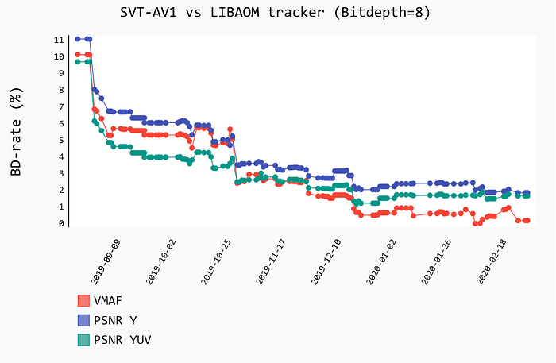
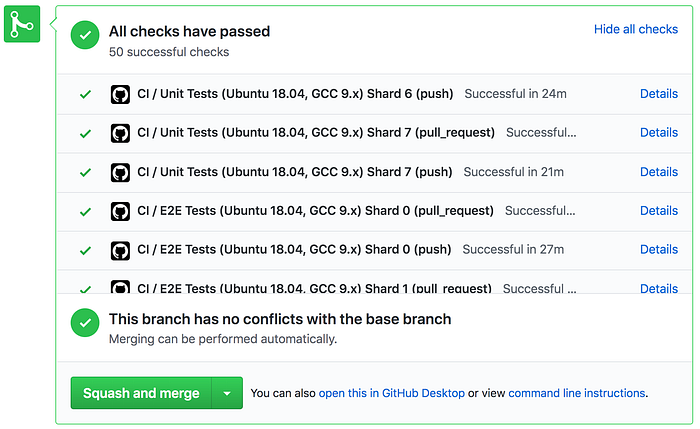

# SVT-AV1: open-source AV1 encoder and decoder

> by Andrey Norkin, Joel Sole, Mariana Afonso, Kyle Swanson, Agata Opalach, Anush Moorthy, Anne Aaron

SVT-AV1 is an open-source AV1 codec implementation hosted on GitHub [https://github.com/OpenVisualCloud/SVT-AV1/](https://github.com/OpenVisualCloud/SVT-AV1/) under a BSD + patent license. As mentioned in our earlier blog [post](./introducing-svt-av1-a-scalable-open-source-av1-framework-c726cce3103a.md), Intel and Netflix have been collaborating on the SVT-AV1 encoder and decoder framework since August 2018. The teams have been working closely on SVT-AV1 development, discussing architectural decisions, implementing new tools, and improving compression efficiency. Since open-sourcing the project, other partner companies and the open-source community have contributed to SVT-AV1. In this tech blog, we will report the current status of the SVT-AV1 project, as well as the characteristics and performance of the encoder and decoder.

## SVT-AV1 codebase status

The SVT-AV1 repository includes both an AV1 encoder and decoder, which share a significant amount of the code. The SVT-AV1 decoder is fully functional and compliant with the AV1 specification for all three profiles (Main, High, and Professional).

The SVT-AV1 encoder supports all AV1 tools which contribute to compression efficiency. Compared to the most recent master version of libaom (AV1 reference software), SVT-AV1 is similar in compression efficiency and at the same time achieves significantly lower encoding latency on multi-core platforms when using its inherent parallelization capabilities.

SVT-AV1 is written in C and can be compiled on major platforms, such as Windows, Linux, and macOS. In addition to the pure C function implementations, which allows for more flexible experimentation, the codec features extensive assembly and intrinsic optimizations for the x86 platform. See the next section for an outline of the main SVT-AV1 features that allow high performance at competitive compression efficiency. SVT-AV1 also includes extensive [documentation](https://github.com/OpenVisualCloud/SVT-AV1/tree/master/Docs) on the encoder design targeted to facilitate the onboarding process for new developers.

## Architectural features

One of Intel’s goals for SVT-AV1 development was to create an AV1 encoder that could offer performance and scalability. SVT-AV1 uses parallelization at several stages of the encoding process, which allows it to adapt to the number of available cores, including the newest servers with significant core count. This makes it possible for SVT-AV1 to decrease encoding time while still maintaining compression efficiency.

The SVT-AV1 encoder uses multi-dimensional (process-, picture/tile-, and segment-based) parallelism, multi-stage partitioning decisions, block-based multi-stage and multi-class mode decisions, and RD-optimized classification to achieve attractive trade-offs between compression and performance. Another feature of the SVT architecture is open-loop hierarchical motion estimation, which makes it possible to decouple the first stage of motion estimation from the rest of the encoding process.

## Compression efficiency and performance

### Encoder performance

SVT-AV1 reaches similar compression efficiency as libaom at the slowest speed settings. During the codec development, we have been tracking the compression and encoding results at the [https://videocodectracker.dev/](https://videocodectracker.dev/) site. The plot below shows the improvements in the compression efficiency of SVT-AV1 compared to the libaom encoder over time. Note that the libaom compression has also been improving over time, and the plot below represents SVT-AV1 catching up with the moving target. In the plot, the Y-axis shows the additional bitrate in percent needed to achieve similar quality as libaom encoder according to three metrics. The plot shows the results of the 2-pass encoding mode in both codecs. SVT-AV1 uses 4-thread mode, whereas libaom operates in a single-thread mode. The SVT-AV1 results for the 1-pass fixed-QP encoding mode, commonly used in research, are even more competitive, as detailed below.


*Reducing BD-rate between SVT-AV1 and libaom in 2-pass encoding mode*

The comparison results of the SVT-AV1 against libaom on [objective-1-fast](https://tools.ietf.org/html/draft-ietf-netvc-testing-09#section-5.2.5) test set are presented in the table below. For estimating encoding times, we used Intel(R) Xeon(R) Platinum 8170 CPU @ 2.10GHz machine with 52 physical cores and 96 GB of RAM, with 60 jobs running in parallel. Both codecs use bi-directional hierarchical prediction structure of 16 pictures. The results are presented for 1-pass mode with fixed frame-level QP offsets. A single-threaded compression mode is used. Below, we compute the BD-rates for the various quality metrics: PSNR on all three color planes, VMAF, and MS-SSIM. A negative BD-Rate indicates that the SVT-AV1 encodes produce the same quality with the indicated relative reduction in bitrate. As seen below, SVT-AV1 demonstrates 16.5% decrease in encoding time compared to libaom while being slightly more efficient in compression ability. Note that the encoding times ratio may vary depending on the instruction sets supported by the platform. The results have been obtained on SVT-AV1 cs2 branch (a development branch that is currently being merged into the master, git hash 3a19f29) against the libaom master branch (git hash fe72512). The QP values used to calculate the BD-rates are: 20, 32, 43, 55, 63.


*BD-rates of SVT-AV1 vs libaom in 1-pass encoding mode with fixed QP offsets. Negative numbers indicate reduction in bitrate needed to reach the same quality level. The overall encoding time difference is change in total CPU time for all sequences and QPs of SVT-AV1 compared to that of libaom.*

*The overall encoding CPU time difference is calculated as change in total CPU time for all sequences and QPs of the test compared to that of the anchor. It is not equal to the average of per sequence values. Per each sequence, the encoding CPU time difference is calculated as change in total CPU time for all QPs for this sequence.

Since all sequences in the objective-1-fast test set have 60 frames, both codecs use one key frame. The following command line parameters have been used to compare the codecs.

libaom parameters:

```
--passes=1 --lag-in-frames=25 --auto-alt-ref=1 --min-gf-interval=16 --max-gf-interval=16 --gf-min-pyr-height=4 --gf-max-pyr-height=4 --kf-min-dist=65 --kf-max-dist=65 --end-usage=q --use-fixed-qp-offsets=1 --deltaq-mode=0 --enable-tpl-model=0 --cpu-used=0
```

SVT-AV1 parameters:

```
--preset 1 --scm 2 --keyint 63 --lookahead 0 --lp 1
```

The results above demonstrate the excellent objective performance of SVT-AV1. In addition, SVT-AV1 includes implementations of some subjective quality tools, which can be used if the codec is configured for the subjective quality.

### Decoder performance

On the objective-1-fast test set, the SVT-AV1 decoder is slightly faster than the libaom in the 1-thread mode, with larger improvements in the 4-thread mode. We observe even larger speed gains over libaom decoder when decoding bitstreams with multiple tiles using the 4-thread mode. The testing has been performed on Windows, Linux, and macOS platforms. We believe the performance is satisfactory for a research decoder, where the trade-offs favor easier experimentation over further optimizations necessary for a production decoder.

## Testing framework

To help ensure codec conformance, especially for new code contributions, the code has been comprehensively covered with unit tests and end-to-end tests. The unit tests are built on the Google Test framework. The unit and end-to-end tests are triggered automatically for each pull request to the repository, which is supported by GitHub actions. The tests support sharding, and they run in parallel to speed-up the turn-around time on pull requests.


*Unit and e2e test have passed for this pull request*

## What’s next?

Over the last several months, SVT-AV1 has matured to become a complete encoder/decoder package providing competitive compression efficiency and performance trade-offs. The project is bolstered with extensive unit test coverage and documentation.

Our hope is that the SVT-AV1 codebase helps further adoption of AV1 and encourages more research and development on top of the current AV1 tools. We believe that the demonstrated advantages of SVT-AV1 make it a good platform for experimentation and research. We invite colleagues from industry and academia to check out the project on Github, reach out to the codebase maintainers for questions and comments or join one of the SVT-AV1 [Open Dev meetings](https://github.com/OpenVisualCloud/SVT-AV1/issues/1030). We welcome more contributors to the project.

---
**Tags:** Av1 · Netflix · Video Encoding · Video Compression · Open Source
