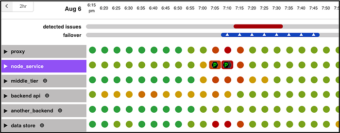
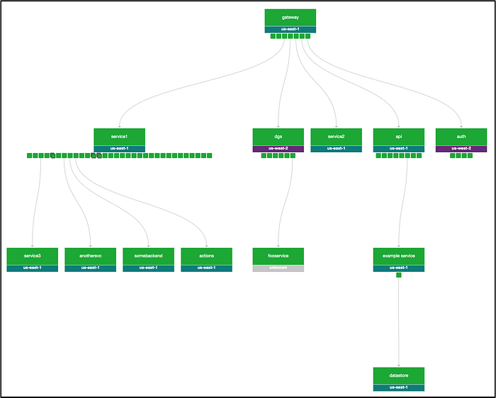
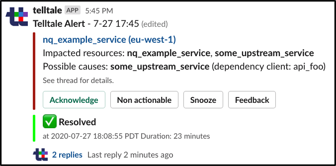
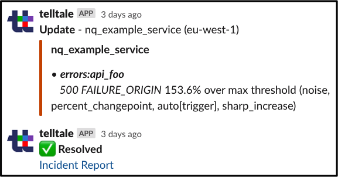
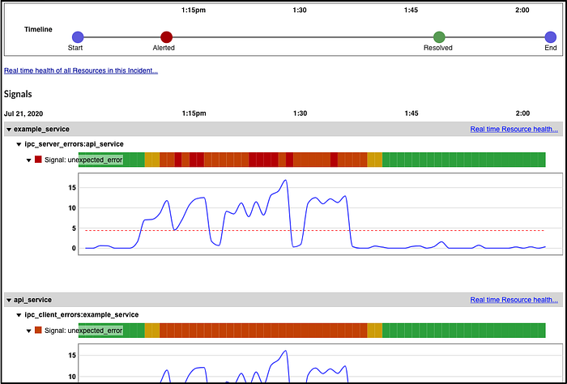
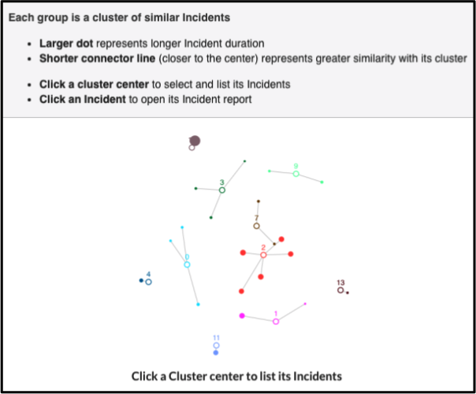
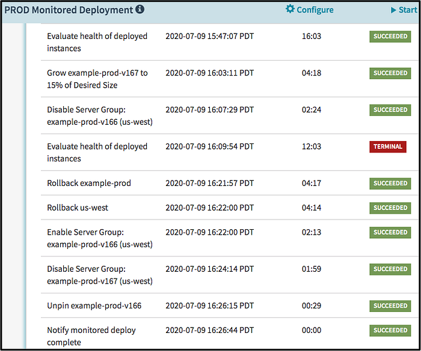
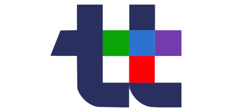

# Telltale: Netflix Application Monitoring Simplified

By Andrei Ushakov, [Seth Katz](https://www.linkedin.com/in/katzseth22202/), [Janak Ramachandran](https://www.linkedin.com/in/19051916/), [Jeff Butsch](https://www.linkedin.com/in/jeff-butsch-08178716/), [Peter Lau](https://www.linkedin.com/in/petercslau/), [Ram Vaithilingam](https://www.linkedin.com/in/ramvaith/), and [Greg Burrell](https://www.linkedin.com/in/greg-burrell-67ab273/)

## Our Telltale Vision

An alert fires and you get paged in the middle of the night. A metric crossed a threshold. You’re half awake and wondering, “Is there really a problem or is this just an alert that needs tuning? When was the last time somebody adjusted our alert thresholds? Maybe it’s due to an upstream or downstream service?” This is a critical application so you drag yourself out of bed, open your laptop, and start poring through dashboards for more info. You’re not yet convinced there’s a real problem but you’re also aware that the clock is ticking as you dig through a mountain of data looking for clues.

**Healthy Netflix services are essential to member joy. **When you sit down to watch “[Tiger King](https://www.netflix.com/title/81115994)” you expect it to just play. Over the years we’ve learned from [on-call engineers](https://netflixtechblog.com/full-cycle-developers-at-netflix-a08c31f83249) about the pain points of application monitoring: **too many alerts, too many dashboards to scroll through, and too much configuration and maintenance.** Our streaming teams need a monitoring system that enables them to quickly diagnose and remediate problems; seconds count! Our [Node team](https://www.youtube.com/watch?v=p74282nDMX8) needs a system that empowers a small group to operate a large fleet.

**So we built Telltale.**

*The Telltale timeline.*

Telltale combines a **variety of data sources** to create a holistic view of an application’s health. Telltale learns what constitutes typical health for an application, no alert tuning required. And because we know what’s healthy, we can let application owners know when their services are trending towards unhealthy.

Metrics are a key part of understanding application health. But sometimes you can have too many metrics, too many graphs, and too many dashboards. Telltale shows **only the relevant data from the application plus that of upstream and downstream services.** We use colors to indicate severity (users can opt to have Telltale display numbers in addition to colors) so users can tell, at a glance, the state of their application’s health. **We also highlight interesting broader events** such as [regional traffic evacuations](https://netflixtechblog.com/project-nimble-region-evacuation-reimagined-d0d0568254d4) and nearby [deployments](https://netflixtechblog.com/global-continuous-delivery-with-spinnaker-2a6896c23ba7), information that is vital to understanding health holistically. Especially during an incident.

**That is our Telltale vision. It exists today and monitors the health of over 100 Netflix production-facing applications.**

*An application lives in an ecosystem*

## The Application Health Model

A microservice doesn’t live in isolation. It usually has dependencies, talks to other services, and lives in different [AWS](https://aws.amazon.com/solutions/case-studies/netflix/) regions. The call graph above is a relatively simple one, they can be much deeper with dozens of services involved. An application is part of an ecosystem that can be subtly influenced by property changes or radically altered by region-wide events. The launch of a [canary](https://netflixtechblog.com/automated-canary-analysis-at-netflix-with-kayenta-3260bc7acc69) can affect an application. As can an upstream or downstream deployments.

**Telltale uses a variety of signals from multiple sources to assemble a constantly evolving model of the application’s health:**

- [Atlas](https://netflixtechblog.com/introducing-atlas-netflixs-primary-telemetry-platform-bd31f4d8ed9a) time series metrics.
- [Regional traffic evacuations](https://netflixtechblog.com/project-nimble-region-evacuation-reimagined-d0d0568254d4).
- [Mantis](./open-sourcing-mantis-a-platform-for-building-cost-effective-realtime-operations-focused-5b8ff387813a.md) real-time streaming data.
- Infrastructure change events.
- [Canary](https://netflixtechblog.com/automated-canary-analysis-at-netflix-with-kayenta-3260bc7acc69) launches and [deployments](https://netflixtechblog.com/global-continuous-delivery-with-spinnaker-2a6896c23ba7).
- The health of upstream and downstream services.
- [Client metrics and QoE changes](https://netflixtechblog.com/optimizing-the-netflix-streaming-experience-with-data-science-725f04c3e834).
- Alerts triggered by our alerting platform.

Different signals have different levels of importance to an application’s health. For example, a latency increase is less critical than error rate increase and some error codes are less critical than others. A canary launch two layers downstream might not be as significant as a deployment immediately upstream. A [regional traffic shift](https://netflixtechblog.com/project-nimble-region-evacuation-reimagined-d0d0568254d4) means one region ends up with zero traffic while another region has double. You can imagine the impact that has on metrics. A metric’s meaning determines how we should interpret it.

Telltale takes all those factors into consideration when constructing its view of application health.

**The application health model is the heart of Telltale.**

## Intelligent Monitoring

Every service operator knows the difficulty of alert tuning. Set thresholds too low and you get a deluge of spurious alerts. So you overcompensate and relax the tuning to the point of missing important health warnings. The end result is a lack of trust in alerts. Telltale is built on the premise that **you shouldn’t have to constantly tune configuration**.

We make setup and configuration easy for application owners by providing curated and managed signal packs. These packs are combined into application profiles to address most common service types. Telltale automatically tracks dependencies between services to build the topology used in the application health model. Signal packs and topology detection keep configuration up-to-date with minimal effort. Those who want a more hands-on approach can still do manual configuration and tuning.

No single algorithm can account for the wide variety of signals we use. So, instead, we employ a mix of algorithms including statistical, rule based, and machine learning. We’ll do a future Netflix Tech Blog article focused on our algorithms. Telltale also has analyzers to detect long-term trends or memory leaks. **Intelligent monitoring means results our users can trust.** It means a faster time to detection and a faster time to resolution during an incident.

## Intelligent Alerting

Intelligent monitoring yields intelligent alerting. Telltale creates an issue when it detects a health problem in your application’s ecosystem. Teams can opt in to alerting via Slack, email, or PagerDuty (all powered by our internal alerting system). If the issue is caused by an upstream or downstream system then Telltale’s context-aware routing alerts that team instead. Intelligent alerting also means a team receives a single notification, alert storms are a thing of the past.

*An example of a Telltale notification in Slack.*

When a problem strikes, it’s essential to have the right information. Our Slack alerts also start a thread containing only the most relevant context about the incident. This includes the signals that Telltale identified as unhealthy and the reasons why. The right context provides a better understanding of the application’s current state so the on-call engineer can return it to health.

**Incidents evolve and have their own lifecycle**, so updates are essential. Are things getting better or worse? Are there new signals or events to consider? Telltale updates the Slack thread as the current incident unfolds. The thread is marked Resolved upon return to healthy state so users know, at a glance, which incidents are ongoing and which have been successfully remediated.

But these Slack threads aren’t just for Telltale. Teams use them to share additional data, observations, theories, and discussion about the incident. Incident data and discussion all in one thread makes for shared understanding, faster resolution, and easier post-incident analysis.

We strive to improve the quality of Telltale alerts. One way to do that is to learn from our users. So we provide feedback buttons right in the Slack message. Users can tell us to suppress future occurrences of an alert. Or provide a reason for why an alert isn’t actionable. **Intelligent alerting means alerts our users can trust.**

*An example of the details found in a Telltale notification in Slack.*

### Why Is My Service Unhealthy?

A wide variety of signals, knowledge of the application’s ecosystem, and correlation of signals across multiple services helps Telltale to detect the possible causes of an application’s degraded health. Causes such as an outlier instance, a canary or deployment by a dependent service, an unhealthy database, or just a spike in traffic. **Highlighting possible causes saves valuable time during an incident.**

## Incident Management

*An example of a Telltale incident summary.*

When Telltale sends an alert it also creates a snapshot that has references to the unhealthy signals. As new information arrives, it’s added to this snapshot. This simplifies the post-incident review process for many teams. When it’s time to review past issues, the **Application Incident Summary** feature shows all aspects of recent issues in a single place including key metrics like total downtime and MTTR (Mean Time To Resolution). We want to help our teams see larger patterns of incidents so they can improve overall service availability.

*The cluster view groups similar incidents.*

## Deployment Monitoring

Telltale’s application health model and intelligent monitoring have proven so powerful that **we’re also using it for safer deployments**. We start with [Spinnaker](https://spinnaker.io/), our open source delivery platform. As Spinnaker slowly rolls out a new build we use Telltale to continuously monitor the health of the instances running the new build. Continuous monitoring means a deployment stops and rolls back at the first sign of a problem. It means deployment problems have smaller blast radius and a shorter duration.

## Continuous Improvement

Operating microservices in a complex ecosystem is challenging. We’re thrilled that Telltale’s intelligent monitoring and alerting helps our service operators improve availability, reduce toil, and sleep better at night. But we’re not done. We’re constantly exploring new algorithms to improve the accuracy of our alerts. We’ll write more about that in a future Netflix Tech Blog post. We’re also evaluating improvements to our application health model. We believe there’s useful information in service log and trace data. And benefits to employing higher resolution metrics. We’re looking forward to collaborating with our platform team on building out those new features. Getting new applications onto Telltale has been a white-glove treatment which doesn’t scale well, we can definitely improve our self-service UI. And we know there’s better heuristics to help pinpoint what’s affecting your service health.

**Telltale is application monitoring simplified.**

_A healthy Netflix service enables us to entertain the world. Correlating disparate signals to model health in realtime is challenging. Add in thousands of streaming device types, an ever-evolving architecture, and a growing content production ecosystem and the problem becomes fascinating. If you’re passionate about observability then _[**_come talk to us_**](https://www.linkedin.com/in/ramvaith/)_._

---
**Tags:** Netflix · Observability · Site Reliability · Operational Insight · Monitoring
