# The AI Evolution of Graph Search at Netflix: From Structured Queries to Natural Language

By [Alex Hutter](https://www.linkedin.com/in/ahutter/) and [Bartosz Balukiewicz](https://www.linkedin.com/in/bartosz-balukiewicz/)

Our previous blog posts ([part 1](./how-netflix-content-engineering-makes-a-federated-graph-searchable-5c0c1c7d7eaf.md), [part 2](./how-netflix-content-engineering-makes-a-federated-graph-searchable-part-2-49348511c06c.md), [part 3](./reverse-searching-netflixs-federated-graph-222ac5d23576.md)) detailed how Netflix’s Graph Search platform addresses the challenges of searching across federated data sets within Netflix’s enterprise ecosystem. Although highly scalable and easy to configure, it still relies on a structured query language for input. Natural language based search has been possible for some time, but the level of effort required was high. The emergence of readily-available AI, specifically Large Language Models (LLMs), has created new opportunities to integrate AI search features, with a smaller investment and improved accuracy.

While Text-to-Query and Text-to-SQL are established problems, the complexity of distributed Graph Search data in the GraphQL ecosystem necessitates innovative solutions. This is the first in a three-part series where we will detail our journey: how we implemented these solutions, evaluated their performance, and ultimately evolved them into a self-managed platform.

## The Need for Intuitive Search: Addressing Business and Product Demands

Natural language search is the ability to use everyday language to retrieve information as opposed to complex, structured query languages like the Graph Search Filter Domain Specific Language (DSL). When users interact with 100’s of various UIs within the suite of Content and Business Products applications, a frequent task is filtering a data table like the one below:

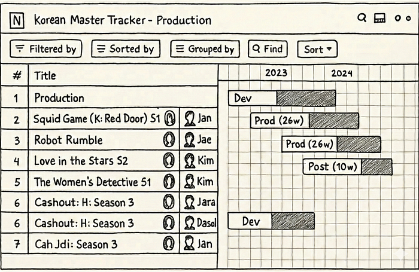
*Example Content and Business Products application view*

Ideally, a user simply wants to satisfy a query like **“I want to see all movies from the 90s about robots from the US.”** Because the underlying platform operates on the Graph Search Filter DSL, the application acts as an intermediary. Users input their requirements through UI elements — toggling facets or using query builders — and the system programmatically converts these interactions into a valid DSL query to filter the data.

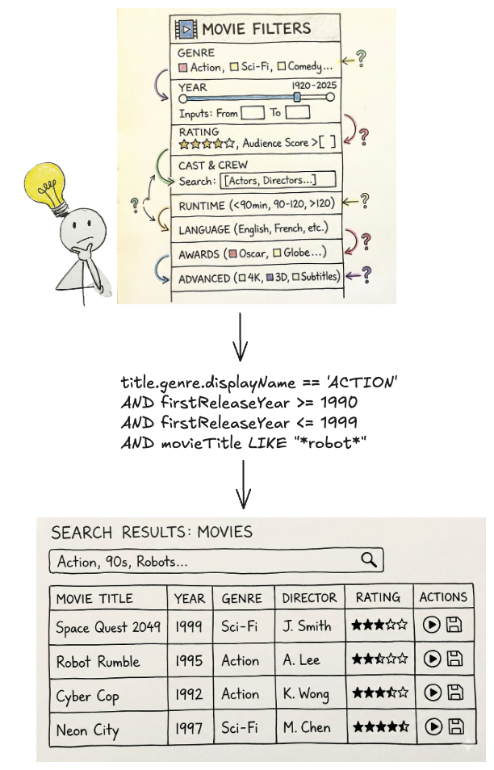
*The Complexity of filtering and DSL generation*

This process presents a few issues.

Today, many applications have bespoke components for collecting user input — the experience varies across them and they have inconsistent support for the DSL. Users need to “learn” how to use each application to achieve their goals.

Additionally, some domains have hundreds of fields in an index that could be faceted or filtered by. A _subject matter expert _(SME) may know exactly what they want to accomplish, but be bottlenecked by the inefficient pace of filling out a large scale UI form and translating their questions in order to encode it in a representation Graph Search needs.

Most importantly, users think and operate using natural language, not technical constructs like query builders, components, or DSLs. By requiring them to switch contexts, we introduce friction that slows them down or even prevents their progress.

With readily-available AI components, our users can now interact with our systems through natural language. The challenge now is to make sure our offering, searching Netflix’s complex enterprise state with natural language, is an intuitive and trustworthy experience.

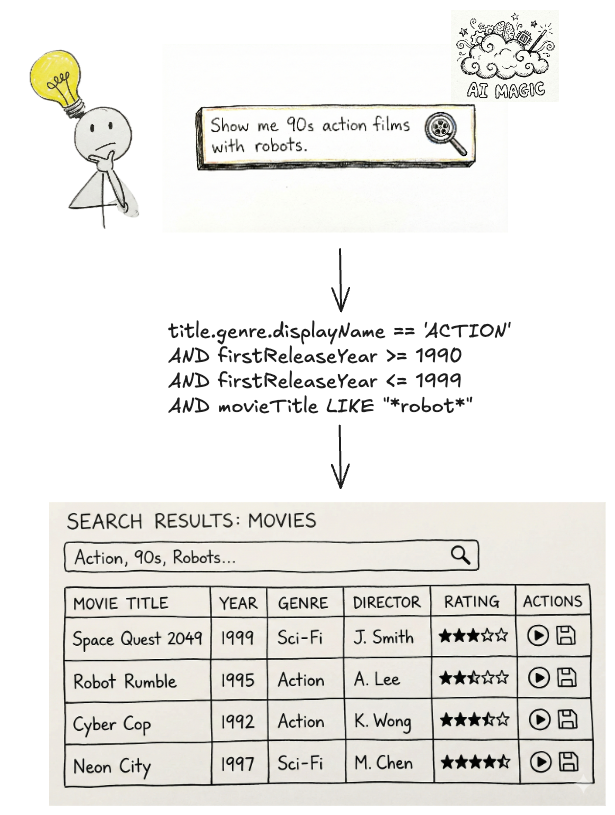
*Natural language queries translated into Graph Search Filter DSL*

We’ve made a decision to pursue generating Graph Search Filter statements from natural language to meet this need. Our intention is to augment and not replace existing applications with [retrieval augmented generation](https://en.wikipedia.org/wiki/Retrieval-augmented_generation) (RAG), providing tooling and capabilities so that applications in our ecosystem have newly accessible means of processing and presenting their data in their distinct domain flavours. It should be noted that all the work here has direct application to building a RAG system on top of Graph Search in the future.

## Under the Hood: Our Approach to Text-to-Query

The core function of the text-to-query process is converting a user’s (often ambiguous) natural language question into a structured query. We primarily achieve this through the use of an LLM.

Before we dive deeper, let’s quickly revisit the structure of Graph Search Filter DSL. Each Graph Search index is [defined by a GraphQL query](./how-netflix-content-engineering-makes-a-federated-graph-searchable-5c0c1c7d7eaf.md), made up of a collection of fields. Each field has a type e.g. boolean, string, and some have their permitted values governed by controlled vocabularies — a standardized and governed list of values (like an enumeration, or a foreign key). The names of those fields can be used to construct expressions using comparison (e.g. > or ==) or inclusion/exclusion operators (e.g. IN). In turn those expressions can be combined using logical operators (e.g. AND) to construct complex statements.

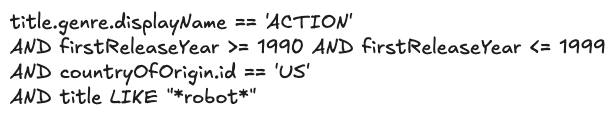
*Graph Search Filter DSL*

With that understanding, we can now more rigorously define the conversion process. We need the LLM to generate a Graph Search Filter DSL statement that is syntactically, semantically, and pragmatically correct.

**Syntactic correctness** is easy — does it parse? To be syntactically correct, the generated statement must be well formed** **i.e. follow the grammar of the Graph Search Filter DSL.

**Semantic correctness **adds some additional complexity as it requires more knowledge of the index itself. To be semantically correct:

- it must respect the field types i.e. only use comparisons that make sense given the underlying type;
- it must only use fields that are actually present in the index, i.e. does not _hallucinate;_
- when the values of a field are constrained to a controlled vocabulary, any comparison must only use values from that controlled vocabulary.

****Pragmatic correctness**** is much more difficult. It asks the question: does the generated filter actually capture the intent of the user’s query?

The following sections will detail how we pre-process the user’s question to create appropriate context for the instructions that we will provide to the LLM — both of [which are fundamental to LLM interaction](https://developers.google.com/machine-learning/resources/intro-llms) — as well as post-processing we perform on the generated statement to validate it, and help users understand and trust the results they receive.

At a high level that process looks like this:

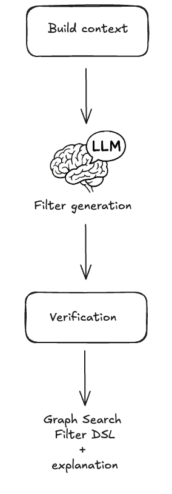
*Graph Search FIlter DSL generation process*

## Context Engineering

Preparation for the filter generation task is predominantly engineering the appropriate context. The LLM will need access to the fields of an index and their metadata in order to construct semantically correct filters. As the indices are defined by GraphQL queries, we can use the type information from the GraphQL schema to derive much of the required information. For some fields, there is additional information we can provide beyond what’s available in the schema as well, in particular permissible values that pull from controlled vocabularies.

Each field in the index is associated with metadata as seen below, and that metadata is provided as part of the context.

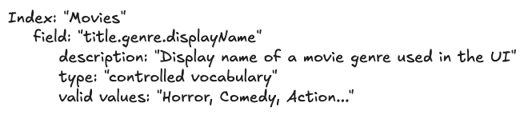
*Graph Search index representation*

- The **field** is derived from the document path as characterized by the GraphQL query.
- The **description** is the comment from the GraphQL schema for the field.
- The **type** is derived from the GraphQL schema for the field e.g. Boolean, String, enum. We also support an additional controlled vocabulary type we will discuss more of shortly.
- The **valid values** are derived from enum values for the enum type or from a controlled vocabulary as we will now discuss.

A _controlled vocabulary_ is a specific field type that consists of a finite set of allowed values, which are defined by a SMEs or domain owners. Index fields can be associated with a particular controlled vocabulary, e.g. countries with members such as Spain and Thailand, and any usage of that field within a generated statement must refer to values from that vocabulary.

Naively providing all the metadata as context to the LLM worked for simple cases but did not scale. Some indices have hundreds of fields and some controlled vocabularies have thousands of valid values. Providing all of those, especially the controlled vocabulary values and their accompanying metadata, expands the context; this proportionally increases latency and decreases the correctness of generated filter statements. Not providing the values wasn’t an option as we needed to ground the LLMs generated statements- without them, the LLM would frequently hallucinate values that did not exist.

Curating the context to an appropriate subset was a problem we addressed using the well known RAG pattern.

### Field RAG

As mentioned previously, some indices have hundreds of fields, however, most user’s questions typically refer only to a handful of them. If there was no cost in including them all, we would, but as mentioned prior, there is a cost in terms of the latency of query generation as well as the correctness of the generated query (e.g. needle-in-the-hackstack problem) and non-deterministic results.

To determine which subset of fields to include in the context, we “match” them against the intent of the user’s question.

- Embeddings are created for index fields and their metadata (name, description, type) and are indexed in a vector store
- At filter generation time, the user’s question is chunked with an overlapping strategy. For each chunk, we perform a vector search to identify the top K most relevant values and the fields to which they belong.
- **Deduplication:** The top K fields from each chunk are both consolidated and deduplicated before being provided as context to the system instructions.

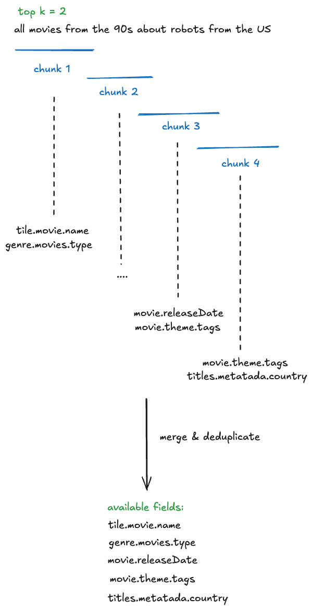
*Field RAG process (chunking, merge, deduplicate)*

### Controlled Vocabularies RAG

Index fields of the controlled vocabulary type are associated with a particular controlled vocabulary, again, countries are one example. Given a user’s question, we can infer whether or not it refers to values of a particular controlled vocabulary. In turn, by knowing which controlled vocabulary values are present, we can identify additional, related index fields that should be included in the context that may not have been identified by the field RAG step.

Each controlled vocabulary value has:

- a unique** identifier** within its type;
- a human readable **display name;**
- a **description** of the value;
- also-known-as values or **AKA** display names, e.g. “romcom” for “Romantic Comedy”.

To determine which subset of values to include in the context for controlled vocabulary fields (and also possibly infer additional fields), we “match” them against the user’s question.

- Embeddings are created for controlled vocabulary values and their metadata, and these are indexed in a vector store. The controlled vocabularies are available via GraphQL and are regularly fetched and reindexed so this system stays up to date with any changes in the domain.
- At filter generation time, the user’s question is chunked. For each chunk, we perform a vector search to identify the top K most relevant values (but only for the controlled vocabularies that are associated with fields in the index)
- The top K values from each chunk are deduplicated by their controlled vocabulary type. The associated field definition is then injected into the context along with the matched values.

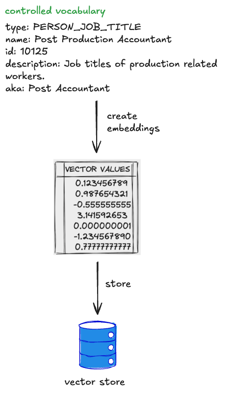
*Controlled Vocabularies RAG*

**Combining both approaches, the RAG of fields and controlled vocabularies, we end up with the solution that each input question resolves in available and matched fields and values:**

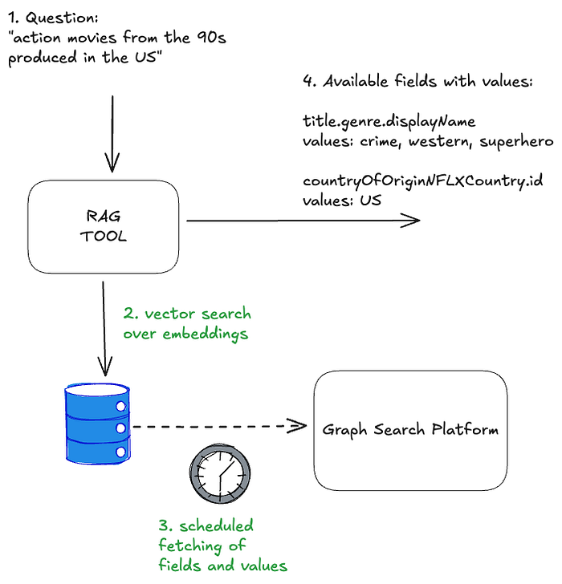
*Field and CV RAG*

The quality of results generated by the RAG tool can be significantly enhanced by tuning its various parameters, or “levers.” These include strategies for reranking, chunking, and the selection of different embedding generation models. The careful and systematic evaluation of these factors will be the focus of the subsequent parts of this series.

## The Instructions

Once the context is constructed, it is provided to the LLM with a set of instructions and the user’s question. The instructions can be summarised as follows: **“_Given a natural language question, generate a syntactically, semantically, and pragmatically correct filter statement given the availability of the following index fields and their metadata_.”**

- In order to generate a _syntactically_ correct filter statement, the instructions include the syntax rules of the DSL.
- In order to generate a _semantically_ correct filter statement, the instructions tell the LLM to ground the generated statement in the provided context.
- In order to generate a _pragmatically_ correct filter statement, so far we focus on better context engineering to ensure that only the most relevant fields and values are provided. We haven’t identified any instructions that make the LLM just “do better” at this aspect of the task.

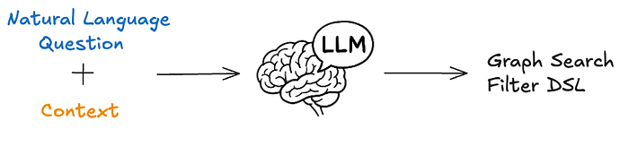
*Graph Search Filter DSL generation*

After the filter statement is generated by the LLM, we deterministically validate it prior to returning the values to the user.

## Validation

### Syntactic Correctness

Syntactic correctness ensures the LLM output is a parsable filter statement. We utilize an Abstract Syntax Tree (AST) parser built for our custom DSL. If the generated string fails to parse into a valid AST, we know immediately that the query is malformed and there is a fundamental issue with the generation.

The other approach to solve this problem could be using the [structured outputs](https://platform.openai.com/docs/guides/structured-outputs) modes provided by some LLMs. However, our initial evaluation yielded mixed results, as the custom DSL is not natively supported and requires further work.

### Semantic Correctness

Despite careful context engineering using the RAG pattern, the LLM sometimes hallucinates both fields and available values in the generated filter statement. The most straightforward way of preventing this phenomenon is validating the generated filters against available index metadata. This approach does not impact the overall latency of the system, as we are already working with an AST of the filter statement, and the metadata is freely available from the context engineering stage.

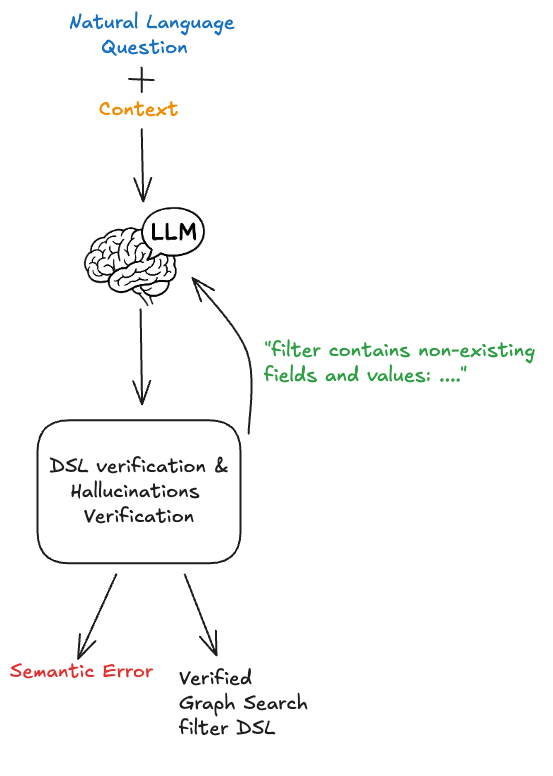
*DSL verification & hallucinations*

If a hallucination is detected it can be returned as an error to a user, indicating the need to refine the query, or can be provided back to the LLM in the form of a feedback loop for self correction.

This increases the filter generation time, so should be used cautiously with a limited number of retries.

## Building Confidence

You probably noticed we are not validating the generated filter for pragmatic correctness. That task is the hardest challenge: The filter parses (_syntactic_) and uses real fields (_semantic_), but is it what the user meant? When a user searches for **“Dark”**, do they mean **the specific German sci-fi series _Dark_, **or are they browsing for the mood category** “dark TV shows”**?

The gap between what a user intended and the generated filter statement is often caused by ambiguity. Ambiguity stems from the [compression of natural language](https://en.wikipedia.org/wiki/Semantic_compression). A user says **“German time-travel mystery with the missing boy and the cave”** but the index contains **discrete metadata fields** like **releaseYear**, **genreTags**, and **synopsisKeywords**.

How do we ensure users aren’t inadvertently led to wrong answers or to answers for questions they didn’t ask?

### Showing Our Work

One way we are handling ambiguity is by _showing our work_. We visualise the generated filters in the UI in a user-friendly way allowing them to very clearly see if the answer we’re returning is what they were looking for so they can trust the results..

We cannot show a raw DSL string (e.g., _origin.country == ‘Germany’ AND genre.tags CONTAINS ‘Time Travel’ AND synopsisKeywords LIKE ‘*cave*’_) to a non-technical user. Instead, we reflect its underlying AST into UI components.

After the LLM generates a filter statement, we parse it into an AST, and then map that AST to the existing “Chips” and “Facets” in our UI (see below). If the LLM generates a filter for _origin.country == ‘Germany’_, the user sees the “Country” dropdown pre-selected to “Germany.” This gives users immediate visual feedback and the ability to easily fine-tune the query using standard UI controls when the results need improvement or further experimentation.

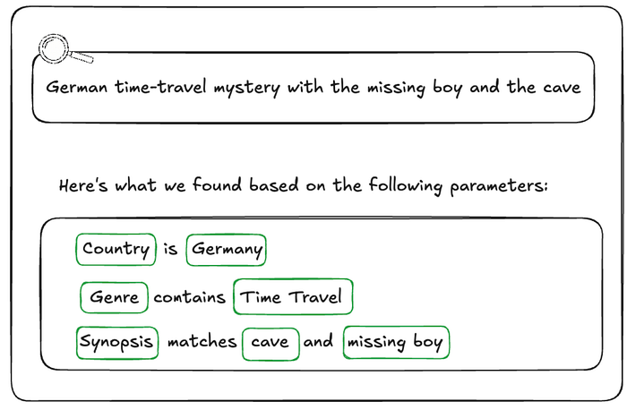
*Generated filters visualisation*

### Explicit Entity Selection

Another strategy we’ve developed to remove ambiguity happens at query time. We give users the ability to constrain their input to refer to known entities using “@mentions”. Similar to Slack, typing @ lets them search for entities directly from our specialized UI Graph Search component, giving them easy access to multiple controlled vocabularies (plus other identifying metadata like launch year) to feel confident they’re choosing the entity they intend.

If a user types, “When was _@dark_ produced”, we explicitly know they are referring to the _Series_ controlled vocabulary, allowing us to bypass the RAG inference step and hard-code that context, significantly increasing pragmatic correctness (and building user trust in the process).

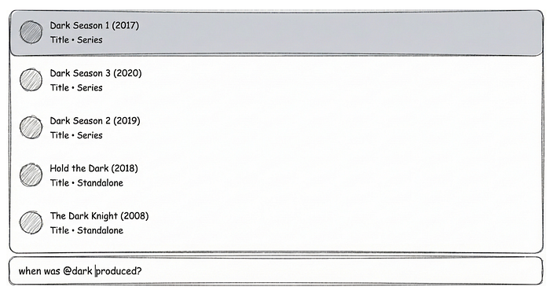
*Example @mentions usage in the UI*

## End-to-end architecture

As mentioned previously, the solution architecture is divided into _pre-processing_, filter statement generation, and then _post-processing_ stages. The pre-processing handles context building and involves a RAG pattern for similarity search, while the post-processing validation stage checks the correctness of the LLM-generated filter statements and provides visibility into the results for end users. This design strategically balances LLM involvement with more deterministic strategies.

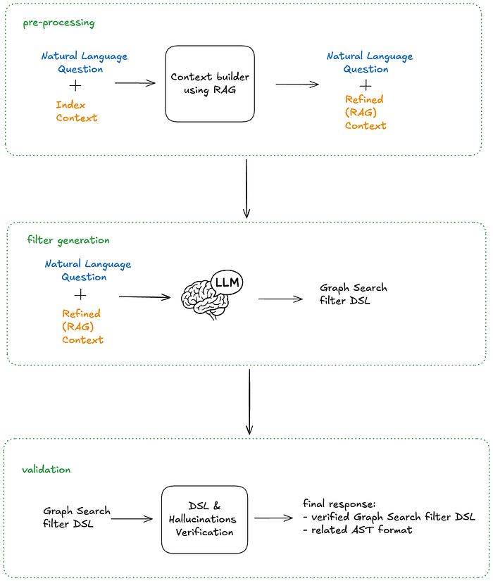
*End-to-end architecture*

The end-to-end process is as follows:

1. A user’s natural language question (with optional `@mentions` statements) are provided as input, along with the Graph Search index context
2. The context is scoped by using the RAG pattern on both fields and possible values
3. The pre-processed context and the question are fed into the LLM with an instruction asking for_ a syntactically and semantically correct filter statement_
4. The generated filer statement DSL is verified and checked for hallucinations
5. The final response contains the related AST in order to build “Chips” and “Facets”

## Summary

By combining our existing Graph Search infrastructure with the power and flexibility of LLMs, we’ve bridged the gap between complex filter statements and user intent. We moved from requiring users to speak our language (DSL) to our systems understanding theirs.

The initial challenge for our users was successfully addressed. However, our next steps involve transforming this system into a comprehensive and expandable platform, rigorously evaluating its performance in a live production environment, and expanding its capabilities to support GraphQL-first user interfaces. These topics, and others, will be the focus of the subsequent installments in this series. Be sure to follow along!

You may have noticed that we have a lot more to do on this project, including named entity recognition and extraction, intent detection so we can route questions to the appropriate indices, and query rewriting among others. If this kind of work interests you, reach out! We’re hiring in our Warsaw office, check for open roles [here](https://explore.jobs.netflix.net/careers?location=Warsaw%2C+Masovian+Voivodeship%2C+Poland&pid=790302168096&domain=netflix.com&sort_by=relevance&triggerGoButton=false).

## Credits

Special thanks to [Alejandro Quesada](https://www.linkedin.com/in/quesadaalejandro/), [Yevgeniya Li](https://www.linkedin.com/in/yevgeniya-li-9877ba160/), [Dmytro Kyrii](https://www.linkedin.com/in/dkyrii/), [Razvan-Gabriel Gatea](https://www.linkedin.com/in/razvan-gabriel-gatea/), [Orif Milod](https://www.linkedin.com/in/milodorif/), [Michal Krol](https://www.linkedin.com/in/michal-krol-45973411a/), [Jeff Balis](https://www.linkedin.com/in/jeffbalis/), [Charles Zhao](https://www.linkedin.com/in/czhao/), [Shilpa Motukuri](https://www.linkedin.com/in/shilpamotukuri/), [Shervine Amidi](https://www.linkedin.com/in/shervineamidi/), [Alex Borysov](https://www.linkedin.com/in/aborysov/), [Mike Azar](https://www.linkedin.com/in/mike-azar-7064883b/), [Bernardo Gomez Palacio](https://www.linkedin.com/in/bernardo-g-4414b41/), [Haoyuan He](https://www.linkedin.com/in/haoyuan-h-98b587134/), [Eduardo Ramirez](https://www.linkedin.com/in/edyr96/), [Cynthia Xie](https://www.linkedin.com/in/yujiaxie2019/).

---
**Tags:** LLM · AI · Search Engines · GraphQL · Software Engineering
