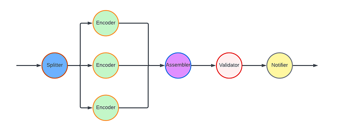
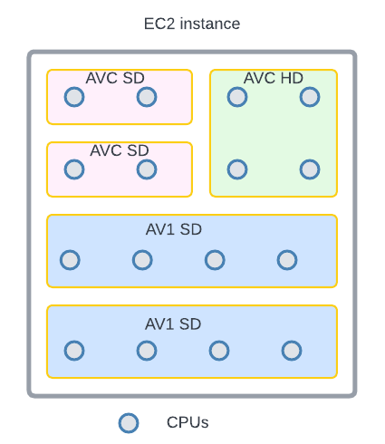
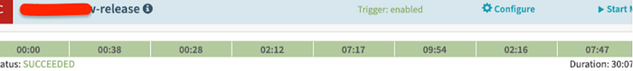

# The Making of VES: the Cosmos Microservice for Netflix Video Encoding

[Liwei Guo](https://www.linkedin.com/in/liwei-guo/), [Vinicius Carvalho](https://www.linkedin.com/in/carvalhovinicius/), [Anush Moorthy](https://www.linkedin.com/in/anush-moorthy-b8451142/), [Aditya Mavlankar](https://www.linkedin.com/in/aditya-mavlankar-7139791/), [Lishan Zhu](https://www.linkedin.com/in/lishan-z-51302abb/)

_This is the second post in a multi-part series from Netflix. See _[_here_](./rebuilding-netflix-video-processing-pipeline-with-microservices-4e5e6310e359.md)_ for Part 1 which provides an overview of our efforts in rebuilding the Netflix video processing pipeline with microservices. This blog dives into the details of building our Video Encoding Service (VES), and shares our learnings._

[Cosmos](./the-netflix-cosmos-platform-35c14d9351ad.md) is the next generation media computing platform at Netflix. Combining microservice architecture with asynchronous workflows and serverless functions, Cosmos aims to modernize Netflix’s media processing pipelines with improved flexibility, efficiency, and developer productivity. In the past few years, the video team within Encoding Technologies (ET) has been working on rebuilding the entire video pipeline on Cosmos.

This new pipeline is composed of a number of microservices, each dedicated to a single functionality. One such microservice is Video Encoding Service (VES). Encoding is an essential component of the video pipeline. At a high level, it takes an ingested mezzanine and encodes it into a video stream that is suitable for Netflix streaming or serves some studio/production use case. In the case of Netflix, there are a number of requirements for this service:

- Given the wide range of devices from mobile phones to browsers to Smart TVs, multiple codec formats, resolutions, and quality levels need to be supported.
- Chunked encoding is a must to meet the latency requirements of our business needs, and use cases with different levels of latency sensitivity need to be accommodated.
- The capability of continuous release is crucial for enabling fast product innovation in both streaming and studio spaces.
- There is a huge volume of encoding jobs every day. The service needs to be cost-efficient and make the most use of available resources.

In this tech blog, we will walk through how we built VES to achieve the above goals and will share a number of lessons we learned from building microservices. Please note that for simplicity, we have chosen to omit certain Netflix-specific details that are not integral to the primary message of this blog post.

## Building Video Encoding Service on Cosmos

A Cosmos microservice consists of three layers: an API layer (Optimus) that takes in requests, a workflow layer (Plato) that orchestrates the media processing flows, and a serverless computing layer (Stratum) that processes the media. These three layers communicate asynchronously through a home-grown, priority-based messaging system called [Timestone](./timestone-netflixs-high-throughput-low-latency-priority-queueing-system-with-built-in-support-1abf249ba95f.md). We chose Protobuf as the payload format for its high efficiency and mature cross-platform support.

To help service developers get a head start, the Cosmos platform provides a powerful service generator. This generator features an intuitive UI. With a few clicks, it creates a basic yet complete Cosmos service: code repositories for all 3 layers are created; all platform capabilities, including discovery, logging, tracing, etc., are enabled; release pipelines are set up and dashboards are readily accessible. We can immediately start adding video encoding logic and deploy the service to the cloud for experimentation.

### Optimus

As the API layer, Optimus serves as the gateway into VES, meaning service users can only interact with VES through Optimus. The defined API interface is a strong contract between VES and the external world. As long as the API is stable, users are shielded from internal changes in VES. This decoupling is instrumental in enabling faster iterations of VES internals.

**As a single-purpose service, the API of VES is quite clean. We defined an endpoint****_ encodeVideo_**** that takes an ****_EncodeRequest_**** and returns an ****_EncodeResponse_** (in an async way through Timestone messages). The _EncodeRequest_ object contains information about the source video as well as the encoding recipe. All the requirements of the encoded video (codec, resolution, etc.) as well as the controls for latency (chunking directives) are exposed through the data model of the encoding recipe.

```
//protobuf definition 

message EncodeRequest {
    VideoSource video_source = 1;//source to be encoded
    Recipe recipe = 2; //including encoding format, resolution, etc.
}

message EncodeResponse {
    OutputVideo output_video = 1; //encoded video
    Error error = 2; //error message (optional)
}

message Recipe {
    Codec codec = 1; //including codec format, profile, level, etc.
    Resolution resolution = 2;
    ChunkingDirectives chunking_directives = 3;
    ...
}
```

Like any other Cosmos service, the platform automatically generates an RPC client based on the VES API data model, which users can use to build the request and invoke VES. Once an incoming request is received, Optimus performs validations, and (when applicable) converts the incoming data into an internal data model before passing it to the next layer, Plato.

## Plato

The workflow layer, Plato, governs the media processing steps. The Cosmos platform supports two programming paradigms for Plato: forward chaining rule engine and Directed Acyclic Graph (DAG). VES has a linear workflow, so we chose DAG for its simplicity.

In a DAG, the workflow is represented by nodes and edges. Nodes represent stages in the workflow, while edges signify dependencies — a stage is only ready to execute when all its dependencies have been completed. VES requires parallel encoding of video chunks to meet its latency and resilience goals. This workflow-level parallelism is facilitated by the DAG through a MapReduce mode. Nodes can be annotated to indicate this relationship, and a Reduce node will only be triggered when all its associated Map nodes are ready.

For the VES workflow, we defined five Nodes and their associated edges, which are visualized in the following graph:

- Splitter Node: This node divides the video into chunks based on the chunking directives in the recipe.
- Encoder Node: This node encodes a video chunk. It is a Map node.
- Assembler Node: This node stitches the encoded chunks together. It is a Reduce node.
- Validator Node: This node performs the validation of the encoded video.
- Notifier Node: This node notifies the API layer once the entire workflow is completed.



In this workflow, nodes such as the Notifier perform very lightweight operations and can be directly executed in the Plato runtime. However, resource-intensive operations need to be delegated to the computing layer (Stratum), or another service. Plato invokes Stratum functions for tasks such as encoding and assembling, where the nodes (Encoder and Assembler) post messages to the corresponding message queues. The Validator node calls another Cosmos service, the Video Validation Service, to validate the assembled encoded video.

### Stratum

The computing layer, Stratum, is where media samples can be accessed. Developers of Cosmos services create Stratum Functions to process the media. They can bring their own media processing tools, which are packaged into Docker images of the Functions. These Docker images are then published to our internal Docker registry, part of [Titus](https://medium.com/p/f868c9fb5436). In production, Titus automatically scales instances based on the depths of job queues.

VES needs to support encoding source videos into a variety of codec formats, including AVC, AV1, and VP9, to name a few. We use different encoder binaries (referred to simply as “encoders”) for different codec formats. For AVC, a format that is now 20 years old, the encoder is quite stable. On the other hand, [the newest addition to Netflix streaming](./bringing-av1-streaming-to-netflix-members-tvs-b7fc88e42320.md), AV1, is continuously going through active improvements and experimentations, necessitating more frequent encoder upgrades. ​​To effectively manage this variability, we decided to create multiple Stratum Functions, each dedicated to a specific codec format and can be released independently. This approach ensures that upgrading one encoder will not impact the VES service for other codec formats, maintaining stability and performance across the board.

Within the Stratum Function, the Cosmos platform provides abstractions for common media access patterns. Regardless of file formats, sources are uniformly presented as locally mounted frames. Similarly, for output that needs to be persisted in the cloud, the platform presents the process as writing to a local file. All details, such as streaming of bytes and retrying on errors, are abstracted away. With the platform taking care of the complexity of the infrastructure, the essential code for video encoding in the Stratum Function could be as simple as follows.

```
ffmpeg -i input/source%08d.j2k -vf ... -c:v libx264 ... output/encoding.264
```

Encoding is a resource-intensive process, and the resources required are closely related to the codec format and the encoding recipe. We conducted benchmarking to understand the resource usage pattern, particularly CPU and RAM, for different encoding recipes. Based on the results, we leveraged the “container shaping” feature from the Cosmos platform.

We defined a number of different “container shapes”, specifying the allocations of resources like CPU and RAM.

```
# an example definition of container shape
group: containerShapeExample1
resources:
  numCpus: 2
  memoryInMB: 4000
  networkInMbp: 750
  diskSizeInMB: 12000
```

Routing rules are created to assign encoding jobs to different shapes based on the combination of codec format and encoding resolution. This helps the platform perform “bin packing”, thereby maximizing resource utilization.


*An example of “bin-packing”. The circles represent CPU cores and the area represents the RAM. This 16-core EC2 instance is packed with 5 encoding containers (rectangles) of 3 different shapes (indicated by different colors).*

## Continuous Release

After we completed the development and testing of all three layers, VES was launched in production. However, this did not mark the end of our work. Quite the contrary, we believed and still do that a significant part of a service’s value is realized through iterations: supporting new business needs, enhancing performance, and improving resilience. An important piece of our vision was for Cosmos services to have the ability to continuously release code changes to production in a safe manner.

Focusing on a single functionality, code changes pertaining to a single feature addition in VES are generally small and cohesive, making them easy to review. Since callers can only interact with VES through its API, internal code is truly “implementation details” that are safe to change. The explicit API contract limits the test surface of VES. Additionally, the Cosmos platform provides a [pyramid](https://martinfowler.com/articles/practical-test-pyramid.html)-based testing framework to guide developers in creating tests at different levels.

After testing and code review, changes are merged and are ready for release. The release pipeline is fully automated: after the merge, the pipeline checks out code, compiles, builds, runs unit/integration/end-to-end tests as prescribed, and proceeds to full deployment if no issues are encountered. Typically, it takes around 30 minutes from code merge to feature landing (a process that took 2–4 weeks in our previous generation platform!). The short release cycle provides faster feedback to developers and helps them make necessary updates while the context is still fresh.


*Screenshot of a release pipeline run in our production environment*

When running in production, the service constantly emits metrics and logs. They are collected by the platform to visualize dashboards and to drive monitoring/alerting systems. Metrics deviating too much from the baseline will trigger alerts and can lead to automatic service rollback (when the “canary” feature is enabled).

## The Learnings:

VES was the very first microservice that our team built. We started with basic knowledge of microservices and learned a multitude of lessons along the way. These learnings deepened our understanding of microservices and have helped us improve our design choices and decisions.

### Define a Proper Service Scope

A principle of microservice architecture is that a service should be built for a single functionality. This sounds straightforward, but what exactly qualifies a “single functionality”? “Encoding video” sounds good but wouldn’t “encode video into the AVC format” be an even more specific single-functionality?

When we started building the VES, we took the approach of creating a separate encoding service for each codec format. While this has advantages such as decoupled workflows, quickly we were overwhelmed by the development overhead. Imagine that a user requested us to add the watermarking capability to the encoding. We needed to make changes to multiple microservices. What is worse, changes in all these services are very similar and essentially we are adding the same code (and tests) again and again. Such kind of repetitive work can easily wear out developers.

The service presented in this blog is our second iteration of VES (yes, we already went through one iteration). In this version, we consolidated encodings for different codec formats into a single service. They share the same API and workflow, while each codec format has its own Stratum Functions. So far this seems to strike a good balance: the common API and workflow reduces code repetition, while separate Stratum Functions guarantee independent evolution of each codec format.

The changes we made are not irreversible. If someday in the future, the encoding of one particular codec format evolves into a totally different workflow, we have the option to spin it off into its own microservice.

### Be Pragmatic about Data Modeling

In the beginning, we were very strict about data model separation — we had a strong belief that sharing equates to coupling, and coupling could lead to potential disasters in the future. To avoid this, for each service as well as the three layers within a service, we defined its own data model and built converters to translate between different data models.

We ended up creating multiple data models for aspects such as bit-depth and resolution across our system. To be fair, this does have some merits. For example, our encoding pipeline supports different bit-depths for AVC encoding (8-bit) and AV1 encoding (10-bit). By defining both _AVC.BitDepth_ and _AV1.BitDepth_, constraints on the bit-depth can be built into the data models. However, it is debatable whether the benefits of this differentiation power outweigh the downsides, namely multiple data model translations.

Eventually, we created a library to host data models for common concepts in the video domain. Examples of such concepts include frame rate, scan type, color space, etc. As you can see, they are extremely common and stable. This “common” data model library is shared across all services owned by the video team, avoiding unnecessary duplications and data conversions. Within each service, additional data models are defined for service-specific objects.

### Embrace Service API Changes

This may sound contradictory. We have been saying that an API is a strong contract between the service and its users, and keeping an API stable shields users from internal changes. This is absolutely true. However, none of us had a crystal ball when we were designing the very first version of the service API. It is inevitable that at a certain point, this API becomes inadequate. If we hold the belief that “the API cannot change” too dearly, developers would be forced to find workarounds, which are almost certainly sub-optimal.

There are many great tech articles about gracefully evolving API. We believe we also have a unique advantage: VES is a service internal to Netflix Encoding Technologies (ET). Our two users, the Streaming Workflow Orchestrator and the Studio Workflow Orchestrator, are owned by the workflow team within ET. Our teams share the same contexts and work towards common goals. If we believe updating API is in the best interest of Netflix, we meet with them to seek alignment. Once a consensus to update the API is reached, teams collaborate to ensure a smooth transition.

## Stay Tuned…

This is the second part of our tech blog series Rebuilding Netflix Video Pipeline with Microservices. In this post, we described the building process of the Video Encoding Service (VES) in detail as well as our learnings. Our pipeline includes a few other services that we plan to share about as well. Stay tuned for our future blogs on this topic of microservices!

---
**Tags:** Microservices · Video Encoding · Netflix · Streaming
