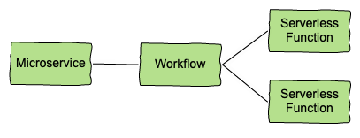
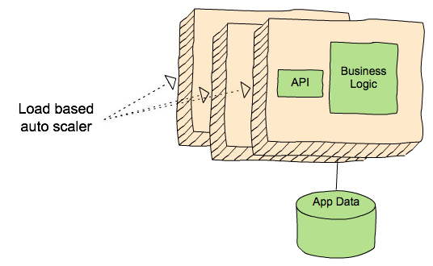
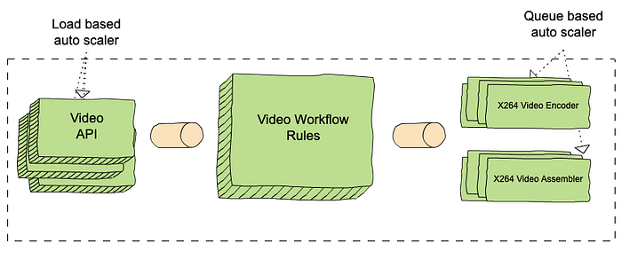
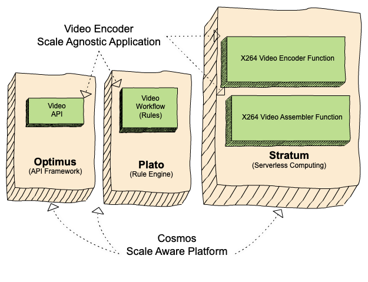
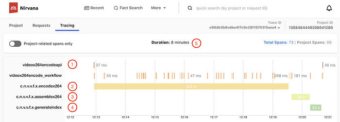
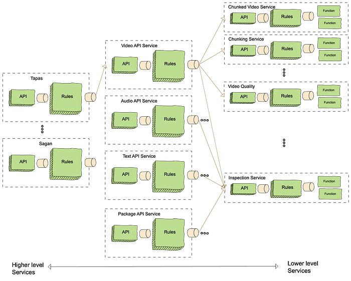
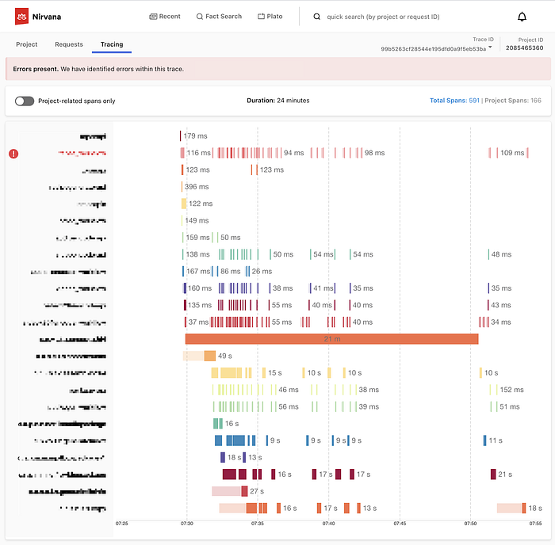

# The Netflix Cosmos Platform

> Orchestrated Functions as a Microservice

_by _[_Frank San Miguel_](https://www.linkedin.com/in/franksanmiguel/)_ on behalf of the Cosmos team_

## Introduction

Cosmos is a computing platform that combines the best aspects of microservices with asynchronous workflows and serverless functions. Its sweet spot is applications that involve resource-intensive algorithms coordinated via complex, hierarchical workflows that last anywhere from minutes to years. It supports both high throughput services that consume hundreds of thousands of CPUs at a time, and latency-sensitive workloads where humans are waiting for the results of a computation.

*A Cosmos service*

This article will explain why we built Cosmos, how it works and share some of the things we have learned along the way.

## Background

The Media Cloud Engineering and Encoding Technologies teams at Netflix jointly operate a system to process incoming media files from our partners and studios to [make them playable](./optimized-shot-based-encodes-for-4k-now-streaming-47b516b10bbb.md) on all devices. The first generation of this system went live with the streaming launch in 2007. The second generation added scale but was extremely difficult to operate. The third generation, called [Reloaded](https://youtu.be/JouA10QJiNc), has been online for about seven years and has proven to be stable and [massively scalable](https://netflixtechblog.com/creating-your-own-ec2-spot-market-part-2-106e53be9ed7).

When Reloaded was designed, we were a small team of developers operating a constrained compute cluster, and focused on one use case: the video/audio processing pipeline. As time passed the number of developers more than tripled, the breadth and depth of our use cases expanded, and our scale increased more than tenfold. The monolithic architecture significantly slowed down the delivery of new features. We could no longer expect everyone to possess the specialized knowledge that was necessary to build and deploy new features. Dealing with production issues became an expensive chore that placed a tax on all developers because infrastructure code was all mixed up with application code. The centralized data model that had served us well when we were a small team became a liability.

Our response was to create Cosmos, a platform for workflow-driven, media-centric microservices. The first-order goals were to preserve our current capabilities while offering:

- Observability — via built-in logging, tracing, monitoring, alerting and error classification.
- Modularity — An opinionated framework for structuring a service and enabling both compile-time and run-time modularity.
- Productivity — Local development tools including specialized test runners, code generators, and a command line interface.
- Delivery — A fully-managed continuous-delivery system of pipelines, continuous integration jobs, and end to end tests. When you merge your pull request, it makes it to production without manual intervention.

While we were at it, we also made improvements to scalability, reliability, security, and other system qualities.

## Overview

A Cosmos service is not a microservice but there are similarities. **A typical microservice is an API with stateless business logic which is autoscaled based on request load.** The API provides strong contracts with its peers while segregating application data and binary dependencies from other systems.

*A typical microservice*

A Cosmos service retains the strong contracts and segregated data/dependencies of a microservice, but adds multi-step workflows and computationally intensive asynchronous serverless functions. In the diagram below of a typical Cosmos service, clients send requests to a Video encoder service API layer. A set of rules orchestrate workflow steps and a set of serverless functions power domain-specific algorithms. Functions are packaged as Docker images and bring their own media-specific binary dependencies (e.g. debian packages). They are scaled based on queue size, and may run on tens of thousands of different containers. Requests may take hours or days to complete.

*A typical Cosmos service*

## Separation of concerns

Cosmos has two axes of separation. On the one hand, logic is divided between API, workflow and serverless functions. On the other hand, logic is separated between application and platform. The platform API provides media-specific abstractions to application developers while hiding the details of distributed computing. For example, a video encoding service is built of components that are scale-agnostic: API, workflow, and functions. They have no special knowledge about the scale at which they run. These domain-specific, scale-agnostic components are built on top of three [scale-aware](https://queue.acm.org/detail.cfm?id=3025012) Cosmos subsystems which handle the details of distributing the work:

- Optimus, an API layer mapping external requests to internal business models.
- [Plato](https://feathercast.apache.org/2019/09/13/serverless-multi-tenant-rule-engine-service-powered-by-apache-karaf-dmitry-vasilyev-saeid-mirzaei-george-ye/), a workflow layer for business rule modeling.
- [Stratum](https://plus.streamingtech.se/asset/4c87f560-0d1e-11ea-999c-eb3daca276d7_29C72F), a serverless layer called for running stateless and computational-intensive functions.

The subsystems all communicate with each other asynchronously via Timestone, a high-scale, low-latency priority queuing system. Each subsystem addresses a different concern of a service and can be deployed independently through a purpose-built managed Continuous Delivery process. This separation of concerns makes it easier to write, test, and operate Cosmos services.

*Separation of Platform and Application*

## A Cosmos service request

*Trace graph of a Cosmos service request*

The picture above is a screenshot from Nirvana, our observability portal. It shows a typical service request in Cosmos (a video encoder service in this case):

1. There is one API call to encode, which includes the video source and a recipe
2. The video is split into 31 chunks, and the 31 encoding functions run in parallel
3. The assemble function is invoked once
4. The index function is invoked once
5. The workflow is complete after 8 minutes

## Layering of services

Cosmos supports decomposition and layering of services. The resulting modular architecture allows teams to concentrate on their area of specialty and control their APIs and release cycles.

For example, the video service mentioned above is just one of many used to create streams that can be played on devices. These services, which also include inspection, audio, text, and packaging, are orchestrated using higher-level services. The largest and most complex of these is Tapas, which is responsible for taking sources from studios and making them playable on the Netflix service. Another high-level service is Sagan, which is used for studio operations like marketing clips or daily production editorial proxies.

*Layering of Cosmos services*

When a new title arrives from a production studio, it triggers a Tapas workflow which orchestrates requests to perform inspections, encode video (multiple resolutions, qualities, and video codecs), encode audio (multiple qualities and codecs), generate subtitles (many languages), and package the resulting outputs (multiple player formats). Thus, a single request to Tapas can result in hundreds of requests to other Cosmos services and thousands of Stratum function invocations.

The trace below shows an example of how a request at a top level service can trickle down to lower level services, resulting in many different actions. In this case the request took 24 minutes to complete, with hundreds of different actions involving 8 different Cosmos services and 9 different Stratum functions.

*Trace graph of a service request through multiple layers*

## Workflows rule!

Or should we say _workflow rules_? Plato is the glue that ties everything together in Cosmos by providing a framework for service developers to define domain logic and orchestrate stateless functions/services. The Optimus API layer has built-in facilities to invoke workflows and examine their state. The Stratum serverless layer generates strongly-typed RPC clients to make invoking a serverless function easy and intuitive.

Plato is a forward chaining rule engine which lends itself to the asynchronous and compute-intensive nature of our algorithms. Unlike a procedural workflow engine like [Netflix’s Conductor](./evolution-of-netflix-conductor-16600be36bca.md), Plato makes it easy to create workflows that are “always on”. For example, as we develop better encoding algorithms, our rules-based workflows automatically manage updating existing videos without us having to trigger and manage new workflows. In addition, any workflow can call another, which enables the layering of services mentioned above.

Plato is a multi-tenant system (implemented using [Apache Karaf](https://karaf.apache.org/)), which greatly reduces the operational burden of operating a workflow. Users write and test their rules in their own source code repository and then deploy the workflow by uploading the compiled code to the Plato server.

Developers specify their workflows in a set of rules written in Emirax, a domain specific language built on Groovy. Each rule has 4 sections:

- match: Specifies the conditions that must be satisfied for this rule to trigger
- action: Specifies the code to be executed when this rule is triggered; this is where you invoke Stratum functions to process the request.
- reaction: Specifies the code to be executed when the action code completes successfully
- error: Specifies the code to be executed when an error is encountered.

In each of these sections, you typically first record the change in state of the workflow and then perform steps to move the workflow forward, such as executing a Stratum function or returning the results of the execution (For more details, see [this presentation](https://feathercast.apache.org/2019/09/13/serverless-multi-tenant-rule-engine-service-powered-by-apache-karaf-dmitry-vasilyev-saeid-mirzaei-george-ye/)).

## Latency-sensitive applications

Cosmos services like Sagan are latency sensitive because they are user-facing. For example, an artist who is working on a social media post doesn’t want to wait a long time when clipping a video from the latest season of [Money Heist](https://www.netflix.com/title/80192098). For Stratum, latency is a function of the _time to perform the work_ plus the _time to get computing resources_. When work is very bursty (which is often the case), the “_time to get resources_” component becomes the significant factor. For illustration, let’s say that one of the things you normally buy when you go shopping is toilet paper. Normally there is no problem putting it in your cart and getting through the checkout line, and the whole process takes you 30 minutes.

*Resource scarcity*

Then one day a bad virus thing happens and _everyone_ decides they need more toilet paper at the same time. Your _toilet paper latency_ now goes from 30 minutes to two weeks because the overall demand exceeds the available capacity. Cosmos applications (and Stratum functions in particular) have this same problem in the face of bursty and unpredictable demand. Stratum manages _function execution latency _in a few ways:

1. **Resource pools.** End-users can reserve Stratum computing resources for their own business use case, and resource pools are hierarchical to allow groups of users to share resources.
2. **Warm capacity**. End-users can request compute resources (e.g. containers) in advance of demand to reduce startup latencies in Stratum.
3. **Micro-batches**. Stratum also uses micro-batches, which is a trick found in platforms like Apache Spark to reduce startup latency. The idea is to spread the startup cost across many function invocations. If you invoke your function 10,000 times, it may run one time each on 10,000 containers or it may run 10 times each on 1000 containers.
4. **Priority. **When balancing cost with the desire for low latency, Cosmos services usually land somewhere in the middle: enough resources to handle typical bursts but not enough to handle the largest bursts with the lowest latency. By prioritizing work, applications can still ensure that the most important work is processed with low latency even when resources are scarce. Cosmos service owners can allow end-users to set priority, or set it themselves in the API layer or in the workflow.

## Throughput-sensitive applications

Services like Tapas are throughput-sensitive because they consume large amounts of computing resources (e.g millions of CPU-hours per day) and are more concerned with the completion of tasks over a period of hours or days rather than the time to complete an individual task. In other words, the service level objectives (SLO) are measured in _tasks per day_ and _cost per task_ rather than _tasks per second_.

For throughput-sensitive workloads, the most important SLOs are those provided by the Stratum serverless layer. Stratum, which is built on top of the [Titus container platform](https://netflixtechblog.com/titus-the-netflix-container-management-platform-is-now-open-source-f868c9fb5436), allows throughput sensitive workloads to use “opportunistic” compute resources through flexible resource scheduling. For example, the cost of a serverless function invocation might be lower if it is willing to wait up to an hour to execute.

## The strangler fig

We knew that moving a legacy system as large and complicated as Reloaded was going to be a big leap over a dangerous chasm littered with the shards of failed re-engineering projects, but there was no question that we had to jump. To reduce risk, we adopted the [strangler fig pattern](https://martinfowler.com/bliki/StranglerFigApplication.html) which lets the new system grow around the old one and eventually replace it completely.

## Still learning

We started building Cosmos in 2018 and have been operating in production since early 2019. Today there are about 40 cosmos services and we expect more growth to come. We are still in mid-journey but we can share a few highlights of what we have learned so far:

## The Netflix culture played a key role

The Netflix engineering culture famously relies on personal judgement rather than top-down control. Software developers have both freedom and responsibility to take risks and make decisions. None of us have the title of Software Architect; all of us play that role. In this context, Cosmos emerged in fits and starts from disparate attempts at local optimization. Optimus, Plato and Stratum were conceived independently and eventually coalesced into the vision of a single platform. The application developers on the team kept everyone focused on user-friendly APIs and developer productivity. It took a strong partnership between infrastructure and media algorithm developers to turn the vision into reality. We couldn’t have done that in a top-down engineering environment.

## Microservice + Workflow + Serverless

We have found that the programming model of “_microservices that trigger workflows that orchestrate serverless functions_” to be a powerful paradigm. It works well for most of our use cases but some applications are simple enough that the added complexity is not worth the benefits.

## A platform mindset

Moving from a large distributed application to a “platform plus applications” was a major paradigm shift. Everyone had to change their mindset. Application developers had to give up a certain amount of flexibility in exchange for consistency, reliability, etc. Platform developers had to develop more empathy and prioritize customer service, user productivity, and service levels. There were moments where application developers felt the platform team was not focused appropriately on their needs, and other times when platform teams felt overtaxed by user demands. We got through these tough spots by being open and honest with each other. For example after a recent retrospective, we strengthened our development tracks for crosscutting system qualities such as developer experience, reliability, observability and security.

## Platform wins

We started Cosmos with the goal of enabling developers to work better and faster, spending more time on their business problem and less time dealing with infrastructure. At times the goal has seemed elusive, but we are beginning to see the gains we had hoped for. Some of the system qualities that developers like best in Cosmos are managed delivery, modularity, and observability, and developer support. We are working to make these qualities even better while also working on weaker areas like local development, resilience and testability.

## Future plans

2021 will be a big year for Cosmos as we move the majority of work from Reloaded into Cosmos, with more developers and much higher load. We plan to evolve the programming model to accommodate new use cases. Our goals are to make Cosmos easier to use, more resilient, faster and more efficient. Stay tuned to learn more details of how Cosmos works and how we use it.

---
**Tags:** Distributed Computing · Serverless Computing · Microservices · Workflow · Media Processing
