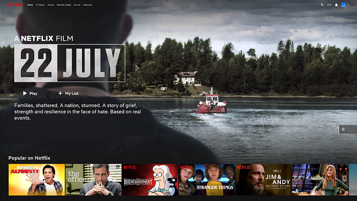
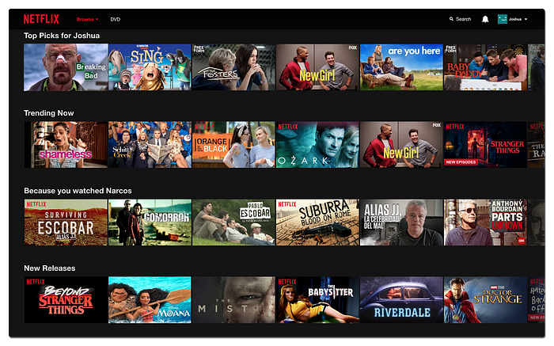
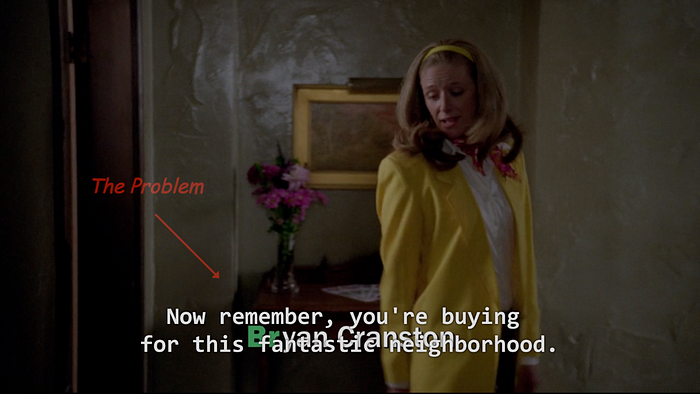

# The Netflix Media Database

Let us imagine we are working on the next generation adaptive video streaming algorithm. **Our goal is to minimize the playback startup time for the millions of Netflix members all over the world.** To do that we need to gather aggregate statistics (minimum, maximum, median, mean, any number of percentiles) for the header sizes of our [ISO BMFF](https://en.wikipedia.org/wiki/ISO_base_media_file_format) (Base Media File Format) formatted bitstreams. The Netflix trans-coding pipeline services a huge catalog of content and produces a large ladder of bitstreams (with varying codec + quality combinations) for every title. In the past, we would need to write one-off scripts that would crawl the bitstream header information from our bitstreams in an arduous fashion before we could analyze the data. Such an approach is clearly not scalable — a software bug in our script would reset the entire effort. Further, a new “throwaway” script would be needed for analyzing another completely different dimension of our media data. Repeating this methodology over several times for problems from different domains made us realize that there was a pattern here, and set us on the path to build a system that would address this in a scalable way.

This blog post introduces the **N**etflix **M**edia **D**ata**B**ase (NMDB) — a highly queryable data system built on the Netflix micro-services platform. NMDB is used to persist deeply technical metadata about various media assets at Netflix and to serve queries in near real-time using a combination of lookups as well as runtime computation. NMDB enables developers (such as video streaming researchers) to focus their time on developing insights into media data and crank out awesome data-driven algorithms as opposed to worrying about the task of collecting and organizing data.

## Why a Media Database?

An optimized user interface, meaningful personalized recommendations, efficient streaming and a vast catalog of content are the principal factors that define the end-user Netflix experience. A myriad of business workflows of varying complexities need to come together to realize this experience.

Artwork imagery and title synopses (see above picture) that are pertinent to the story as well as insightful video previews go a long way in helping users find relevant shows and movies. The ever increasing scale of content ingestion at Netflix necessitates the development of systems that can assist our creative teams synthesize high quality digital merchandise assets in a timely fashion. This could be done for example, by providing them with meaningful raw imagery and video clips automatically (algorithmically) extracted from the source video assets. This could serve as a starting point for creating engaging digital media assets.

As shown below, the content recommendations system economically surfaces choices that are personalized to the content preferences and tastes of the end-user. Compact and effective feature representations of the content present in the Netflix catalog are critical to this function. Such representations could for example, be obtained by building machine learning models that use the media files (audio, timed text, video) as well as title metadata (genre tags, synopses) as their input.

Efficient audio and video encoding recipes lead to creation of compact bitstreams — a precursor to efficient streaming of media over the Internet. Temporal and spatial video analyses such as detecting moments of shot and scene changes, as well as identifying salient parts and objects in the video frames help generate critical input for the video encoding system.

Lastly, maintaining high standards on the quality of the source content ingested at Netflix is vital to a great end-user Netflix experience. The above image illustrates one such use case. This image corresponds to a video frame for a title from the Western Classical genre. **In this case, a camera used for the production of the title is visible in the video.** It is highly desirable to have an automated analysis system that would detect and localize (perhaps through a rectangular bounding box) the presence of the camera. Another such case is illustrated in the following picture. In this case, the subtitles text is placed on top of the text that is burnt in the video rendering both of them unreadable. A video text detection algorithm together with knowledge of timing and positioning of subtitles could be used to solve this problem automatically.

We would like to note that the seemingly disparate use cases illustrated above actually overlap in their use of core component algorithms. For instance, shot change data serves a critical role for the video encoding use case. Different shots have different visual characteristics and merit different bit budgets. For the same reason, shot change data is also an essential ingredient for producing diverse raw imagery and video clips from source video assets. A collection of high quality raw artwork candidates could be obtained by selecting the top few candidates from each shot. Likewise, meaningful latent representations for video media can be constructed by composing per shot representations. As another example, while video text detection data serves an invaluable role in content quality control, it is also beneficial for the video encoding and the artwork automation use cases — video frames containing large amounts of text typically do not serve as good artwork image candidates.

Further, many of these analyses tend to be very expensive computationally — it would be highly inefficient to repeat the same computation when addressing different business use cases. Together, these reasons make an argument for a data system that could act as a universal storage for any analysis related to the timeline of a media. In other words, we need a “media database”.

## Characteristics of a Media Database

A media database houses media analysis data corresponding to media of varying modalities — these include audio, video, images, and text (e.g., subtitles). It is expected to service arbitrary queries on the media timeline. For example, what time intervals in the timeline of an audio track contain music, or the list of video frames in a video that contain text, or the set of time intervals in a subtitles file that correspond to dialog. Given the breadth of its scope, we believe that the following are the vital traits of a media database:

1. Affinity to structured data: Data that has a schema is amenable to machine-based processing and is thus available for analysis and consumption at scale. In our case, schema compliance allows us to index data which in-turn enables data search and mining opportunities. Further, this unburdens the creator of the data from needing to “white glove” consumers of the data. This results in an efficient overall system.
2. Efficient media timeline modeling: The ability to service various types of media timeline data ranging from periodic sample-oriented ones (e.g., video frames) to event based ones (e.g., timed text intervals) is a fundamental trait of a media database.
3. Spatio-temporal query-ability: A media database natively supports the temporal (e.g., time intervals in an audio track) as well as spatial (e.g., parts of an image) characteristics of media data and provides high query-ability on these dimensions. As an example, a media database makes it easy to check if a contiguous sequence of video frames contains text in a specific spatial region (e.g., top-left corner) of the video frame. Such a query could come in handy for detecting collisions between text present in video and subtitles.
4. Multi-tenancy: A well-designed media database could serve as a platform for supporting a plurality of analyses data from a plurality of applications. As such, it allows storing arbitrary data provided that it is structured. Additionally, if that data can also be associated to a particular time interval of the media resource, each tenant can then benefit from the efficient query-ability of our system.
5. Scalability: A scalable micro-services based model is essential. This means that the system has to address issues related to availability and consistency under various load scenarios.

## Introducing Netflix Media DataBase

The use cases outlined above inspired us to build NMDB — a universal store for any analysis related to the timeline of a media that can be used to answer spatio-temporal queries on the media timeline at scale. The Netflix catalog comprises a large number of media assets of varying modalities — examples of static assets includes images, and examples of playable assets include audio, text, and video. As was presented above, a myriad of business applications stand to benefit from access to in-depth semantic information pertaining to these assets. The primary goal of NMDB is to serve the requisite data needed by these applications — we think of NMDB as the data system that forms the backbone for various Netflix media processing systems.

## To Be Continued …

Efficient modeling of media timeline data is a core trait of NMDB. A canonical representation of the media timeline could support a large class of use cases while efficiently addressing user queries schema. This forms the subject for our next article in this series.

_— by Rohit Puri, Shinjan Tiwary, Sreeram Chakrovorthy, Subbu Venkatrav, Arsen Kostenko and Yi Guo_

---
**Tags:** Distributed Systems · Database · Media Timeline · Distributed Database · Nmdb
