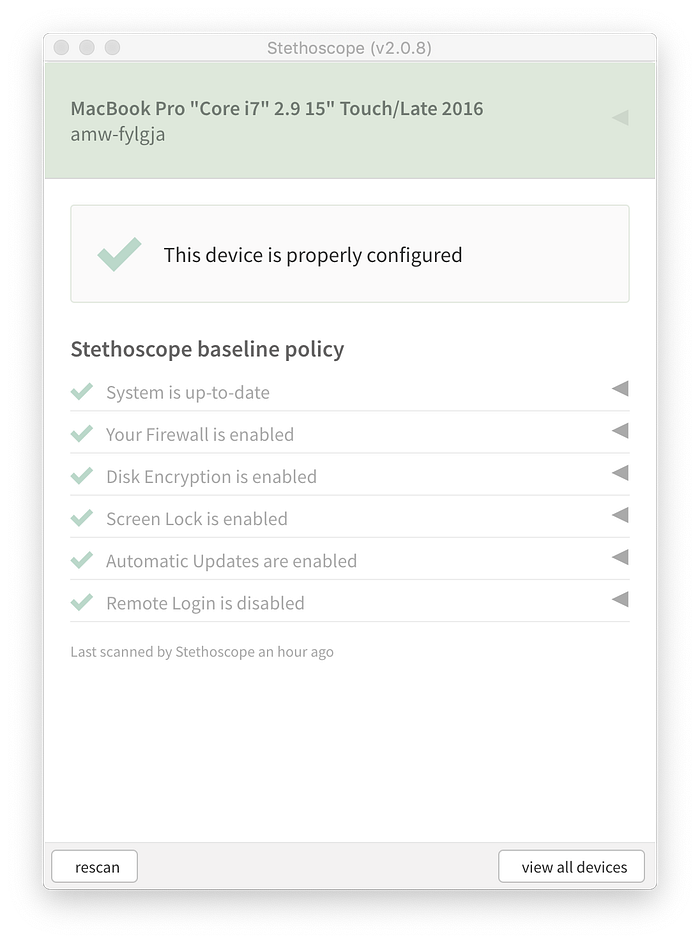
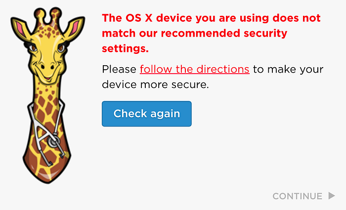

# The New Netflix Stethoscope Native App

> A user focused approach to endpoint health and management

We are happy to announce the next big release in user focused security, the [Stethoscope native app](https://github.com/Netflix-Skunkworks/stethoscope-app). The new native app includes basic device health recommendations with inline clickable instructions on how to update settings. It can also communicate with a web app (such as a Single Sign On provider) in order to make device health suggestions at pivotal moments.

Last year we introduced [Stethoscope](https://medium.com/netflix-techblog/introducing-netflix-stethoscope-5f3c392368e3) along with the concept of user focused security. TL;DR: Basic device hygiene is a fundamental security practice. People want to securely configure their devices, but they may not know what the best practices are, or how to comply with them. Empowering users to see the state of their devices and how to get them into an ideal state improves the overall security posture of an organization.

### Taking User Focused Security a Step Further

The first release of Stethoscope gave users visibility into data that is sourced from various Device Management platforms: JAMF, LANDESK, and Google MDM. One issue with this approach was that the web view users only saw updates as frequently as the device management software reports data, which is typically once a day. Additionally, as new patches or recommendations came out users had to go back to Stethoscope web or rely on out of band communications like emails to see if they had fallen into a bad state. Finally, it required an organization to implement one or more of these platforms and manage their users’ devices.

We’ve chosen to address these issues by providing our users with a native app that gives real time feedback to users.

### About the app

The Stethoscope native app can make the same basic recommendations about security practices that Stethoscope web can:

- Disk encryption
- Firewall
- Up-to-date OS/software
- Automatic updates
- Screen lock
- Remote login disabled
- Application is installed or not installed

Practices are evaluated real time in the app to give immediate feedback to users. If a user makes a settings change, they can rescan to see updated results. In addition to health scans being run on demand by users, the app provides a local server for outside processes to run device health scans. This provides a mechanism for applications to grant access conditionally based on the state of a connecting device.

Unique scenarios may require unique device health recommendations, so the app can be configured to be appropriate to the situation. The default [policy](https://github.com/Netflix-Skunkworks/stethoscope-app/blob/master/practices/policy.yaml) and [instructions](https://github.com/Netflix-Skunkworks/stethoscope-app/blob/master/practices/instructions.en.yaml) can be configured at build time. Additionally when other apps are running scans they can specify which security practices they care about, and what state they should be in.

The Stethoscope app was built with not just device health in mind, but also with security in mind. The app does not run as root, and has no elevated privileges. The app does not change settings for users automatically. This respects the user’s ownership of their device settings, but also has the benefit of not adding risk of settings being changed maliciously via the app. Device information can be sensitive, so we limited who is able to run scans. This is enforced via a CORS policy, which is [configured](https://github.com/Netflix-Skunkworks/stethoscope-app/blob/master/practices/config.yaml) at build time. The local server only listens on loopback so that device scans cannot be run outside of the local machine.

Currently Mac OS and Windows 10 devices are supported.

### Authentication Time Checks

Operating systems frequently release security patches, and people change device settings, so we think it’s important to remind people at a regular cadence about the state their devices are in.

While users are ultimately in charge of their devices’ settings, we think it’s appropriate to nudge people when they access sensitive data.

It was a natural fit to integrate health checks into our single sign on provider. When someone accesses a sensitive application the SSO provider makes a request to the app for data. If the check passes, they are logged in automatically. Otherwise they see a reminder to update their settings.

Checks at authentication time may not be the best fit for everyone. We’ve spoken to some groups who do not have the ability to modify their SSO providers, and some who have no centralized SSO or desire to collect user’s device information. An option we’ve seen used by one early Stethoscope adopter is to simply provide a signed build along with a recommendation for people to run it, and no ties to outside systems.

### Implementation

The Stethoscope native app is built with open source software. The native app is built using [Electron](https://electronjs.org/). Most of the device information is collected via [osquery](https://osquery.io/). The app bundles in [osqueryd](https://osquery.readthedocs.io/en/stable/introduction/using-osqueryd/), and when the app starts it launches osqueryd as a child process. When the app runs a scan it runs osquery queries via a Thrift socket, and creates the user interface with [React](https://reactjs.org/). In order for web applications to query device information, the app starts an [Express](http://expressjs.com/) server that listens only on loopback. [GraphQL](https://graphql.org/) is used to create a standard schema and query language for applications to get device data. Example device queries can be found [here](https://github.com/Netflix-Skunkworks/stethoscope-app/blob/master/docs/GRAPHQL.md).

For SSO we use a customized version of PingFederate, which allows us to add steps into the authentication process. We inserted a step that queries the native app, and displays appropriate messaging based on the results of the scan. This part of the process is fairly specific to Netflix, so we have chosen not to open source it for now.

### What About Mobile?

The world and the workforce are shifting to mobile. It’s important to ensure mobile devices are securely configured in addition to traditional corporate devices. We are working on a native mobile app, written with React Native. It makes basic recommendations about security practices to users for their mobile devices the same way the Electron app makes recommendations for Mac OS, and Windows devices.

### Join us!

We hope that other organizations find the Stethoscope app to be a useful tool, and we welcome contributions and opportunities for collaboration. We have open sourced the app, which can be found in the Netflix Skunkworks organization: [https://github.com/Netflix-Skunkworks/stethoscope-app](https://github.com/Netflix-Skunkworks/stethoscope-app). While we’re excited for the opportunity to collaborate, we chose to open source the app in Skunkworks for now, as we’re early in this journey, and are still making frequent changes.

Our Identity and Access Engineering and Enterprise Security teams are hiring managers at our Los Gatos office: [Identity Engineering Manager](https://jobs.netflix.com/jobs/868162) and [Corporate Information Security Manager](https://jobs.netflix.com/jobs/868204). If you’d like to help us work on Stethoscope and related tools, please apply!

---

_By: _[_Nicole Grinstead_](https://www.linkedin.com/in/nicole-grinstead-8549205b/)

_The Stethoscope app was written by and is maintained by _[_Rob McVey,_](https://www.linkedin.com/in/robmcvey/)_ _[_Jesse Kriss_](https://jklabs.net/)_, _[_Andrew White_](https://www.linkedin.com/in/andrewmwhite/)_ and _[_Nicole Grinstead_](https://www.linkedin.com/in/nicole-grinstead-8549205b/)

---
**Tags:** Endpoint Security · Electron · Osquery · GraphQL · Netflixsecurity
