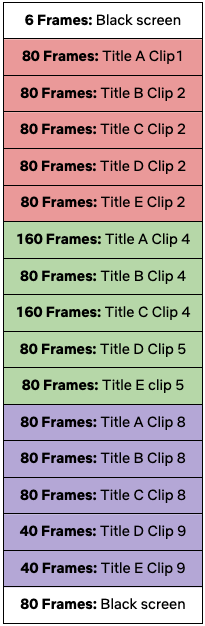
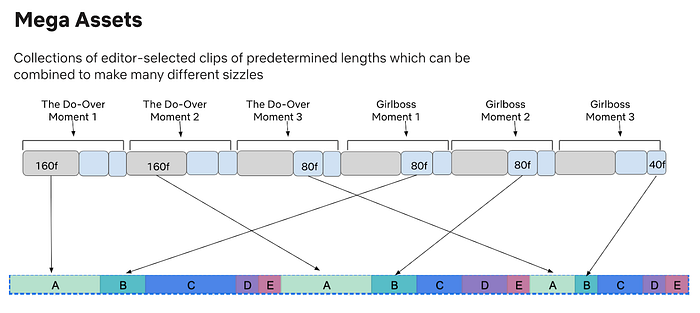

# The Next Step in Personalization: Dynamic Sizzles

Authors:[Bruce Wobbe](https://www.linkedin.com/in/bruce-wobbe-197395/), [Leticia Kwok](https://www.linkedin.com/in/leticiak/)

Additional Credits:[Sanford Holsapple](https://www.linkedin.com/in/sanford-holsapple-782a3a158/), [Eugene Lok](https://www.linkedin.com/in/eugene-lok-6465045b/), [Jeremy Kelly](https://www.linkedin.com/in/jeremy-kelly-526a30180/)

## Introduction

**At Netflix, we strive to give our members an excellent personalized experience, helping them make the most successful and satisfying selections from our thousands of titles. We already personalize ****[artwork](https://netflixtechblog.com/artwork-personalization-c589f074ad76)**** and trailers, but we hadn’t yet personalized sizzle reels — until now.**

A sizzle reel is a montage of video clips from different titles strung together into a seamless A/V asset that gets members excited about upcoming launches (for example, our Emmys nominations or holiday collections). **Now Netflix can create a personalized sizzle reel dynamically in real time and on demand. The order of the clips and included titles are personalized per member, giving each a unique and effective experience. These new personalized reels are called ****_Dynamic Sizzles_****.**

**In this post, we will dive into the exciting details of how we create Dynamic Sizzles with minimal human intervention, including the challenges we faced and the solutions we developed.**

An example of a Dynamic Sizzle created for Chuseok, the Korean mid-autumn harvest festival collection.

## Overview

In the past, each sizzle reel was created manually. The time and cost of doing this prevents scaling and misses the invaluable benefit of personalization, which is a bedrock principle at Netflix. We wanted to figure out how to efficiently scale sizzle reel production, while also incorporating personalization — all in an effort to yield greater engagement and enjoyment for our members.

Enter the creation of Dynamic Sizzles. We developed a systems-based approach that uses our interactive and creative technology to programmatically stitch together multiple video clips alongside a synced audio track. The process involves compiling personalized multi-title/multi-talent promotional A/V assets on the fly into a _Mega Asset_. A Mega Asset is a large A/V asset made up of video clips from various titles, acting as a library from which the Dynamic Sizzle pulls media. These clips are then used to construct a personalized Dynamic Sizzle according to a predefined cadence.

**With Dynamic Sizzles, we can utilize more focused creative work from editors and generate a multitude of personalized sizzle reels efficiently and effectively — up to 70% in terms of time and cost savings than a manually created one. This gives us the ability to create thousands, if not millions, of combinations of video clips and assets that result in optimized and personalized sizzle reel experiences for Netflix members.**

## Creating the Mega Asset

### Where To Begin

Our first challenge was figuring out how to create the Mega Asset, as each video clip needs to be precise in its selection and positioning. A Mega Asset can contain any number of clips, and millions of unique Dynamic Sizzles can be produced from a single Mega Asset.

We accomplished this by using human editors to select the clips — ensuring that they are well-defined from both a creative and technical standpoint — then laying them out in a specific known order in a timeline. We also need each clip marked with an index to its location — an extremely tedious and time consuming process for an editor. To solve this, we created an Adobe Premiere plug-in to automate the process. Further verifications can also be done programmatically via ingestion of the timecode data, as we can validate the structure of the Mega Asset by looking at the timecodes.

An example of a title’s video clips layout.

The above layout shows how a single title’s clips are ordered in a Mega Asset and in 3 different lengths: 160, 80 and 40 frame rates. Each clip should be unique per title; however, when using multiple titles, they may share the same frame rate. This gives us more variety to choose from while maintaining a structured order in the layout.

### Cadence

The cadence is a predetermined collection of clip lengths that indicates when, where, and for how long a title shows within a Dynamic Sizzle. The cadence ensures that when a Dynamic Sizzle is played, it will show a balanced view of any titles chosen, while still giving more time to a member’s higher ranked titles. Cadence is something we can personalize or randomize, and will continue to evolve as needed.

*Sample Cadence*

In the above sample cadence, Title A refers to the highest ranked title in a member’s personalized sort, Title B the second highest, and so on. The cadence is made up of 3 distinct segments with 5 chosen titles (A-E) played in sequence using various clip lengths. Each clip in the cadence refers to a different clip in the Mega Asset. For example, the 80 frame clip for title A in the first (red) segment is different from the 80 frame clip for title A in the third (purple) segment.

## Composing the Dynamic Sizzle

### Personalization

When a request comes in for a sizzle reel, our system determines what titles are in the Mega Asset and based on the request, a personalized list of titles is created and sorted. The top titles for a member are then used to construct the Dynamic Sizzle by leveraging the clips in the Mega Asset. Higher ranked titles get more weight in placement and allotted time.

### Finding Timecodes

For the Dynamic Sizzle process, we have to quickly and dynamically determine the timecodes for each clip in the Mega Asset and make sure they are easily accessed at runtime. We accomplish this by utilizing Netflix’s [Hollow technology](https://hollow.how/). Hollow allows us to store timecodes for quick searches and use timecodes as a map — a key can be used to find the timecodes needed as defined by the cadence. The key can be as simple as _titleId-clip-1._

### Building The Reel

The ordering of the clips are set by the predefined cadence, which dictates the final layout and helps easily build the Dynamic Sizzle. For example, if the system knows to use title 17 within the Mega Asset, we can easily calculate the time offset for all the clips because of the known ordering of the titles and clips within the Mega Asset. This all comes together in the following way:

The result is a series of timecodes indicating the start and stop times for each clip. These codes appear in the order they should be played and the player uses them to construct a seamless video experience as seen in the examples below:

*The Beautiful Game Dynamic Sizzle*

With Dynamic Sizzles, each member experiences a personalized sizzle reel.

*Example of what 2 different profiles might see for the same sizzle*

## Playing the Dynamic Sizzle

### Delivering To The Player

The player leverages the Mega Asset by using timecodes to know where to start and stop each clip, and then seamlessly plays each one right after the other. This required a change in the API that devices normally use to get trailers. The API change was twofold. First, on the request we need the device to indicate that it can support Dynamic Sizzles. Second, on the response the timecode list needs to be sent. (Changing the API and rolling it out took time, so this all had to be implemented before Dynamic Sizzles could actually be used, tested, and productized.)

### Challenges With The Player

There were two main challenges with the player. First, in order to support features like background music across multiple unique video segments, we needed to support asymmetrical segment streaming from discontiguous locations in the Mega Asset. This involved modifying existing schemas and adding corresponding support to the player to allow for the stitching of the video and audio together separately while still keeping the timecodes in sync. Second, we needed to optimize our streaming algorithms to account for these much shorter segments, as some of our previous assumptions were incorrect when dealing with dozens of discontiguous tiny segments in the asset.

### Building Great Things Together

We are just getting started on this journey to build truly great experiences. While the challenges may seem endless, the work is incredibly fulfilling. The core to bringing these great engineering solutions to life is the direct collaboration we have with our colleagues and innovating together to solve these challenges.

If you are interested in working on great technology like Dynamic Sizzles, we’d love to talk to you! We are hiring: [jobs.netflix.com](https://jobs.netflix.com/)

---
**Tags:** Personalization · Trailers · Automation · Realtime Video Processing
