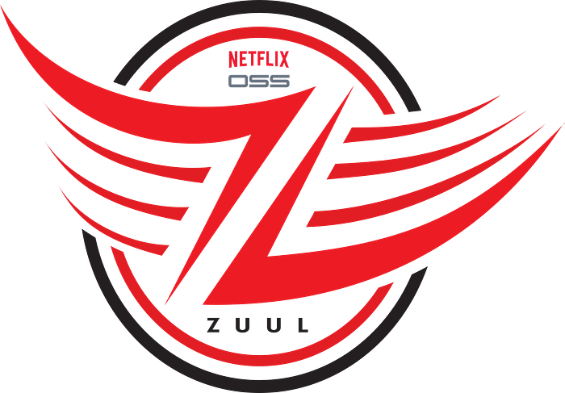
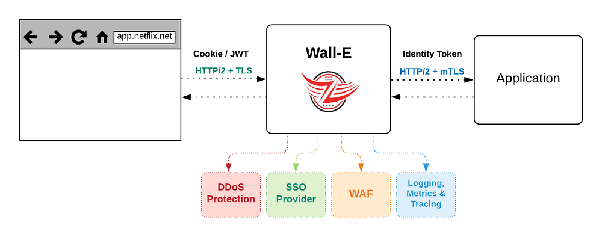
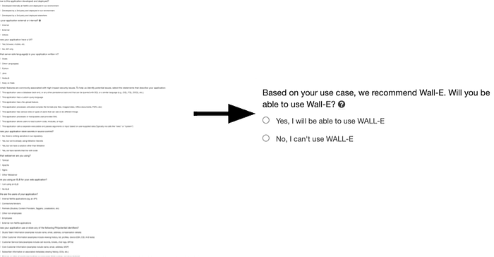
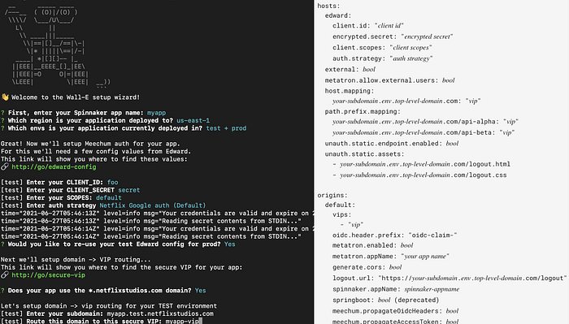

# The Show Must Go On: Securing Netflix Studios At Scale

_Written by _[_Jose Fernandez_](https://twitter.com/jrfernandez)_, _[_Arthur Gonigberg_](https://twitter.com/agonigberg)_, _[_Julia Knecht_](https://twitter.com/JuliaaMarieee)_, and _[_Patrick Thomas_](https://twitter.com/coffeetocode)

In 2017, Netflix Studios was hitting an inflection point from a period of merely rapid growth to the sort of explosive growth that throws “how do we scale?” into every conversation. The vision was to create a “Studio in the Cloud”, with applications supporting every part of the business from pitch to play. The security team was working diligently to support this effort, faced with two apparently contradictory priorities:

- 1) _streamline any security processes _so that we could get applications built and deployed to the public internet faster
- 2) _raise the overall security bar_ so that the accumulated risk of this giant and growing portfolio of newly internet-facing, high-sensitivity assets didn’t exceed its value

The journey to resolve that contradiction has been a collaboration that we’re proud of, and that we think exemplifies how Netflix approaches infrastructure product development and product security partnerships. You’ll hear from two teams here: first Application Security, and then Cloud Gateway.

**_Julia & Patrick (Netflix Application Security):_** In deciding how to address this, we focused on two observations. The first was that there were too many security things that each software team needed to think about — things like TLS certificates, authentication, security headers, request logging, rate limiting, among many others. There were security checklists for developers, but they were lengthy and mostly manual, neither of which contributed to the goal of accelerating development. Adding to the complexity, many of the checklist items themselves had a variety of different options to fulfill them (“new apps do _this_, but legacy apps do that”; “Java apps should use _this approach_, but Ruby apps should try _one of these four things”… _yes, there were flowcharts inside checklists. Ouch.). For development teams, just working through the flowcharts of requirements and options was a monumental task. Supporting developers through those checklists for edge cases, and then validating that each team’s choices resulted in an architecture with all the desired security properties, was similarly not scalable for our security engineers.

Our second observation centered on strong authentication as our highest-leverage control. Missing or incomplete authentication in an application was the most critical type of issue we regularly faced, while at the same time, an application that had a bulletproof authentication story was an application we considered to be lower risk. Concepts like Zero Trust, Beyond Corp, and Identity Aware Proxies all seemed to point the same way: ****there is powerful assurance in making 100% authentication a property of the ********_architecture_******** of the application rather than an implementation detail within an application******.**

With both of these observations in hand, we looked at the challenge through a lens that we have found incredibly valuable: how do we _productize_ it? Netflix engineers talk a lot about the concept of a “[Paved Road](https://www.oreilly.com/library/view/oscon-2017/9781491976227/video306724.html)”. One especially attractive part of a Paved Road approach for security teams with a large portfolio is that it helps turn lots of questions into a boolean proposition: Instead of “_Tell me how your app does this important security thing?_”, it’s just “_Are you using this paved road product that handles that?_”. So, what would a product look like that could tackle most of the security checklist for a team, and that also could give us that architectural property of guaranteed authentication? With these lofty goals in mind, we turned to our central engineering teams to help get us there.

---

## Partnering to Productize Security

**_Jose & Arthur (Netflix Cloud Gateway): _**The Cloud Gateway team develops and operates Netflix’s “[Front Door](https://www.linkedin.com/pulse/netlfixs-cloud-edge-architecture-philip-fisher-ogden/)”. Historically we have been responsible for connecting, routing, and steering internet traffic from Netflix subscribers to services in the cloud. Our gateways are powered by our flagship open-source technology [Zuul](https://github.com/Netflix/zuul). When Netflix Studios and our security partners approached us, the proposal was conceptually simple and a good fit for our modular, filter-based approach. To try it out, we deployed a custom Zuul build (which we named “API Wall” and eventually, more affectionately, “Wall-E”) with a new filter for Netflix’s Single-Sign-On provider, enabled it for all requests, and boom! — an application deployment strategy that guarantees authentication for services behind it.

## Killing the Checklist

Once we worked together to integrate our SSO with Wall-E, we had established a pretty exciting pattern of adding security requirements as filters. We thought back to our checklist through the lens of: which of these things are consistent enough across applications to add as a required filter? Our web application firewall (WAF), DDoS prevention, security header validation, and durable logging all fit the bill. One by one, we saw our checklists’ requirements bite the dust, and shift from ‘individual app developer-owned’ to ‘Wall-E owned’ (and consistently implemented!).

By this point, it was clear that we had achieved the vision in the AppSec team’s original request. We eventually were able to add so much security leverage into Wall-E that **the bulk of the “going internet-facing” checklist for Studio applications boiled down to one item: _Will you use Wall-E?_**

*A small section of our go-external security questionnaire and checklist for studio apps before Wall-E and after Wall-E.*

## The Early Adopter Challenge

Wall-E’s early adopters were handpicked and nudged along by the Application Security team. Back then, the Cloud Gateway team had to work closely with application developers to provide a seamless migration without disrupting users. These joint efforts took several weeks for both parties. During our initial consultations, it was clear that developers preferred prioritizing product work over security or infrastructure improvements. Our meetings usually ended like this: “Security suggested we talk to you, and we like the idea of improving our security posture, but we have product goals to meet. Let’s talk again next quarter”. These conversations surfaced a couple of problems we knew we had to overcome to address this early adopter challenge:

1. Setting up Wall-E for an application took too much time and effort, and the hands-on approach would not scale.
2. Security improvements alone were not enough to drive organic adoption in Netflix’s “context not control” culture.

We were under pressure to improve our adoption numbers and decided to focus first on the setup friction by improving the developer experience and automating the onboarding process.

## Scaling With Developer Experience

Developers in the Netflix streaming world compose the customer-facing Netflix experience out of hundreds of microservices, reachable by complex routing rules. On the Netflix Studio side, in Content Engineering, each team develops distinct products with simpler routing needs. To support that much different model, we did another thing that seemed simple at the time but has had an outsized impact over the years: we asked app teams to integrate with us by creating a version-controlled YAML file. Originally this was intended as a simplified and developer-friendly way to help collect domain names and some routing rules into a versionable package, but we quickly realized we had stumbled into a powerful model: we were harvesting developer _intent_.

*An interactive Wall-E configuration wizard, and a concise declarative format for an application’s routing, resource, and authentication decisions*

This small change was a kind of magic, and completely flipped our relationship with development teams: since we had a concise, standardized definition of the app they intended to expose, we could proactively automate a lot of the setup. Specify a domain name? Wall-E can ensure that it automagically exists, with DNS and TLS configured correctly. Iterating on this experience eventually led to other intent-based streamlining, like asking about intended user populations and related applications (to select OAuth configs and claims). We could now tell developers that setting up Wall-E would only take a few minutes and that our tooling would automate everything.

## Going Faster, Faster

As all of these pieces came together, app teams outside Studio took notice. **For a typical paved road application with no unusual security complications, a team could go from “git init” to a production-ready, fully authenticated, internet accessible application in a little less than 10 minutes**. The automation of the infrastructure setup, combined with reducing risk enough to streamline security review saves developers days, if not weeks, on _each application_. Developers didn’t necessarily care that the original motivating factor was about security: what they saw in practice was that apps using Wall-E could get in front of users sooner, and iterate faster.

This created that virtuous cycle that core engineering product teams get incredibly excited about: more users make the amortized platform investment more valuable, but they also bring more ideas and clarity for feature ideas, which in turn attract more users. This set the tone for the next year of development, along two tracks: fixing adoption blockers, and turning more “developer intent” into product features to just handle things for them.

For adoption, both the security team and our team were asking the same question of developers: Is there anything that prevents you from using Wall-E? Each time we got an answer to that question, we tried to figure out how we could address it. Nearly all of the blockers related to systems in which (usually for historical reasons) some application team was solving both authentication and application routing in a custom way. Examples include legacy mTLS and various webhook schemes​. With Wall-E as a clear, durable, paved road choice, we finally had enough of a carrot to move these teams away from supporting unique, potentially risky features. The value proposition wasn’t just “let us help you migrate and you’ll only ever have to deal with incoming traffic that is already properly authenticated”, it was also “you can throw away the services and manual processes that handled your custom mechanisms and offload any responsibility for authentication, WAF integration and monitoring, and DDoS protection _to the platform_”. Overall, we cannot overstate the value of organizationally committing to a single paved road product to handle these kinds of concerns. It creates an amazing clarity and strategic pressure that helps align _actual services that teams operate_ to the charters and expertise that define them. The difference between 2–4 “right-ish” ways and a **single** paved road one is powerful.

Also, with fewer exceptions and clearer criteria for apps that should adopt this paved road, our AppSec Engineering and **User Focused Security Engineering (UFSE)** teams could automate security guidance to give more appropriate automated nudges for adoption. Every leader’s security risk dashboard now includes a Wall-E adoption metric, and roughly ⅔ of recommended apps have chosen to adopt it. Wall-E now fronts over 350 applications, and is adding roughly 3 new production applications (mostly internet-facing) _per week_.

*Automated guidance data, showing the percentage of applications recommended to use Wall-E which have taken it up. The jumpiness in the number of apps recommended for adoption is real: as adoption blockers were discovered then eventually solved, and as we standardized guidance across the company, our automated recommendations reflected these developments.*

As adoption continued to increase, we looked at various signals of developer intent for good functionality to move from development-team-owned to platform-owned. One particularly pleasing example turned out to be UI hosting: it popped up over and over again as both an awkward exception to our “full authentication” goal, and also oftentimes the only thing that required Single Page App (SPA) UI teams to run actual cloud instances and have to be on-call for infrastructure. This eventually matured into an opinionated, declarative asset service that abstracts static file hosting for application teams: developers get fast static asset deployments, security gets strong guardrails around UI applications, and Netflix overall has fewer cloud instances to manage (and pay for!). Wall-E became a requirement for the best UI developer experience, and that drove even more adoption.

A productized approach also meant that we could efficiently enable lots of complex but “nice to have” features to enhance the developer experience, like [Atlas metrics for free](https://netflixtechblog.com/introducing-atlas-netflixs-primary-telemetry-platform-bd31f4d8ed9a), and integration with our [request tracing tool, Edgar](./edgar-solving-mysteries-faster-with-observability-e1a76302c71f.md).

## From Product to Platform

You may have noticed a word sneak into the conversation up there… “platform”. Netflix has a Developer Productivity organization: teams dedicated to helping other developers be more effective. A big part of their work is this idea of harvesting developer intent and automating the necessary touchpoints across our systems. As these teams came to see Wall-E as the clear answer for many of their customers, they started integrating their tools to configure Wall-E from the even higher level developer intents _they_ were harvesting. In effect, this moves authentication and traffic routing (and everything else that Wall-E handles) from being a specific product that developers need to think about and make a _choice_ about, to just a fact that developers can trust and generally ignore. In 2019, essentially 100% of the Wall-E app configuration was done manually by developers.** In 2021, that interaction has changed dramatically: now more than 50% of app configuration in WallE is done by automated tools (which are acting on higher-level abstractions on behalf of developers).**

This scale and standardization again multiplies value: our internal risk quantification forecasts show compelling annualized savings in risk and incident response costs across the Wall-E portfolio. These applications have fewer, less severe, and less exploitable bugs compared to non-Wall-E apps, and we rarely need an urgent response from app owners (we call this _not-getting-paged-at-midnight-as-a-service_). Developer time saved on initial application setup and unneeded services additionally adds up on the order of team-months of productivity per year.

Looking back to the core need that started us down this road (“_streamline any security processes […]_” and “_raise the overall security bar […]_”), Wall-E’s evolution to being part of the platform cements and extends the initial success. Going forward, more and more apps and developers can benefit from these security assurances while needing to think less and less about them. It’s an outcome we’re quite proud of.

## Let’s Do More Of That

To briefly recap, here’s a few of the things that we take away from this journey:

- If you can do _one thing_ to manage a large product security portfolio, do bulletproof authentication; preferably as a property of the _architecture_
- Security teams and central engineering teams can and should have a collaborative, mutually supportive partnership
- “Productizing” a capability (eg: clearly articulated; defined value proposition; branded; measured), even for internal tools, is useful to drive adoption and find further value
- A specific product makes the “paved road” clearer; a boolean “uses/doesn’t use” is strongly preferable to various options with subtle caveats
- Hitch the security wagon to developer productivity
- Harvesting intent is powerful; it lets many teams add value

## What’s Next

We see incredible power in this kind of security/infrastructure partnership work, and we’re excited to leverage these wins into our next goal: to truly become an infrastructure-as-service provider by building a full-fledged Gateway API, thereby handing off ownership of the developer experience to our partner teams in the Developer Productivity organization. This will allow us to focus on the challenges that will come on our way to the next milestone: 1000 applications behind Wall-E.

If this kind of thing is exciting to you, we are hiring for both of these teams: [Senior Software Engineer](https://jobs.netflix.com/jobs/79606915) and [Engineering Manager](https://jobs.netflix.com/jobs/81138242) on Application Networking; and [Senior Security Partner](https://jobs.netflix.com/jobs/84208051) and [Appsec Senior Software Engineer](https://jobs.netflix.com/jobs/98588293).

_With special thanks to Cloud Gateway and InfoSec team members past and present, especially Sunil Agrawal, Mikey Cohen, Luke Kosewski_,_ Will Rose, Dilip Kancharla, Grant Callaghan, our partners on Studio & Developer Productivity, and the early Wall-E adopters that provided valuable feedback and ideas. And also to Queen for the song references we slipped in; tell us if you find ’em all._

---
**Tags:** Netflix · Cloud Security · Technology · Security · Cloud Networking
