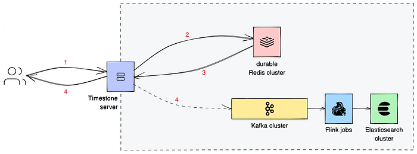
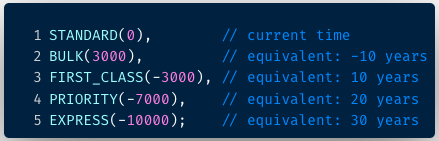
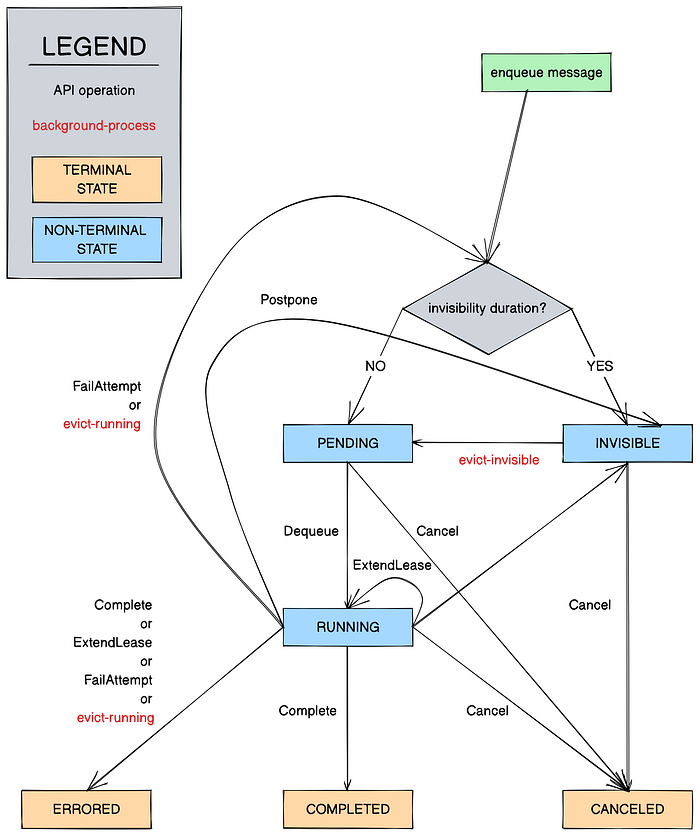
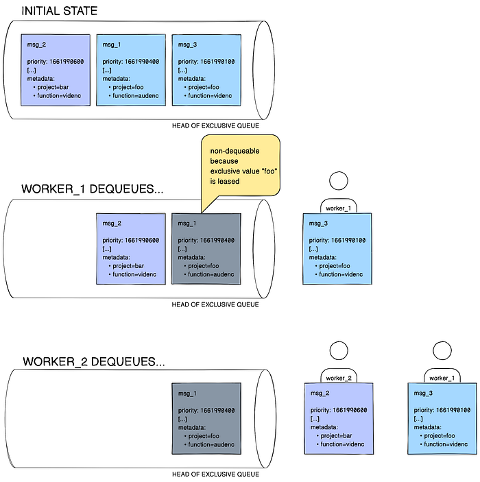

# Timestone: Netflix’s High-Throughput, Low-Latency Priority Queueing System with Built-in Support for Non-Parallelizable Workloads

_by _[_Kostas Christidis_](https://www.linkedin.com/in/konstantinoschristidis/)

## Introduction

Timestone is a high-throughput, low-latency priority queueing system we built in-house to support the needs of our media encoding platform, [Cosmos](./the-netflix-cosmos-platform-35c14d9351ad.md). Over the past 2.5 years, its usage has increased, and Timestone is now also the priority queueing engine backing our general-purpose workflow orchestration engine ([Conductor](https://conductor.netflix.com/)), and the scheduler for large-scale data pipelines ([BDP Scheduler](https://www.infoq.com/presentations/netflix-big-data-orchestrator/)). All in all, millions of critical workflows within Netflix now flow through Timestone on a daily basis.

Timestone clients can create queues, enqueue messages with user-defined deadlines and metadata, then dequeue these messages in an earliest-deadline-first (EDF) fashion. Filtering for EDF messages with criteria (e.g. “messages that belong to queue X and have metadata Y”) is also supported.

One of the things that make Timestone different from other priority queues is its support for a construct we call _exclusive queues _— this is a means to mark chunks of work as non-parallelizable, without requiring any locking or coordination on the consumer side; everything is taken care of by the exclusive queue in the background. We explain the concept in detail in the sections that follow.

## Why Timestone

When designing the successor to Reloaded — our media encoding system — back in 2018 (see “Background” section in [The Netflix Cosmos Platform](./the-netflix-cosmos-platform-35c14d9351ad.md)), we needed a priority queueing system that would provide queues between the three components in Cosmos (**Figure 1**):

1. the API framework (Optimus),
2. the forward chaining rule engine (Plato), and
3. the serverless computing layer (Stratum)

*Figure 1. A video encoding application built on top of Cosmos. Notice the three Cosmos subsystems: Optimus, an API layer mapping external requests to internal business models, Plato, a workflow layer for business rule modeling, and Stratum, the serverless layer for running stateless and computational-intensive functions. Source: The Netflix Cosmos Platform*

Some of the key requirements this priority queueing system would need to satisfy:

1. A message can only be assigned to one worker at any given time. The work that tends to happen in Cosmos is resource-intensive, and can fan out to thousands of actions. **Assume then, that there is replication lag between the replicas in our data store, and we present as dequeueable to worker B the message that was just dequeued by worker A via a different node. When we do that, we waste significant compute cycles. This requirement then throws eventually consistent solutions out of the window, and means we want ****[linearizable consistency](https://jepsen.io/consistency/models/linearizable)**** at the queue level.**

2. Allow for non-parallelizable work.

_Given_ that Plato is continuously polling all workflow queues for more work to execute —

_While_ Plato is executing a workflow for a given project (a request for work on a given service) —

_Then_ Plato should not be able to dequeue additional requests for work for that project on that workflow. Otherwise Plato’s inference engine will evaluate the workflow prematurely, and may move the workflow to an incorrect state.

There exists then, a certain type of work in Cosmos that should not be parallelizable, and the ask is for the queueing system to support this type of access pattern natively. This requirement gave birth to the exclusive queue concept. We explain how exclusive queues work in Timestone in the“Key Concepts” section.

3. Allow for dequeueing and queue depth querying using filters (metadata key-value pairs)

4. Allow for the automatic creation of a queue upon message ingestion

5. Render a message dequeueable within a second of ingestion

We built Timestone because we could not find an off-the-shelf solution that meets these requirements.

## System Architecture

Timestone is a gRPC-based service. We use protocol buffers to define the interface of our service and the structure of our request and response messages. The system diagram for the application is shown in **Figure 2**.

*Figure 2. Timestone system diagram. Arrows link all the components touched during a typical Timestone client-server interaction. Numbers in red indicate sequence steps. Identical numbers identify concurrent steps.*

### System of record

The system of record is a durable Redis cluster. Every write request (see Step 1 — note that this _includes_ dequeue requests since they alter the state of the queue) that reaches the cluster (Step 2) is persisted to a transaction log _before_ a response is sent back to the server (Step 3).

Inside the database, we represent each queue with [a sorted set](https://redis.com/ebook/part-1-getting-started/chapter-1-getting-to-know-redis/1-2-what-redis-data-structures-look-like/1-2-5-sorted-sets-in-redis/) where we rank message IDs (see “Message” section) according to priority. We persist messages and queue configurations (see “Queues” section) in Redis as [hashes](https://redis.com/ebook/part-1-getting-started/chapter-1-getting-to-know-redis/1-2-what-redis-data-structures-look-like/1-2-4-hashes-in-redis/). All data structures related to a queue — from the messages it contains to the in-memory secondary indexes needed to support dequeue-by-filter — are placed in the same Redis shard. We achieve this by having them share a common prefix, specific to the queue in question. We then codify this prefix as a [Redis hash tag](https://redis.io/docs/reference/cluster-spec/#hash-tags). Each message carries a payload (see “Message” section) that can weigh up to 32 KiB.

Almost all of the interactions between Timestone and Redis (see “Message States” section) are codified as Lua scripts. In most of these Lua scripts, we tend to update a number of data structures. Since Redis guarantees that each script is executed atomically, a successful script execution is guaranteed to leave the system in a consistent (in the ACID sense) state.

All API operations are queue-scoped. All API operations that modify state are [idempotent](https://martinfowler.com/articles/patterns-of-distributed-systems/idempotent-receiver.html).

### Secondary indexes

For observability purposes, we capture information about incoming messages and their transition between states in two secondary indexes maintained in Elasticsearch. When we get a write response from Redis, we concurrently (a) return the response to the client, and (b) convert this response into an event that we post to a Kafka cluster, as shown in Step 4. Two Flink jobs — one for each type of index we maintain — consume the events from the corresponding Kafka topics, and update the indexes in Elasticsearch.

One index (“current”) gives users a best-effort view into the current state of the system, while the other index (“historic”) gives users a best effort longitudinal view for messages, allowing them to trace the messages as they flow through Timestone, and answer questions such as time spent in a state, and number of processing errors. We maintain a version counter for each message; every write operation increments that counter. We rely on that version counter to order the events in the historic index. Events are stored in the Elasticsearch cluster for a finite number of days.

## Current Usage at Netflix

The system is dequeue heavy. We see 30K dequeue requests per second (RPS) with a P99 latency of 45ms. In comparison, we see 1.2K enqueue RPS at 25ms P99 latency. We regularly see 5K RPS enqueue bursts at 85ms P99 latency. 15B messages have been enqueued to Timestone since the beginning of the year; these messages have been dequeued 400B times. Pending messages regularly reach 10M. Usage is expected to double next year, as we migrate the rest of Reloaded, our legacy media encoding system, to Cosmos.

## Key Concepts

### Message

A message carries an opaque **payload**, a user-defined priority (see “Priority” section), an optional (mandatory for exclusive queues) **set of metadata key-value pairs** that can be used for filter-based dequeueing, and an optional **invisibility duration**. Any message that is placed into a queue can be dequeued a finite number of times. We call these **attempts**; each dequeue invocation on a message decreases the attempts left on it.

### Priority

The priority of a message is expressed as an integer value; the lower the value, the higher the priority. While an application is free to use whatever range they see fit, the norm is to use Unix timestamps in milliseconds (e.g. 1661990400000 for 9/1/2022 midnight UTC).

*Figure 3. A snippet from the PriorityClass enum used by a streaming encoding pipeline in Cosmos. The values in parentheses indicate the offset in days.*

It is also entirely up to the application to define its own priority levels. For instance a streaming encoding pipeline within Cosmos uses mail priority classes, as shown in **Figure 3**. Messages belonging to the standard class use the time of enqueue as their priority, while all other classes have their priority values adjusted in multiples of ∼10 years. The priority is set at the workflow rule level, but can be overridden if the request carries a studio tag, such as `DAY_OF_BROADCAST`.

### Message States

Within a queue, a Timestone message belongs to one of six states (Figure 4):

1. invisible
2. pending
3. running
4. completed
5. canceled
6. errored

In general, a message can be enqueued with or without invisibility, which makes the message **invisible** or **pending** respectively. Invisible messages become pending when their invisibility window elapses. **A worker can dequeue a pending earliest-deadline-first message from a queue by specifying the amount of time (******lease duration******) they will be processing it for.** Dequeueing messages in batch is also supported. This moves the message to the **running** state. The same worker can then issue a complete call to Timestone within the allotted lease window to move the message to the **completed** state, or issue a lease extension call if they want to maintain control of the message. (A worker can also move a typically **running** message to the **canceled** state to signal it is no longer need for processing.) If none of these calls are issued on time, the message becomes dequeueable again, and this attempt on the message is spent. If there are no attempts left on the message, it is moved automatically to the **errored** state. The **terminal states** (completed, errored, and canceled) are garbage-collected periodically by a background process.

Messages can move states either when a worker invokes an API operation, or when Timestone runs its background processes (Figure 4, marked in red — these run periodically). **Figure 4** shows the complete state transition diagram.

*Figure 4. State transition diagram for Timestone messages.*

### Queues

All incoming messages are stored in queues. Within a queue, messages are sorted by their priority date. Timestone can host an arbitrary number of user-created queues, and offers a set of API operations for queue management, all revolving around a **queue configuration** object. Data we store in this object includes the queue’s type (see rest of section), the lease duration that applies to dequeued messages, or the invisibility duration that applies to enqueued messages, the number of times a message can be dequeued, and whether enqueueing or dequeueing is temporarily blocked. Note that a message producer can override the default lease or invisibility duration by setting it at the message level during enqueue.

All queues in Timestone fall into two types, **simple**, and **exclusive**.

When an **exclusive queue** is created, it is associated with a user-defined **exclusivity key** — for example `project`. All messages posted to that queue must carry this key in their metadata. For instance, a message with `project=foo` will be accepted into the queue; a message without the `project` key will not be. In this example, we call `foo`, the value that corresponds to the exclusivity key, the message’s **exclusivity value**. The contract for exclusive queues is that _at any point in time, there can be only up to one consumer per exclusivity value_. Therefore, if the `project`-based exclusive queue in our example has two messages with the key-value pair `project=foo` in it, and one of them is already leased out to a worker, the other one is not dequeueable. This is depicted in **Figure 5**.

*Figure 5. When worker_2 issues a dequeue call, they lease msg_2 instead of msg_1, even though msg_1 has a higher priority. That happens because the queue is exclusive, and the exclusive value foo is already leased out.*

In a simple queue no such contract applies, and there is no tight coupling with message metadata keys. A simple queue works as your typical priority queue, simply ordering messages in an earliest-deadline-first fashion.

## What We Are Working On

Some of the things we’re working on:

1. As the the usage of Timestone within Cosmos grows, so does the need to support a range of queue depth queries. To solve this, we are building a dedicated query service that uses [a distinct query model](https://martinfowler.com/bliki/CQRS.html).
2. As noted above (see “System of record” section), a queue and its contents can only currently occupy one Redis shard. Hot queues however can grow big, esp. when compute capacity is scarce. We want to support arbitrarily large queues, which has us building support for queue sharding.
3. Messages can carry up to 4 key-value pairs. We currently use all of these key-value pairs to populate the secondary indexes used during dequeue-by-filter. This operation is exponentially complex both in terms of time and space (O(2^n)). We are switching to lexicographical ordering on sorted sets to drop the number of indexes by half, and handle metadata in a more cost-efficient manner.

We may be covering our work on the above in follow-up posts. If these kinds of problems sound interesting to you, and if you like the challenges of building distributed systems for the Netflix Content and Studio ecosystem at scale in general, [you should consider joining us](https://jobs.netflix.com/jobs/229880272).

## Acknowledgements

[Poorna Reddy](https://www.linkedin.com/in/poorna-reddy-5721939/), [Aravindan Ramkumar](https://www.linkedin.com/in/aravindanr/), [Surafel Korse](https://www.linkedin.com/in/surafel/), [Jiaofen Xu](https://www.linkedin.com/in/jiaofen-xu-39044552/), [Anoop Panicker](https://www.linkedin.com/in/anoop-panicker/), and [Kishore Banala](https://www.linkedin.com/in/kishore-banala/) have contributed to this project. We thank [Charles Zhao](https://www.linkedin.com/in/czhao/), [Olof Johansson](https://www.linkedin.com/in/olofjohanson/), [Frank San Miguel](https://www.linkedin.com/in/franksanmiguel/), [Dmitry Vasilyev](https://www.linkedin.com/in/dmitry-vasilyev-70148a5a/), [Prudhvi Chaganti](https://www.linkedin.com/in/prudhvichaganti/), and the rest of the Cosmos team for their constructive feedback while developing and operating Timestone.

---
**Tags:** Distributed Systems · Priority Queue · Redis
