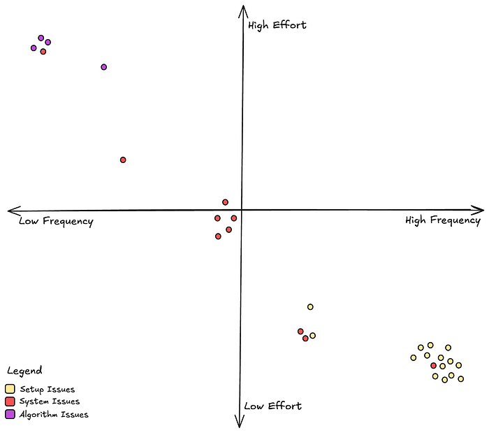
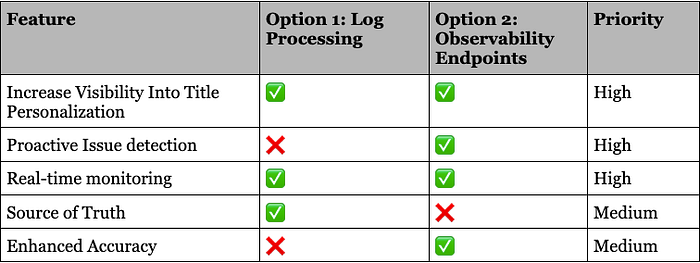

# Title Launch Observability at Netflix Scale

> Part 2: Navigating Ambiguity

**By:** [Varun Khaitan](https://www.linkedin.com/in/varun-khaitan/)

With special thanks to my stunning colleagues: [Mallika Rao](https://www.linkedin.com/in/mallikarao/), [Esmir Mesic](https://www.linkedin.com/in/esmir-mesic/), [Hugo Marques](https://www.linkedin.com/in/hugodesmarques/)

Building on the foundation laid in [Part 1](https://medium.com/netflix-techblog/title-launch-observability-at-netflix-scale-c88c586629eb), where we explored the “what” behind the challenges of title launch observability at Netflix, this post shifts focus to the “how.” How do we ensure every title launches seamlessly and remains discoverable by the right audience?

In the dynamic world of technology, it’s tempting to leap into problem-solving mode. But the key to lasting success lies in taking a step back — understanding the broader context before diving into solutions. This thoughtful approach doesn’t just address immediate hurdles; it builds the resilience and scalability needed for the future. Let’s explore how this mindset drives results.

## Understanding the Bigger Picture

Let’s take a comprehensive look at all the elements involved and how they interconnect. We should aim to address questions such as: What is vital to the business? Which aspects of the problem are essential to resolve? And how did we arrive at this point?

This process involves:

1. **Identifying Stakeholders: **Determine who is impacted by the issue and whose input is crucial for a successful resolution. In this case, the main stakeholders are:  
  
-**_ Title Launch Operators  
Role:_**_ Responsible for setting up the title and its metadata into our systems.  
_**_Challenge:_**_ Don’t understand the cascading effects of their setup on these perceived black box personalization systems  
  
-_**_ Personalization System Engineers_**_  
 _**_Role: _**_Develop and operate the personalization systems.  
_**_Challenge:_**_ End up spending unplanned cycles on title launch and personalization investigations.  
  
- _**_Product Managers _**_  
_**_Role: _**_Ensure we put forward the best experience for our members.  
_**_Challenge: _**_Members may not connect with the most relevant title.  
  
- _**_Creative Representatives_**_   
_**_Role:_**_ Mediator between the content creators and Netflix.  
_**_Challenge: _**_Build trust in the Netflix brand with content creators._
2. **Mapping the Current Landscape:** By charting the existing landscape, we can pinpoint areas ripe for improvement and steer clear of redundant efforts. Beyond the scattered solutions and makeshift scripts, it became evident that there was no established solution for title launch observability. This suggests that this area has been neglected for quite some time and likely requires significant investment. This situation presents both challenges and opportunities; while it may be more difficult to make initial progress, there are plenty of easy wins to capitalize on.
3. **Clarifying the Core Problem:** By clearly defining the problem, we can ensure that our solutions address the root cause rather than just the symptoms. While there were many issues and problems we could address, the core problem here was to make sure every title was treated fairly by our personalization stack. If we can ensure fair treatment with confidence and bring that visibility to all our stakeholders, we can address all their challenges.
4. **Assessing Business Priorities: **Understanding what is most important to the organization helps prioritize actions and resources effectively. In this context, we’re focused on developing systems that ensure successful title launches, build trust between content creators and our brand, and reduce engineering operational overhead. While this is a critical business need and we definitely should solve it, it’s essential to evaluate how it stacks up against other priorities across different areas of the organization.

## Defining Title Health

Navigating such an ambiguous space required a shared understanding to foster clarity and collaboration. To address this, we introduced the term “Title Health,” a concept designed to help us communicate effectively and capture the nuances of maintaining each title’s visibility and performance. This shared language became a foundation for discussing the complexities of this domain.

**“Title Health”** encompasses various metrics and indicators that reflect how well a title is performing, in terms of discoverability and member engagement. The three main questions we try to answer are:

1. Is this title visible at all to **any** **member**?
2. Is this title visible to an appropriate **audience size**?
3. Is this title reaching **all the appropriate audiences**?

Defining Title Health provided a framework to monitor and optimize each title’s lifecycle. It allowed us to align with partners on principles and requirements before building solutions, ensuring every title reaches its intended audience seamlessly. This common language not only introduced the problem space effectively but also accelerated collaboration and decision-making across teams.

## Categories of issues

To build a robust plan for title launch observability, we first needed to categorize the types of issues we encounter. This structured approach allows us to address all aspects of title health comprehensively.

Currently, these issues are grouped into three primary categories:

**1. Title Setup**

**A title’s setup includes essential attributes like metadata (e.g., launch dates, audio and subtitle languages, editorial tags) and assets (e.g., artwork, trailers, supplemental messages).** These elements are critical for a title’s eligibility in a row, accurate personalization, and an engaging presentation. Since these attributes feed directly into algorithms, any delays or inaccuracies can ripple through the system.

The observability system must ensure that title setup is complete and validated in a timely manner, identify potential bottlenecks and ensure a smooth launch process.

**2. Personalization Systems**

Titles are eligible to be recommended across multiple canvases on product — HomePage, Coming Soon, Messaging, Search and more. Personalization systems handle the recommendation and serving of titles on these canvases, leveraging a vast ecosystem of microservices, caches, databases, code, and configurations to build these product canvases.

We aim to validate that titles are eligible in all appropriate product canvases across the end to end personalization stack during all of the title’s launch phases.

**3. Algorithms**

Complex algorithms drive each personalized product experience, recommending titles tailored to individual members. Observability here means validating the accuracy of algorithmic recommendations for all titles.  
Algorithmic performance can be affected by various factors, such as model shortcomings, incomplete or inaccurate input signals, feature anomalies, or interactions between titles. Identifying and addressing these issues ensures that recommendations remain precise and effective.

By categorizing issues into these areas, we can systematically address challenges and deliver a reliable, personalized experience for every title on our platform.

## Issue Analysis

Let’s also learn more about how often we see each of these types of issues and how much effort it takes to fix them once they come up.

From the above chart, we see that setup issues are the most common but they are also easy to fix since it’s relatively straightforward to go back and rectify a title’s metadata. System issues, which mostly manifest as bugs in our personalization microservices are not uncommon, and they take moderate effort to address. Algorithm issues, while rare, are really difficult to address since these often involve interpreting and retraining complex machine learning models.

## Evaluating Our Options

Now that we understand more deeply about the problems we want to address and how we should go about prioritizing our resources. Lets go back to the two options we discussed in Part 1, and make an informed decision.

Ultimately, we realized this space demands the full spectrum of features we’ve discussed. But the question remained: _Where do we start?_   
After careful consideration, we chose to focus on proactive issue detection first. Catching problems before launch offered the greatest potential for business impact, ensuring smoother launches, better member experiences, and stronger system reliability.

This decision wasn’t just about solving today’s challenges — it was about laying the foundation for a scalable, robust system that can grow with the complexities of our ever-evolving platform.

## Up next

In the next iteration we will talk about how to design an observability endpoint that works for all personalization systems. What are the main things to keep in mind while creating a microservice API endpoint? How do we ensure standardization? What is the architecture of the systems involved?

Keep an eye out for our next binge-worthy episode!

---
**Tags:** Netflix · Observability · Staff Engineering · Ambiguity
