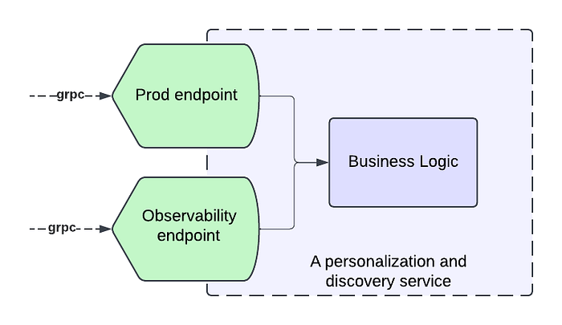
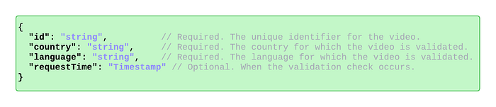
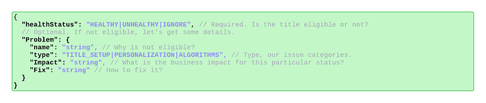
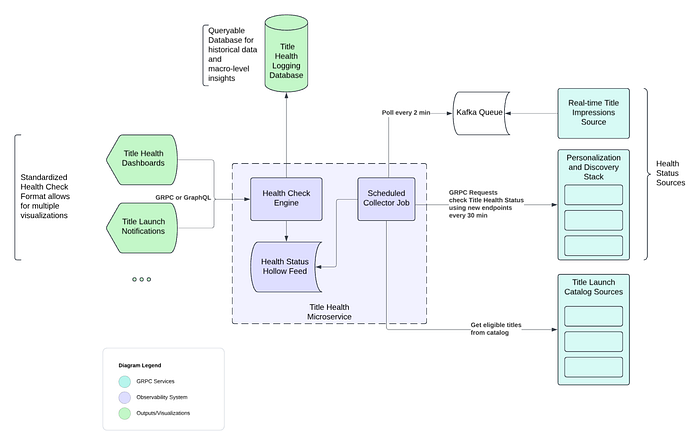
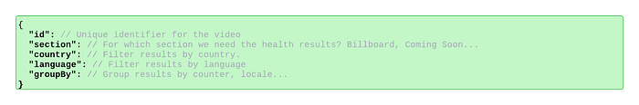
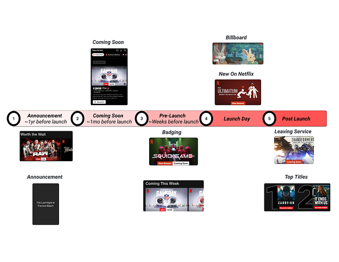
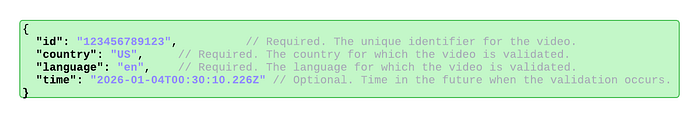

# Title Launch Observability at Netflix Scale

> Part 3: System Strategies and Architecture

**By:** [Varun Khaitan](https://www.linkedin.com/in/varun-khaitan/)

With special thanks to my stunning colleagues: [Mallika Rao](https://www.linkedin.com/in/mallikarao/), [Esmir Mesic](https://www.linkedin.com/in/esmir-mesic/), [Hugo Marques](https://www.linkedin.com/in/hugodesmarques/)

This blog post is a continuation of [Part 2](./title-launch-observability-at-netflix-scale-19ea916be1ed.md), where we cleared the ambiguity around title launch observability at Netflix. In this installment, we will explore the strategies, tools, and methodologies that were employed to achieve comprehensive title observability at scale.

## Defining the observability endpoint

To create a comprehensive solution, we decided to introduce observability endpoints first. Each microservice involved in our **Personalization stack** that integrated with our observability solution had to introduce a new “Title Health” endpoint. Our goal was for each new endpoint to adhere to a few principles:

1. Accurate reflection of production behavior
2. Standardization across all endpoints
3. Answering the Insight Triad: “Healthy” or not, why not and how to fix it.

**Accurately Reflecting Production Behavior**

A key part of our solution is insights into production behavior, which necessitates our requests to the endpoint result in traffic to the real service functions that mimics the same pathways the traffic would take if it came from the usual callers.

In order to allow for this mimicking, many systems implement an “event” handling, where they convert our request into a call to the real service with properties enabled to log when titles are filtered out of their response and why. Building services that adhere to software best practices, such as Object-Oriented Programming (OOP), the SOLID principles, and modularization, is crucial to have success at this stage. Without these practices, service endpoints may become tightly coupled to business logic, making it challenging and costly to add a new endpoint that seamlessly integrates with the observability solution while following the same production logic.

*A service with modular business logic facilitates the seamless addition of an observability endpoint.*

**Standardization**

To standardize communication between our observability service and the personalization stack’s observability endpoints, we’ve developed a stable proto request/response format. This centralized format, defined and maintained by our team, ensures all endpoints adhere to a consistent protocol. As a result, requests are uniformly handled, and responses are processed cohesively. This standardization enhances adoption within the personalization stack, simplifies the system, and improves understanding and debuggability for engineers.

*The request schema for the observability endpoint.*

**The Insight Triad API**

To efficiently understand the health of a title and triage issues quickly, all implementations of the observability endpoint must answer: is the title eligible for this phase of promotion, if not — why is it not eligible, and what can be done to fix any problems.

The end-users of this observability system are Launch Managers, whose job it is to ensure smooth title launches. As such, they must be able to quickly see whether there is a problem, what the problem is, and how to solve it. Teams implementing the endpoint must provide as much information as possible so that a non-engineer (Launch Manager) can understand the root cause of the issue and fix any title setup issues as they arise. They must also provide enough information for partner engineers to identify the problem with the underlying service in cases of system-level issues.

These requirements are captured in the following protobuf object that defines the endpoint response.

*The response schema for the observability endpoint.*

## High level architecture

We’ve distilled our comprehensive solution into the following key steps, capturing the essence of our approach:

1. Establish observability endpoints across all services within our Personalization and Discovery Stack.
2. Implement proactive monitoring for each of these endpoints.
3. Track real-time title impressions from the Netflix UI.
4. Store the data in an optimized, highly distributed datastore.
5. Offer easy-to-integrate APIs for our dashboard, enabling stakeholders to track specific titles effectively.
6. “Time Travel” to validate ahead of time.

*Observability stack high level architecture diagram*

In the following sections, we will explore each of these concepts and components as illustrated in the diagram above.

## Key Features

### Proactive monitoring through scheduled collectors jobs

**Our Title Health microservice runs a scheduled collector job every 30 minutes for most of our personalization stack.**

For each Netflix row we support (such as Trending Now, Coming Soon, etc.), there is a dedicated collector. These collectors retrieve the relevant list of titles from our catalog that qualify for a specific row by interfacing with our catalog services. These services are informed about the expected subset of titles for each row, for which we are assessing title health.

Once a collector retrieves its list of candidate titles, it orchestrates batched calls to assigned row services using the above standardized schema to retrieve all the relevant health information of the titles. Additionally, some collectors will instead poll our kafka queue for impressions data.

### Real-time Title Impressions and Kafka Queue

In addition to evaluating title health via our personalization stack services, we also keep an eye on how our recommendation algorithms treat titles by reviewing impressions data. It’s essential that our algorithms treat all titles equitably, for each one has limitless potential.

This data is processed from a real-time impressions stream into a Kafka queue, which our title health system regularly polls. Specialized collectors access the Kafka queue every two minutes to retrieve impressions data. This data is then aggregated in minute(s) intervals, calculating the number of impressions titles receive in near-real-time, and presented as an additional health status indicator for stakeholders.

### Data storage and distribution through Hollow Feeds

[Netflix Hollow](https://hollow.how/) is an Open Source java library and toolset for disseminating in-memory datasets from a single producer to many consumers for high performance read-only access. Given the shape of our data, hollow feeds are an excellent strategy to distribute the data across our service boxes.

Once collectors gather health data from partner services in the personalization stack or from our impressions stream, this data is stored in a dedicated Hollow feed for each collector. Hollow offers numerous features that help us monitor the overall health of a Netflix row, including ensuring there are no large-scale issues across a feed publish. It also allows us to track the history of each title by maintaining a per-title data history, calculate differences between previous and current data versions, and roll back to earlier versions if a problematic data change is detected.

### Observability Dashboard using Health Check Engine

We maintain several dashboards that utilize our title health service to present the status of titles to stakeholders. These user interfaces access an endpoint in our service, enabling them to request the current status of a title across all supported rows. This endpoint efficiently reads from all available Hollow Feeds to obtain the current status, thanks to Hollow’s in-memory capabilities. The results are returned in a standardized format, ensuring easy support for future UIs.

Additionally, we have other endpoints that can summarize the health of a title across subsets of sections to highlight specific member experiences.

*Message depicting a dashboard request.*

### Time Traveling: Catching before launch

Titles launching at Netflix go through several phases of pre-promotion before ultimately launching on our platform. For each of these phases, the first several hours of promotion are critical for the reach and effective personalization of a title, especially once the title has launched. Thus, to prevent issues as titles go through the launch lifecycle, our observability system needs to be capable of simulating traffic ahead of time so that relevant teams can catch and fix issues before they impact members. We call this capability **“Time Travel”**.

Many of the metadata and assets involved in title setup have specific timelines for when they become available to members. To determine if a title will be viewable at the start of an experience, we must simulate a request to a partner service as if it were from a future time when those specific metadata or assets are available. This is achieved by including a future timestamp in our request to the observability endpoint, corresponding to when the title is expected to appear for a given experience. The endpoint then communicates with any further downstream services using the context of that future timestamp.

*An example request with a future timestamp.*

## Conclusion

Throughout this series, we’ve explored the journey of enhancing title launch observability at Netflix. In [Part 1](./title-launch-observability-at-netflix-scale-c88c586629eb.md), we identified the challenges of managing vast content launches and the need for scalable solutions to ensure each title’s success. [Part 2](./title-launch-observability-at-netflix-scale-19ea916be1ed.md) highlighted the strategic approach to navigating ambiguity, introducing “Title Health” as a framework to align teams and prioritize core issues. In this final part, we detailed the sophisticated system strategies and architecture, including observability endpoints, proactive monitoring, and “Time Travel” capabilities; all designed to ensure a thrilling viewing experience.

By investing in these innovative solutions, we enhance the discoverability and success of each title, fostering trust with content creators and partners. This journey not only bolsters our operational capabilities but also lays the groundwork for future innovations, ensuring that every story reaches its intended audience and that every member enjoys their favorite titles on Netflix.

Thank you for joining us on this exploration, and stay tuned for more insights and innovations as we continue to entertain the world.

---
**Tags:** Observability · System Design Concepts · Software Engineering · Netflix
