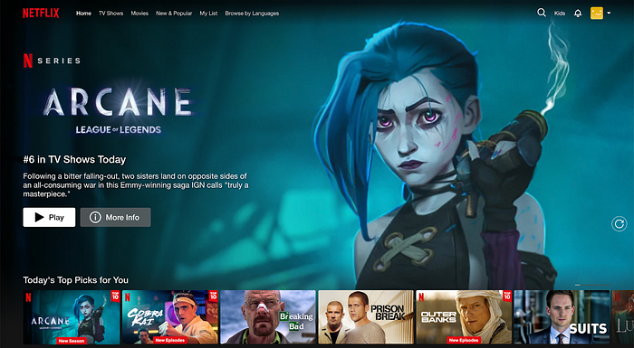

# Title Launch Observability at Netflix Scale

> Part 1: Understanding The Challenges

**By:** [Varun Khaitan](https://www.linkedin.com/in/varun-khaitan/)

With special thanks to my stunning colleagues: [Mallika Rao](https://www.linkedin.com/in/mallikarao/), [Esmir Mesic](https://www.linkedin.com/in/esmir-mesic/), [Hugo Marques](https://www.linkedin.com/in/hugodesmarques/)

## Introduction

At Netflix, we manage over a thousand global content launches each month, backed by billions of dollars in annual investment. Ensuring the success and discoverability of each title across our platform is a top priority, as we aim to connect every story with the right audience to delight our members. To achieve this, we are committed to building robust systems that deliver comprehensive observability, enabling us to take full accountability for every title on our service.

## The Challenge of Title Launch Observability

As engineers, we’re wired to track system metrics like error rates, latencies, and CPU utilization — but what about metrics that matter to a title’s success?

Consider the following example of two different Netflix Homepages:

*Sample Homepage A*

*Sample Homepage B*

To a basic recommendation system, the two sample pages might appear equivalent as long as the viewer watches the top title. Yet, these pages couldn’t be more different. Each title represents countless hours of effort and creativity, and our systems need to honor that uniqueness.

How do we bridge this gap? How can we design systems that recognize these nuances and empower every title to shine and bring joy to our members?

## The Operational Needs of a Personalization System

**In the early days of Netflix Originals, our launch team would huddle together at midnight, manually verifying that titles appeared in all the right places.** While this hands-on approach worked for a handful of titles, it quickly became clear that it couldn’t scale. As Netflix expanded globally and the volume of title launches skyrocketed, the operational challenges of maintaining this manual process became undeniable.

Operating a personalization system for a global streaming service involves addressing numerous inquiries about why certain titles appear or fail to appear at specific times and places.   
Some examples:

- Why is title X not showing on the Coming Soon row for a particular member?
- Why is title Y missing from the search page in Brazil?
- Is title Z being displayed correctly in all product experiences as intended?

As Netflix scaled, we faced the mounting challenge of providing accurate, timely answers to increasingly complex queries about title performance and discoverability. **This led to a suite of fragmented scripts, runbooks, and ad hoc solutions scattered across teams — an approach that was neither sustainable nor efficient**.

The stakes are even higher when ensuring every title launches flawlessly. Metadata and assets must be correctly configured, data must flow seamlessly, microservices must process titles without error, and algorithms must function as intended. The complexity of these operational demands underscored the urgent need for a scalable solution.

## Automating the Operations

It becomes evident over time that we need to automate our operations to scale with the business. As we thought more about this problem and possible solutions, two clear options emerged.

## Option 1: Log Processing

Log processing offers a straightforward solution for monitoring and analyzing title launches. By logging all titles as they are displayed, we can process these logs to identify anomalies and gain insights into system performance. This approach provides a few advantages:

1. **Low burden on existing systems:** Log processing imposes minimal changes to existing infrastructure. By leveraging logs, which are already generated during regular operations, we can scale observability without significant system modifications. This allows us to focus on data analysis and problem-solving rather than managing complex system changes.
2. **Using the source of truth:** Logs serve as a reliable “source of truth” by providing a comprehensive record of system events. They allow us to verify whether titles are presented as intended and investigate any discrepancies. This capability is crucial for ensuring our recommendation systems and user interfaces function correctly, supporting successful title launches.

However, taking this approach also presents several challenges:

1. **Catching Issues Ahead of Time:** Logging primarily addresses post-launch scenarios, as logs are generated only after titles are shown to members. To detect issues proactively, we need to simulate traffic and predict system behavior in advance. Once artificial traffic is generated, discarding the response object and relying solely on logs becomes inefficient.
2. **Appropriate Accuracy:** Comprehensive logging requires services to log both included and excluded titles, along with reasons for exclusion. This could lead to an exponential increase in logged data. Utilizing probabilistic logging methods could compromise accuracy, making it difficult to ascertain whether a title’s absence in logs is due to exclusion or random chance.
3. **SLA and Cost Considerations:** Our existing online logging systems do not natively support logging at the title granularity level. While reengineering these systems to accommodate this additional axis is possible, it would entail increased costs. Additionally, the time-sensitive nature of these investigations precludes the use of cold storage, which cannot meet the stringent SLAs required.

## Option 2: Observability Endpoints in Our Personalization Systems

To prioritize title launch observability, we could adopt a centralized approach. By introducing observability endpoints across all systems, we can enable real-time data flow into a dedicated microservice for title launch observability. This approach embeds observability directly into the very fabric of services managing title launches and personalization, ensuring seamless monitoring and insights. Key benefits and strategies include:

1. **Real-Time Monitoring: **Observability endpoints enable real-time monitoring of system performance and title placements, allowing us to detect and address issues as they arise.
2. **Proactive Issue Detection: **By simulating future traffic(an aspect we call “time travel”) and capturing system responses ahead of time, we can preemptively identify potential issues before they impact our members or the business.
3. **Enhanced Accuracy:** Observability endpoints provide precise data on title inclusions and exclusions, allowing us to make accurate assertions about system behavior and title visibility. It also provides us with advanced debugability information needed to fix identified issues.
4. **Scalability and Cost Efficiency:** While initial implementation required some investment, this approach ultimately offers a scalable and cost-effective solution to managing title launches at Netflix scale.

Choosing this option also comes with some tradeoffs:

1. **Significant Initial Investment: **Several systems would need to create new endpoints and refactor their codebases to adopt this new method of prioritizing launches.
2. **Synchronization Risk: **There would be a potential risk that these new endpoints may not accurately represent production behavior, thus necessitating conscious efforts to ensure all endpoints remain synchronized.

## Up Next

By adopting a comprehensive observability strategy that includes real-time monitoring, proactive issue detection, and source of truth reconciliation, we’ve significantly enhanced our ability to ensure the successful launch and discovery of titles across Netflix, enriching the global viewing experience for our members. In the next part of this series, we’ll dive into how we achieved this, sharing key technical insights and details.

Stay tuned for a closer look at the innovation behind the scenes in [Part 2](./title-launch-observability-at-netflix-scale-19ea916be1ed.md)!

---
**Tags:** Observability · Netflix
