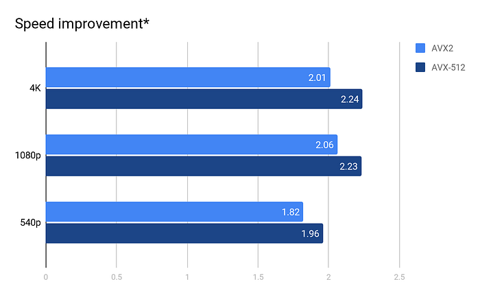
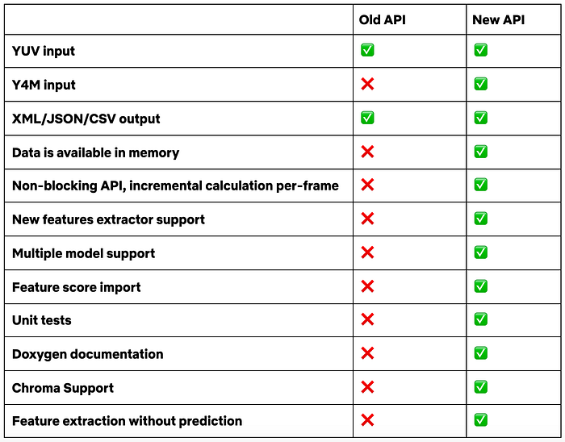
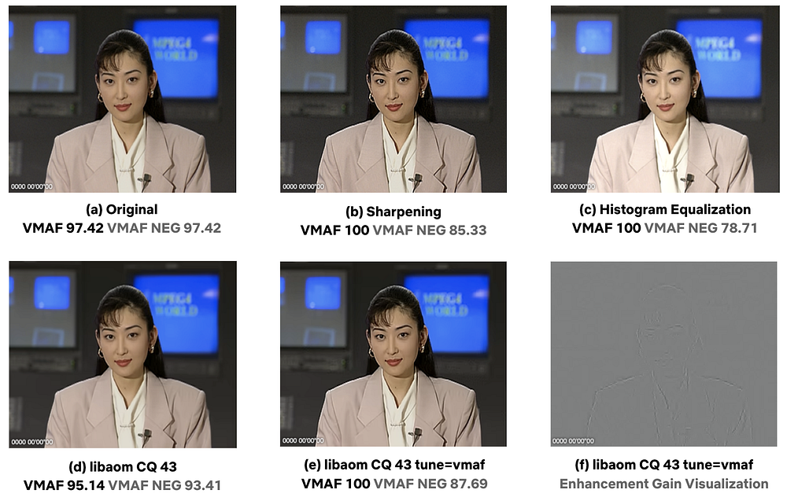
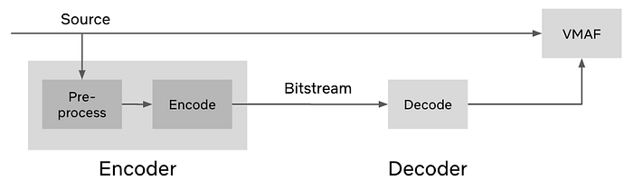

# Toward a Better Quality Metric for the Video Community

_by Zhi Li, Kyle Swanson, Christos Bampis, Lukáš Krasula and Anne Aaron_

_Over the past few years, we have been striving to make VMAF a more usable tool not just for Netflix, but for the video community at large. This tech blog highlights our recent progress toward this goal._

VMAF is a video quality metric that Netflix jointly developed with [a number of university collaborators](https://netflixtechblog.com/vmaf-the-journey-continues-44b51ee9ed12) and [open-sourced](https://github.com/Netflix/vmaf) on Github. VMAF was originally designed with Netflix’s streaming use case in mind, in particular, to capture the video quality of professionally generated movies and TV shows in the presence of encoding and scaling artifacts. Since its open-sourcing, we have started seeing VMAF being applied in a wider scope within the open-source community. To give a few examples, VMAF has been applied to [live sports](https://blog.hotstar.com/video-encoding-recipes-for-live-cricket-21f875080932), [video chat](https://blog.airtime.com/end-to-end-objective-video-quality-analysis-at-airtime-9fd1431553cb), [gaming](https://www.igorslab.de/en/nvidias-nvenc-vs-cpu-encoding-the-turing-video-encoder-for-twitch-streaming-co-comparison-analysis-with-netflix-vmaf/2/), [360 videos](https://ieeexplore.ieee.org/document/8924618), and [user generated content](https://www.livevideostack.cn/news/bilibili-20200714/). VMAF has become a _de facto_ standard for evaluating the performance of encoding systems and driving encoding optimizations.

VMAF stands for _Video Multi-Method Assessment Fusion_. It leans on Human Visual System modeling, or the simulation of low-level neural-circuits to gather evidence on how the human brain perceives quality. The gathered evidence is then fused into a final predicted score using machine learning, guided by subjective scores from training datasets. One aspect that differentiates VMAF from other traditional metrics such as PSNR or SSIM, is that VMAF is able to predict more consistently across spatial resolutions, across shots, and across genres (for example. animation vs. documentary). Traditional metrics, such as PSNR, are already able to do a good job evaluating the quality for the same content on a single resolution, but they often fall short when predicting quality across shots and different resolutions. VMAF fills this gap. For more background information, interested readers may refer to our [first](https://netflixtechblog.com/toward-a-practical-perceptual-video-quality-metric-653f208b9652) and [second](https://netflixtechblog.com/vmaf-the-journey-continues-44b51ee9ed12) tech blogs on VMAF.

**Recently, we migrated VMAF’s license from **[**Apache 2.0**](https://www.apache.org/licenses/LICENSE-2.0)** to **[**BSD+Patent**](https://opensource.org/licenses/BSDplusPatent) to allow for increased compatibility with other existing open source projects. In the rest of this blog, we highlight three other areas of recent development, as our efforts toward making VMAF a better quality metric for the community.

**The runtime ratio between the floating-point & optimized vmafossexec vs. the fixed-point & optimized vmaf executable, measured in the single-thread mode.*

## Speed Optimization

Improving the speed performance of VMAF has been a major theme over the past several years. Through low-level code optimization and vectorization, we sped up VMAF’s execution by more than 4x in the past. We also introduced [frame-level multithreading and frame skipping](https://netflixtechblog.com/vmaf-the-journey-continues-44b51ee9ed12), that allow VMAF to run in real time for 4K videos.

Most recently, we teamed up with _Facebook _and_ Intel_ to make VMAF even faster. This work took place in two steps. First, we worked with _Ittiam_ to convert from the original floating-point based representation to fixed-point; and second, Intel implemented vectorization on the fixed-point data pipeline.

This work has allowed us to **squeeze out another 2x speed gain on average** while maintaining the numerical accuracy at the first decimal digit of the final score. The figure above shows the relative speed improvement under Intel Advanced Vector Extension 2 (Intel AVX2) and Intel AVX-512 intrinsics, for video at 4K, full HD and SD resolutions. Also notice that this is an ongoing effort, so stay tuned for more speed improvements.

## New libvmaf API

The new [BSD+Patent](https://opensource.org/licenses/BSDplusPatent) license allows for increased compatibility with existing open source projects. This brings us to the second area of development, which is on how VMAF can be integrated with them. For historical reasons, the libvmaf C library has been a minimal solution to integrate VMAF with FFmpeg. This year, we invested heavily on revamping the API. **Today, we are announcing the release of **[**libvmaf v2.0.0**](https://github.com/Netflix/vmaf/releases/tag/v2.0.0)**.** It comes with a new API that is much easier to use, integrate and extend.

This table above highlights the features achieved by the new API. A number of areas are worth highlighting:

- It is extensible without breaking the API.
- It is easy to add a new feature extractor. And this can easily support future evolution of the VMAF algorithms.
- It becomes very flexible to allocate memory and incrementally calculate VMAF at the frame level.

The last feature makes it possible to integrate VMAF in an encoding loop, guiding encoding decisions iteratively on a frame-by-frame basis.

## “No Enhancement Gain” Mode

One unique feature about VMAF that differentiates it from traditional metrics such as PSNR and SSIM is that VMAF can capture the visual gain from image enhancement operations, which aim to improve the subjective quality perceived by viewers.

The examples above demonstrate an original frame (a) and its enhanced versions by sharpening (b), and histogram equalization (c), and their corresponding VMAF scores. As one can notice, the visual improvement achieved by the enhancement operations are reflected in the VMAF scores. Most recently, a [_tune=vmaf_ mode](https://aomedia.googlesource.com/aom/+/615dc24579d531cb3a2c9627ab25a3026f9e2b47) was introduced in the libaom library as an option to perform quality-optimized AV1 encoding. This mode achieves BD-rate gain mostly by performing frame-based image sharpening prior to video compression (e). For a comparison, AV1 encoding without image sharpening is demonstrated in (d).

This is a good demonstration of how VMAF can drive perceptual optimization of video codecs. However, in codec evaluation, it is often desirable to measure the gain achievable from compression without taking into account the gain from image enhancement during pre-processing. As demonstrated by the block diagram above, since it is difficult to strictly separate an encoder from its pre-processing step (especially for proprietary encoders), it may become difficult to use VMAF to assess the pure compression gain. This dilemma is well aligned with two voices we have heard from the community: users seem to like the fact that VMAF could capture the enhancement gains, but at the same time, they have expressed concerns that [such enhancement could be overused (or abused)](https://www.reddit.com/r/AV1/comments/g19ary/more_vmaf_more_better/).

We think that** there is value in disregarding enhancement gain **that is not part of a codec. We also believe that **there is value in preserving enhancement gain** in many cases to reflect the fact that enhancement can improve the visual quality perceived by the end viewers. Our solution to this dilemma is to introduce a new mode called VMAF NEG (“neg” stands for “no enhancement gain”). And we propose the following:

- Use the NEG mode for codec evaluation purposes to assess the pure effect coming from compression.
- Use the “default” mode to assess compression and enhancement combined.

**How does VMAF NEG mode work?** To make the long story short: we can detect the magnitude of the VMAF gain coming from image enhancement, and subtract this effect from the measurement. The grayscale map in (f) above demonstrates the magnitude of the image sharpening performed in tune=vmaf. And we can subtract this effect from the VMAF scores. The VMAF NEG scores are also shown in (a) ~ (e) above. As we can see, the VMAF scores are largely muted by the enhancement subtraction in the NEG mode. More details about VMAF NEG mode can be found in [this tech memo](https://docs.google.com/document/d/1dJczEhXO0MZjBSNyKmd3ARiCTdFVMNPBykH4_HMPoyY/edit#heading=h.oaikhnw46pw5).

## What Comes Next

We are committed to improve the accuracy and performance of VMAF in the long run. Over the past several years, through field testing and feedback from the users, we have learned extensively about the existing algorithm’s strengths and weaknesses. We believe that there is still plenty of room for improvement.

The NEG mode is our first step toward more accurately quantifying the perceptual gain without image enhancement. When operating in its regular mode, it is known that VMAF tends to overpredict perceptual quality when image enhancement operations, like oversharpening, lead to quality degradation. We plan to address this in future versions, by imposing limits on the enhancement attainable.

We have identified a number of other areas for further improvement, for example, to better predict perceived quality under challenging cases, such as banding and blockiness in the shades. Other potential areas of improvement include better model temporal masking effects in high motion sequences and also more accurately capture the effects of encoding videos generated from noisy sources. We will continue to leverage Human Visual System modeling, subjective testing and machine learning as we work toward a better quality metric for the video community.

---
**Tags:** Vmaf · Video Quality · Video Encoding · Netflix · Open Source
