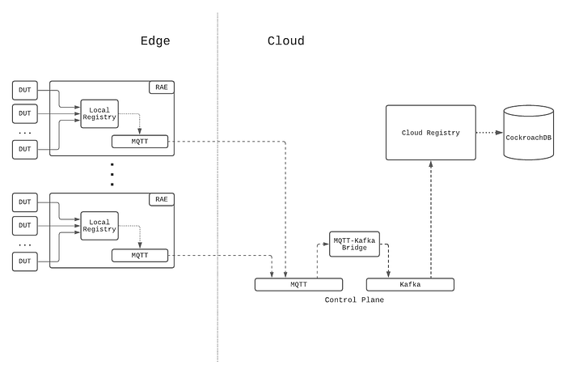
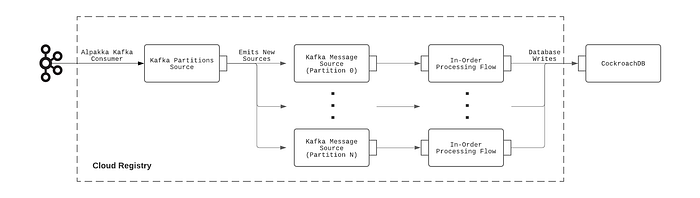
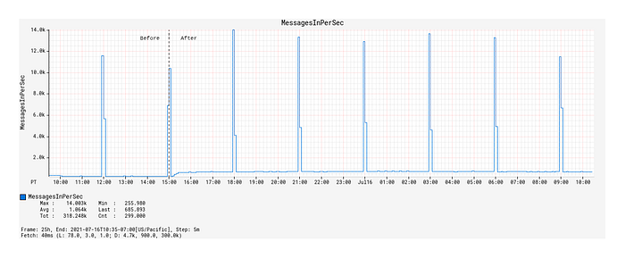
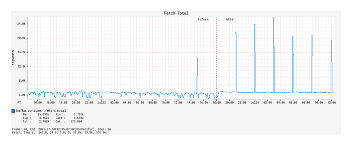
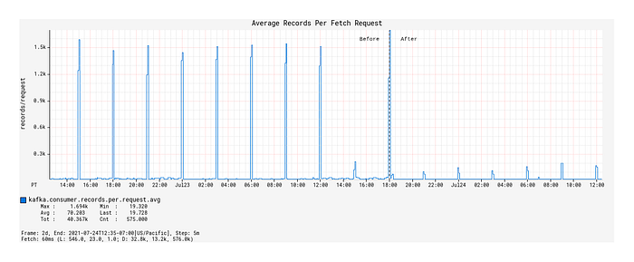
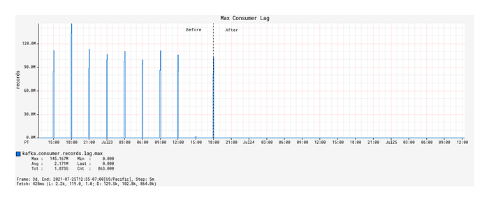
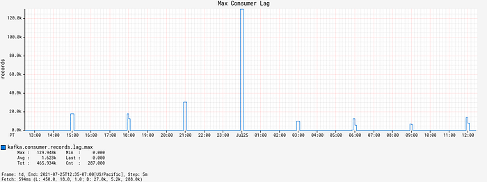
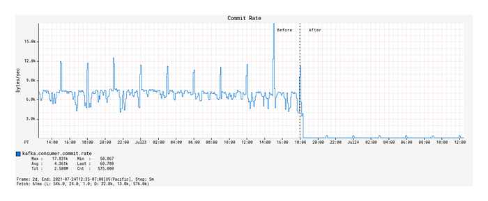
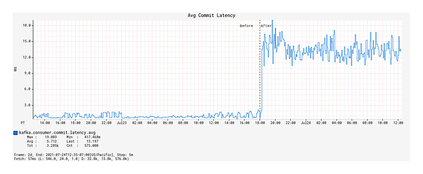

# Towards a Reliable Device Management Platform

By [_Benson Ma_](https://www.linkedin.com/in/benson-ma-86338917/)_, _[_Alok Ahuja_](https://www.linkedin.com/in/alahuja/)

## Introduction

At Netflix, hundreds of different device types, from streaming sticks to smart TVs, are tested every day through automation to ensure that new software releases continue to deliver the quality of the Netflix experience that our customers enjoy. In addition, Netflix continuously works with its partners (such as Roku, Samsung, LG, Amazon) to port the Netflix SDK to their new and upcoming devices (TVs, smart boxes, etc), to ensure the quality bar is reached before allowing the Netflix application on the device to go out into the world. The Partner Infrastructure team at Netflix provides solutions to support these two significant efforts by enabling device management at scale.

## Background

To normalize the diversity of networking environments across both the Netflix and Partner networks and create a consistent and controllable computing environment on which users can run regression and Netflix application [certification testing for devices](https://www.linkedin.com/pulse/scaling-netflix-quality-validation-streaming-devices-matt-duddles), the Partner Infrastructure team provides a customized embedded computer called the Reference Automation Environment (RAE). Complementing the hardware is the software on the RAE and in the cloud, and bridging the software on both ends is a bi-directional control plane. Together, they form the Device Management Platform, which is the infrastructural foundation for [Netflix Test Studio](https://netflixtechblog.com/nts-real-time-streaming-for-test-automation-7cb000e933a1) (NTS). Users then effectively run tests by connecting their devices to the RAE in a plug-and-play fashion.

The platform allows for effective device management at scale, and its feature set is broadly divided into two areas:

1. Provide a service-level abstraction for controlling devices and their environments (hardware and software topologies).
2. Collect and aggregate information and state updates for all devices attached to the RAEs in the fleet. In this blog post, we will focus on the latter feature set.

Over the lifecycle of a device connected to the RAE, the device can change attributes at any time. For example, when running tests, the state of the device will change from “available for testing” to “in test.” In addition, because many of these devices are pre-production devices and thus subject to frequent firmware changes, attributes that are generally static in production devices can sometimes change as well, such as the MAC address and the Electronic Serial Number (ESN) assigned to the Netflix installation on the device. As such, it is very critical to be able to keep device information up to date for device tests to work properly. In the Device Management Platform, this is achieved by having device updates be [event-sourced](https://martinfowler.com/eaaDev/EventSourcing.html) through the control plane to the cloud so that NTS will always have the most up-to-date information about the devices available for testing. The challenge, then, is to be able to ingest and process these events in a scalable manner, i.e., scaling with the number of devices, which will be the focus of this blog post.

## System Setup

### Architecture

The following diagram summarizes the architecture description:

*Figure 1: Event-sourcing architecture of the Device Management Platform.*

The RAE is configured to be effectively a router that devices under test (DUTs) are connected to. On the RAE, there exists a service called the Local Registry, which is responsible for detecting, onboarding, and maintaining information about all devices connected to the LAN side of the RAE. When a new hardware device is connected, the Local Registry detects and collects a set of information about it, such as networking information and ESN. At periodic intervals, the Local Registry probes the device to check on its connection status. As the device attributes and properties change over time, these changes are saved into the Local Registry and simultaneously published upstream to the Device Management Platform’s control plane. In addition to attribute changes, a complete snapshot of the device record is published upstream by the Local Registry at regular intervals as a form of state reconciliation. These checkpoint events enable faster state reconstruction by consumers of the data feed while guarding against missed updates.

On the cloud side, a service called the Cloud Registry ingests the device information updates published by the Local Registry instance, processes them, and subsequently pushes materialized data into a datastore backed by [CockroachDB](https://www.cockroachlabs.com/). CockroachDB is chosen as the backing data store since it offered SQL capabilities, and our data model for the device records was normalized. In addition, unlike other SQL stores, CockroachDB is designed from the ground up to be horizontally scalable, which addresses our concerns about Cloud Registry’s ability to scale up with the number of devices onboarded onto the Device Management Platform.

### Control Plane

[MQTT](https://mqtt.org/) forms the basis of the control plane for the Device Management Platform. MQTT is an OASIS standard messaging protocol for the Internet of Things (IoT) and was designed as a highly lightweight yet reliable publish/subscribe messaging transport that is ideal for connecting remote devices with a small code footprint and minimal network bandwidth. MQTT clients connect to the MQTT broker and send messages prefixed with a topic. In contrast, the broker is responsible for receiving all messages, filtering them, determining who is subscribed to which topic, and sending the messages to the subscribed clients accordingly. The key features that make MQTT highly appealing to us are its support for hierarchical topics, client authentication and authorization, per-topic ACLs, and bi-directional request/response message patterns, all of which are crucial for the business use cases we have for the control plane.

Inside the control plane, device commands and device information updates are prefixed with a topic string that includes both the RAE serial number and the `device_session_id`, which is a UUID corresponding to a device session. Embedding these two bits of information into the topic for every message allows for us to apply topic ACLs and effectively control which RAEs and DUTs users can see and interact with, in the safety and isolation against other users’ devices.

Since [Kafka](https://kafka.apache.org/) is a supported messaging platform at Netflix, a bridge is established between the two protocols to allow cloud-side services to communicate with the control plane. Through the bridge, MQTT messages are converted directly to Kafka records, where the record key is set to be the MQTT topic that the message was assigned to. Since device information updates published on MQTT contain the `device_session_id` in the topic, this means that all device information updates for a given device session will effectively appear on the same Kafka partition, thus giving us a well-defined message order for consumption.

### Canary Test Workloads

In addition to serving the regular message traffic between users and DUTs, the control plane itself is stress-tested at roughly 3-hour intervals, where nearly 3000 ephemeral MQTT clients are created to connect to and generate flash traffic on the MQTT brokers. This is intended to be a canary test to verify that the brokers are online and able to handle sudden influxes of client connections and high message loads. As such, we can see that the traffic load on the Device Management Platform’s control plane is very dynamic over time.

### Adherence to the Paved-Path

At Netflix, we emphasize building out solutions that use paved-path tooling as much as possible (see posts [here](https://netflixtechblog.com/how-we-build-code-at-netflix-c5d9bd727f15) and [here](https://www.slideshare.net/diannemarsh/the-paved-road-at-netflix)). In particular, the flavor of [Spring Boot Native](./netflix-oss-and-spring-boot-coming-full-circle-4855947713a0.md) maintained by the Runtime team is the basis for many of the web services developed inside Netflix (including the Cloud Registry). The Netflix Spring package comes with all the integrations needed for applications to work seamlessly within the Netflix ecosystem. In particular, the Kafka integration is the most relevant for this blog post.

## Translating to System Requirements

Given the system setup that we have described, we came up with a list of fundamental business requirements that the Cloud Registry’s Kafka-based device updates processing solution must address.

### Back-Pressure Support

Because the processing workload varies significantly over time, the solution must first and foremost scale with the message load by providing back-pressure support as defined in the [Reactive Streams](https://www.reactive-streams.org/) specification — in other words, the solution should be able to switch between push and pull-based back-pressure models depending on the downstream being able to cope with the message production rate or not.

### In-Order Processing

The semantics of correct device information updates ingestion requires that messages be consumed in the order that they are produced. Since message order is guaranteed per Kafka partition, and all updates for a given device session are assigned to the same partition, this means that the order of processing of updates for each device can be enforced as long as only one thread is assigned per partition. At the same time, events arriving on different partitions should be processed in parallel for maximum throughput.

### Fault Tolerance

If the underlying `KafkaConsumer` crashes due to ephemeral system or network events, it should be automatically restarted. If an exception is thrown during the consumption of a message, the exception should be gracefully caught, and message consumption should seamlessly continue after the offending message is dropped.

### Graceful Shutdown

Application shutdowns are necessary and inevitable when a service is re-deployed, or its instance group is resized. As such, processor shutdowns should be invokable from outside of the Kafka consumption context to facilitate graceful application termination. In addition, since Kafka messages are usually pulled down in batches by the `KafkaConsumer`, the implemented solution should, upon receiving the shutdown signal, consume and drain all the already-fetched messages remaining in its internal queue prior to shutting down.

### Paved-Path Integration

As mentioned earlier, Spring is heavily employed as the paved-path solution for developing services at Netflix, and the Cloud Registry is a Spring Boot Native application. Thus, the implemented solution must integrate with Netflix Spring facilities for authentication and metrics support at the very minimum — the former for access to the Kafka clusters and the latter for service monitoring and alerts. In addition, the lifecycle management of the implemented solution must also be integrated into Spring’s lifecycle management.

### Long-Term Maintainability

The implemented solution must be friendly enough for long-term maintenance support. This means that it must at the very least be unit- and functional-testable for rapid and iterative feedback-driven development, and the code must be reasonably ergonomic to lower the learning curve for new maintainers.

## Adopting a Stream Processing Framework

There are many frameworks available for reliable stream processing for integration into web services (for example, [Kafka Streams](https://kafka.apache.org/documentation/streams/), [Spring ](https://docs.spring.io/spring-kafka/reference/html/)`[KafkaListener](https://docs.spring.io/spring-kafka/reference/html/)`, [Project Reactor](https://projectreactor.io/), [Flink](https://flink.apache.org/), [Alpakka-Kafka](https://doc.akka.io/docs/alpakka-kafka/current/), to name a few). We chose Alpakka-Kafka as the basis of the Kafka processing solution for the following reasons.

1. Alpakka-Kafka turns out to satisfy all of the system requirements we laid out, including the need for Netflix Spring integration. It further provides advanced and fine-grained control over stream processing, including automatic back-pressure support and streams supervision.
2. Compared to the other solutions that may satisfy all of our system requirements, Akka is a much more lightweight framework, with its integration into a Spring Boot application being relatively short and concise. In addition, Akka and Alpakka-Kafka code is much less terse than the other solutions out there, which lowers the learning curve for maintainers.
3. The maintenance costs over time for an Alpakka-Kafka-based solution is much lower than that for the other solutions, as both Akka and Alpakka-Kafka are mature ecosystems in terms of documentation and community support, having been around for at least 12 and 6 years, respectively.

The construction of the Alpakka-based Kafka processing pipeline can be summarized with the following diagram:

*Figure 2: Kafka processing pipeline employed by the Cloud Registry.*

### Implementation

The integration of Alpakka-Kafka streams with the Netflix Spring application context is very straightforward and is implemented as follows:

1. Import the Alpakka-Kafka library into the project build file (e.g. `build.gradle`), **but** **exclude** the `kafka-client` transitive dependency that comes packaged with it so that the Netflix internal-enhanced variant is used.
2. Build a Spring `@Configuration` class that `autowire`s the `KafkaProperties` bean injected by the Netflix Spring runtime and, using the Kafka settings available from that bean, construct an Alpakka-Kafka `ConsumerSettings` bean.
3. Construct an Alpakka-Kafka processing graph using the `ConsumerSettings` bean as an input.

Because this integration explicitly uses the Netflix-enhanced `KafkaConsumer` and Netflix Spring-injected Kafka settings, the authentication, and metrics-logging facilities that come with the paved-path Spring `KafkaListener` are immediately enjoyed by the Alpakka-Kafka-based solution.

### Testing

Functional testing of the Alpakka-Kafka consumers is very straightforward with the [EmbeddedKafka](https://github.com/embeddedkafka/embedded-kafka) library, which provides an in-memory Kafka instance to run tests against. To scale up testing with the complexity of the Kafka message processing pipeline, the message processing code was separated from the Alpakka-Kafka graph code. This allowed the message processing code to be tested separately using functional tests while minimizing the surface area of required testing by EmbeddedKafka-based Kafka integration tests.

## Results

### Prior to Alpakka-Kafka

The original Kafka processing solution implemented in the Cloud Registry was built on Spring `KafkaListener`, primarily due to its immediate availability as a paved-path solution provided by Netflix Spring. A timeline of the transition from Spring `KafkaListener` to Alpakka-Kafka is presented here for a better understanding of the motivations for the transition.

**Memory and GC Troubles**

The Spring `KafkaListener`-based solution was deployed earlier this year, during which messages on the Kafka topic were sparse because the Local Registry was not fully in production at the time. Upstream event sourcing was fully enabled on the producer side at around `2021–07–15 15:00 PST`. By the following morning, alerts were received regarding high memory consumption and GC latencies, to the point where the service was unresponsive to HTTP requests. An investigation of the JVM memory dump revealed an internal Kafka message concurrent queue whose size had grown uncontrollably to over 1.3 million elements.

The cause for this abnormal queue growth is due to Spring `KafkaListener`’s lack of native back-pressure support. With `KafkaListener`, the Kafka message fetch rate is fixed on application startup. However, it can be adjusted by tuning the `max-poll-interval-ms` and `max-poll-records` configuration values, which need to be somehow determined empirically beforehand for best performance. This setup is neither optimal nor break-proof since the Kafka message processing rate will vary depending on environmental factors, such as database latencies in our system setup. As a result, the `KafkaListener` ends up effectively over-consuming messages over time, which is manifested in the growth of its internal message queue.

After doubling the number of service instances and increasing the instance sizes with only mediocre success, the decision was made to look into an alternative Kafka processing solution with full back-pressure management capabilities.

**Kafka Topic Metrics**

The enabling of event-sourcing from Local Registry significantly increased the Device Management Platform’s control plane traffic, as evidenced by the 9x growth of Kafka topic message publication frequency from 100 messages / 90 kB incoming per second to 900 messages / 840kB incoming per second (Figure 3).

*Figure 3: Message traffic over time before and after event-sourcing was enabled.*

The spikes that occur on 3-hour intervals shown here correspond to the canary runs mentioned earlier that effectively load-test the Kafka topic with a flood of new records. Hereafter, they will be referred to as burst events. While the average message publication rate is low compared to the data systems out there that produce hundreds of thousands, if not millions, events per second, it does highlight the significance of having back-pressure management in place even at the lower end of the message load spectrum.

### Kafka Consumption Improvements with Alpakka-Kafka

We now compare the Kafka consumption between the Spring `KafkaListener`-based Kafka processing solution and the Alpakka-Kafka-based solution, the latter of which was deployed to production on `2021–07–23 18:00 PST`. In particular, we will look at three indicators of Kafka consumption performance: the message fetch rate, the max consumer lag, and the commit rate.

**Fetch Request Metrics**

Upon deployment of the Alpakka-Kafka-based processor, we made a few observations:

- Prior to the deployment, the number of fetch calls over time generally remained unchanged across burst events but was otherwise actually quite unstable over time (Figure 4).
- After the deployment, the fetch calls over time followed a 1:1 correspondence with the Kafka topic’s message publication rate, including the interval burst events (Figure 4). Outside of the burst event windows, the number of fetch calls over time was very stable.
- Surprisingly, the average number of records fetched per fetch request during the burst events windows decreased compared to that of the Spring `KafkaListener`-based processor (Figure 5).

What we can infer from these observations is that, with native back-pressure support in place, the Alpakka-Kafka-based processor is able to dynamically scale its Kafka consumption such that it is never under-consuming or over-consuming Kafka messages. This behavior keeps the processor constantly busy enough, but without overloading it with a growing queue of messages pulled from Kafka that eventually overflows the JVM’s memory and GC capacity.

*Figure 4: Record fetch calls made by the KafkaConsumer over time, before and after deployment of the Alpakka-Kafka-based processor.*

*Figure 5: Average number of records fetched per fetch request over time, before and after deployment.*

**Max Consumer Lag**

Except for JVM and service uptime, the most significant improvements with the Alpakka-Kafka-based processor manifested in the Kafka consumer lag metrics. While the Spring `KafkaListener` was deployed, the max consumer lag generally floated long-term at around 60,000 records, excluding the burst event time windows (this is not visually discernible from the graph due to the orders of magnitude differences in plotted values). From a functional point of view, this was unacceptable, as such a large constant lag value implies that device information updates will take a significantly long enough time to propagate into service such that it will be noticeable by our users. The situation exacerbates during the burst event windows, where the max consumer lag would increase to values of over 100 million records (Figure 6).

Since the deployment of the Alpakka-Kafka-based processor, the max consumer lag over time has averaged at zero outside of the burst event windows. Inside the burst event windows, the max consumer lag increases ephemerally to roughly 20,000 records, with only one outlier in the 48 hour time period since deployment (Figure 7). These metrics show us that the Kafka consumption patterns employed by Alpakka-Kafka and the streaming capabilities of Akka, in general, perform exceptionally well at scale, from the quiet use case to the presence of sudden huge message loads.

*Figure 6: Max consumer lag of the KafkaConsumer over time, before and after deployment.*

*Figure 7: Max consumer lag of the KafkaConsumer over time, magnified to the time window some time after deployment.*

**Commit Rate and Average Commit Latency**

When a Kafka consumer fetches records, it can perform manual or automatic offset commits — this is configurable through `enable.auto.commit`. Contrary to the name, the semantics of manual vs auto commit don’t necessarily refer to _how_ the offset commits are performed, but _when_ in relations to the record fetch-process cycle. With auto commits, messages are acknowledged to have been received as soon as they are fetched and irrespective of processing, whereas with manual commits, the consumer can decide to acknowledge only after a message is properly processed.

By default, when `enable.auto.commit` is set to `false`, the Spring `KafkaListener` performs an offset commit every time a record is processed, i.e., the acknowledgement mode is set to `AckMode.RECORD`. This is exceedingly inefficient, and is [known](https://doc.akka.io/docs/alpakka-kafka/current/consumer.html#offset-storage-in-kafka-committing) to reduce the message consumption throughput of the consumer. With the Alpakka-Kafka-based processor, we opted for making record commits in batches (set to [1000](https://github.com/akka/alpakka-kafka/blob/master/core/src/main/resources/reference.conf) by default), with a max interval of 1 second allowed between commits. This behavior is similar to the `AckMode.COUNT_TIME` acknowledgement mode in Spring `KafkaListener`, but with the added benefit of automatically attempting to complete outstanding commit requests when the Kafka consumption fails or terminates.

Under a manual offset commit scheme, it is always possible to re-process Kafka messages in the case of failures. To retain the (mainly) exactly-once processing that is guaranteed by the automatic offset commit scheme, the Kafka processor was updated to store device updates using idempotent upserts, i.e., perform an upsert conditioned on the timestamp of record in the database being earlier than the timestamp of the update to be upserted. This effectively ensures exactly-once processing on a per-event basis.

With the deployment of the Alpakka-Kafka-based processor, the commit rate was significantly lowered from roughly 7 kbytes/sec to 50 bytes/sec (Figure 8), but the average commit latency increased from 1 ms on average to 12 ms (Figure 9). Nonetheless, this is a considerable reduction in the network overhead spent on committing offsets, and has contributed significantly to the improved throughput of the Kafka processing.

*Figure 8: Rate of offset commits made by the KafkaConsumer over time, before and after deployment.*

*Figure 9: Average latency per offset commit over time, before and after deployment.*

## Conclusion

Kafka streams processing can be difficult to get right. Many system implementation details need to be considered in light of the business requirements. Fortunately, the primitives provided by Akka streams and Alpakka-Kafka empower us to achieve exactly this by allowing us to build streaming solutions that match the business workflows we have while scaling up developer productivity in building out and maintaining these solutions. With the Alpakka-Kafka-based processor in place in the Cloud Registry, we have ensured fault tolerance in the consumer side of the control plane, which is key to enabling accurate and reliable device state aggregation within the Device Management Platform.

Though we have achieved fault-tolerant message consumption, it is only one aspect of the design and implementation of the Device Management Platform. The reliability of the platform and its control plane rests on significant work made in several areas, including the MQTT transport, authentication and authorization, and systems monitoring, all of which we plan to discuss in detail in future blog posts. In the meantime, as a result of this work, we can expect the Device Management Platform to continue to scale to increasing workloads over time as we onboard ever more devices into our systems.

---
**Tags:** Kafka · Alpakka · Reactive Streams · Event Sourcing · Fault Tolerance
