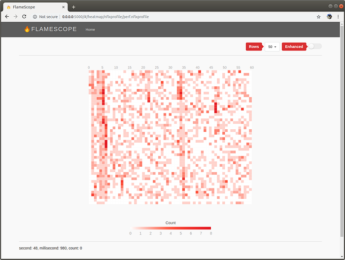
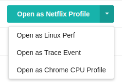

# Trace Event, Chrome and More Profile Formats on FlameScope


*FlameScope sub-second heatmap visualization.*

Less than a year ago, [FlameScope](https://medium.com/netflix-techblog/netflix-flamescope-a57ca19d47bb) was released as a proof of concept for a new profile visualization. Since then, it helped us, and many other users, to easily find and fix performance issues, and allowed us to see patterns that we had never noticed before in our profiles.

As a tool, FlameScope was limited. It only supported the profile format generated by Linux perf, which at the time, was the profiler of choice internally at Netflix.

Immediately after launch, we received multiple requests to support other profile formats. Users looking to use the FlameScope visualization, with their own profilers and tools. Our goal was never to support hundreds of profile formats, especially for tools we don’t use internally, but we always knew that supporting a few “generic” formats would be useful, both for us, and the community.

After receiving multiple requests from users and investigating a few profile formats, we opted to support the [Trace Event Format](https://docs.google.com/document/d/1CvAClvFfyA5R-PhYUmn5OOQtYMH4h6I0nSsKchNAySU/preview). It is well documented. It is flexible. Multiple tools already use it, and it is the format used by [Trace-Viewer](https://github.com/catapult-project/catapult/tree/master/tracing), which is the javascript frontend for Chrome’s [about:tracing](http://dev.chromium.org/developers/how-tos/trace-event-profiling-tool) and [Android’s systrace](http://developer.android.com/tools/help/systrace.html) tools.

The complete documentation for the format can be found [here](https://docs.google.com/document/d/1CvAClvFfyA5R-PhYUmn5OOQtYMH4h6I0nSsKchNAySU/preview), but in a nutshell, it consists of an ordered list of events. For now, FlameScope only supports _Duration_ and _Complete_ event types. According to the documentation:

> Duration events provide a way to mark a duration of work on a given thread. The duration events are specified by the B and E phase types. The B event must come before the corresponding E event. You can nest the B and E events. This allows you to capture function calling behavior on a thread.Each complete event logically combines a pair of duration (B and E) events. The complete events are designated by the X phase type.There is an extra parameter dur to specify the tracing clock duration of complete events in microseconds. All other parameters are the same as in duration events.

Here’s an example:

```
[
  {
    "name": "Asub",
    "cat": "PERF",
    "ph": "B",
    "pid": 22630,
    "tid": 22630,
    "ts": 829
  }, {
    "name": "Asub",
    "cat": "PERF",
    "ph": "E",
    "pid": 22630,
    "tid": 22630,
    "ts": 833
  }
]
```

As you can imagine, this format works really well for tracing profilers, where the beginning and end of work units are recorded. For sampling based profilers, like perf, the format is not ideal. We could create a Complete event for every sample, with stacks, but even being more efficient than the output generated by perf, there is still a lot of overhead, especially from repeated stacks. Another option would be to analyze the whole profile and create begin and end events every time we enter or exit a stack frame, but that adds complexity to converters.

Since we also work with sampling profilers frequently, we needed a simpler format. In the past, we worked with profiles in the v8 profiler format, which is very similar to Chrome’s old JavaScript CPU profiler format and newer [ProfileType](https://chromedevtools.github.io/devtools-protocol/tot/Profiler#type-Profile) event format. We already had all the code needed to generate both heatmap and partial flame graphs, so we decided to use it as base for a new format, which for lack of a more creative name, we called _nflxprofile._ Different from the v8 profiler format, it uses a map instead of a list to store the nodes, includes extra information about the profile, and takes advantage [Protocol Buffers](https://developers.google.com/protocol-buffers/) to serialize the data instead of JSON. The _.proto_ file looks like this:

```
syntax = “proto2”;
package nflxprofile;
message Profile {
  required double start_time = 1;
  required double end_time = 2;
  repeated uint32 samples = 3 [packed=true];
  repeated double time_deltas = 4 [packed=true];
  message Node {
    required string function_name = 1;
    required uint32 hit_count = 2;
    repeated uint32 children = 3;
    optional string libtype = 4;
  }
  map<uint32, Node> nodes = 5;
}
```

It can be found on [FlameScope’s repository](https://github.com/Netflix/flamescope) too, and be used to generate code for the multiple programming languages supported by Protocol Buffers.

Netflix has been using the new format internally in its cloud profiling tool, and the improvement is noticeable. The significant reduction in file size, from raw perf output to _nflxprofile_, allows for faster download time from external storage. The reduction will depend on sampling duration and how homogeneous the workload is (similar stacks), but generally, the output is orders of magnitude smaller. Time spent on parsing and deserialization is also reduced significantly. No more regular expressions!

Since the new format is so similar to what Chrome generates, we decided to include it too! It has been challenging to keep up with the constant changes in DevTools, from _CpuProfile_, to _Profile_ and now _ProfileChunk_ events, but the format is supported as of now. If you want to try it out, check out the [Get Started With Analyzing Runtime Performance](https://developers.google.com/web/tools/chrome-devtools/evaluate-performance/) post, record and save the profile to FlameScope’s profile directory, and open it!

We also had to make minor adjustments to the user interface, more specifically the file list, to support the new profile formats. Now, instead of a simple list, you will get a dropdown menu next to each file that allows you to select the correct profile type.


*New profile selection dropdown.*

We might consider adding support for more formats in the future, or accept pull requests that add support for something new, but in general, profile converters are the simplest solution. If you created a converter for a known profile format, we are happy to link to it on FlameScope’s documentation!

_FlameScope was developed by Martin Spier, Brendan Gregg and the Netflix performance engineering team. Blog post by Martin Spier._

---
**Tags:** Performance · Chrome · JavaScript · Linux
