# Model Once, Represent Everywhere: UDA (Unified Data Architecture) at Netflix

By [Alex Hutter](https://www.linkedin.com/in/ahutter/), [Alexandre Bertails](https://www.linkedin.com/in/bertails/), [Claire Wang](https://www.linkedin.com/in/clairezwang0612/), [Haoyuan He](https://www.linkedin.com/in/haoyuan-h-98b587134/), [Kishore Banala](https://www.linkedin.com/in/kishore-banala/), [Peter Royal](https://www.linkedin.com/in/peterroyal/), [Shervin Afshar](https://www.linkedin.com/in/shervinafshar/)

As Netflix’s offerings grow — across films, series, games, live events, and ads — so does the complexity of the systems that support it. Core business concepts like ‘actor’ or ‘movie’ are modeled in many places: in our Enterprise GraphQL Gateway powering internal apps, in our asset management platform storing media assets, in our media computing platform that powers encoding pipelines, to name a few.** Each system models these concepts differently and in isolation, with little coordination or shared understanding.** While they often operate on the same concepts, these systems remain largely unaware of that fact, and of each other.

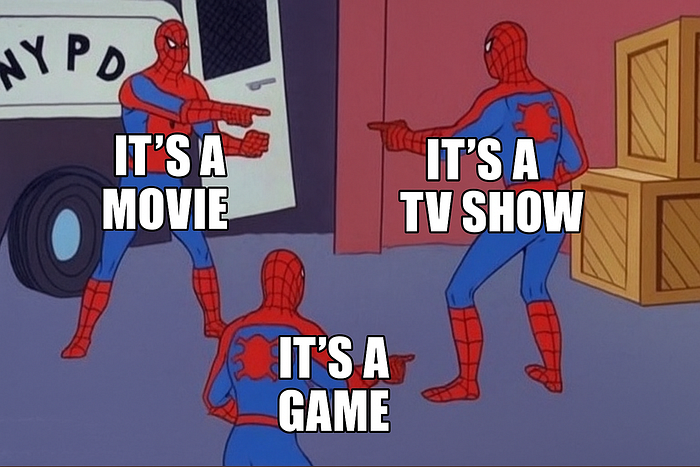

As a result, several challenges emerge:

- **Duplicated and Inconsistent Models** — Teams re-model the same business entities in different systems, leading to conflicting definitions that are hard to reconcile.
- **Inconsistent Terminology** — Even within a single system, teams may use different terms for the same concept, or the same term for different concepts, making collaboration harder.
- **Data Quality Issues** — Discrepancies and broken references are hard to detect across our many microservices. While identifiers and foreign keys exist, they are inconsistently modeled and poorly documented, requiring manual work from domain experts to find and fix any data issues.
- **Limited Connectivity** — Within systems, relationships between data are constrained by what each system supports. Across systems, they are effectively non-existent.

**To address these challenges, we need new foundations that allow us to define a model once, at the conceptual level, and reuse those definitions everywhere**. But it isn’t enough to just document concepts; we need to connect them to real systems and data. And more than just connect, we have to project those definitions outward, generating schemas and enforcing consistency across systems. The conceptual model must become part of the control plane.

These were the core ideas that led us to build UDA.

## Introducing UDA

**UDA (Unified Data Architecture)** is the foundation for connected data in [Content Engineering](./netflix-studio-engineering-overview-ed60afcfa0ce.md). It enables teams to model domains once and represent them consistently across systems — powering automation, discoverability, and [semantic interoperability](https://en.wikipedia.org/wiki/Semantic_interoperability).

**Using UDA, users and systems can:**

**Register and connect domain models **— formal conceptualizations of federated business domains expressed as data.

- **Why? **So everyone uses the same official definitions for business concepts, which avoids confusion and stops different teams from rebuilding similar models in conflicting ways.

**Catalog and map domain models to data containers**, such as GraphQL type resolvers served by a [Domain Graph Service](./open-sourcing-the-netflix-domain-graph-service-framework-graphql-for-spring-boot-92b9dcecda18.md), [Data Mesh sources](./data-mesh-a-data-movement-and-processing-platform-netflix-1288bcab2873.md), or Iceberg tables, through their representation as a graph.

- **Why?** To make it easy to find where the actual data for these business concepts lives (e.g., in which specific database, table, or service) and understand how it’s structured there.

**Transpile domain models into schema definition languages** like GraphQL, Avro, SQL, RDF, and Java, while preserving semantics.

- **Why? **To automatically create consistent technical data structures (schemas) for various systems directly from the domain models, saving developers manual effort and reducing errors caused by out-of-sync definitions.

**Move data faithfully between data containers**, such as from federated GraphQL entities to [Data Mesh](./data-mesh-a-data-movement-and-processing-platform-netflix-1288bcab2873.md) (a general purpose data movement and processing platform for moving data between Netflix systems at scale), Change Data Capture (CDC) sources to joinable Iceberg Data Products.

- **Why? **To save developer time by automatically handling how data is moved and correctly transformed between different systems. This means less manual work to configure data movement, ensuring data shows up consistently and accurately wherever it’s needed.

**Discover and explore domain concepts **via search and graph traversal.

- **Why? **So anyone can more easily find the specific business information they’re looking for, understand how different concepts and data are related, and be confident they are accessing the correct information.

**Programmatically introspect the knowledge graph** using Java, GraphQL, or SPARQL.

- **Why?** So developers can build smarter applications that leverage this connected business information, automate more complex data-dependent workflows, and help uncover new insights from the relationships in the data.

**This post introduces the foundations of UDA** as a knowledge graph, connecting domain models to data containers through mappings, and grounded in an in-house [metamodel](https://en.wikipedia.org/wiki/Metamodeling#:~:text=A%20metamodel%2F%20surrogate%20model%20is,representing%20input%20and%20output%20relations), or model of models, called Upper. Upper defines the language for domain modeling in UDA and enables projections that automatically generate schemas and pipelines across systems.

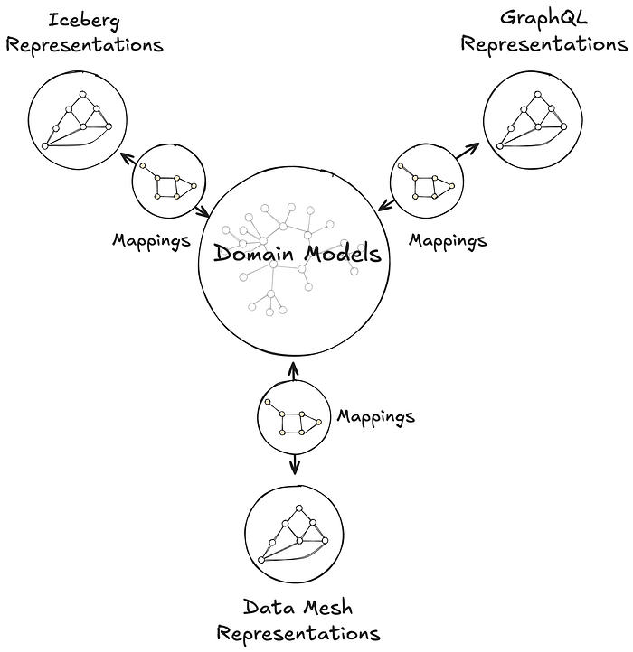
*The same domain model can be connected to semantically equivalent data containers in the UDA knowledge graph.*

**This post also highlights two systems** that leverage UDA in production:

**Primary Data Management (PDM)** is our platform for managing authoritative reference data and taxonomies. PDM turns domain models into flat or hierarchical taxonomies that drive a generated UI for business users. These taxonomy models are projected into Avro and GraphQL schemas, automatically provisioning data products in the Warehouse and GraphQL APIs in the [Enterprise Gateway](./how-netflix-scales-its-api-with-graphql-federation-part-1-ae3557c187e2.md).

**Sphere** is our self-service operational reporting tool for business users. Sphere uses UDA to catalog and relate business concepts across systems, enabling discovery through familiar terms like ‘actor’ or ‘movie.’ Once concepts are selected, Sphere walks the knowledge graph and generates SQL queries to retrieve data from the warehouse, no manual joins or technical mediation required.

### UDA is a Knowledge Graph

**UDA needs to solve the **[**data integration**](https://en.wikipedia.org/wiki/Data_integration)** problem. **We needed a data catalog unified with a schema registry, but with a hard requirement for [semantic integration](https://en.wikipedia.org/wiki/Semantic_integration#:~:text=Semantic%20integration%20is%20the%20process,from%20diverse%20sources). Connecting business concepts to schemas and data containers in a graph-like structure, grounded in strong semantic foundations, naturally led us to consider a [knowledge graph](https://en.wikipedia.org/wiki/Knowledge_graph) approach.

**We chose RDF and SHACL as the foundation for UDA’s knowledge graph**. But operationalizing them at enterprise scale surfaced several challenges:

- **RDF lacked a usable information model.** **While RDF offers a flexible graph structure, it provides little guidance on how to organize data into ****[named graphs](https://www.w3.org/TR/rdf12-concepts/#dfn-named-graph)****, manage ontology ownership, or define governance boundaries**. Standard [follow-your-nose mechanisms](https://www.w3.org/2001/sw/wiki/Linking_patterns) like owl:imports apply only to ontologies and don’t extend to named graphs; we needed a generalized mechanism to express and resolve dependencies between them.
- **SHACL is not a modeling language for enterprise data.** Designed to validate native RDF, SHACL assumes globally unique URIs and a single data graph. But enterprise data is structured around local schemas and typed keys, as in GraphQL, Avro, or SQL. SHACL could not express these patterns, making it difficult to model and validate real-world data across heterogeneous systems.
- **Teams lacked shared authoring practices.** Without strong guidelines, teams modeled their ontologies inconsistently breaking semantic interoperability. Even subtle differences in style, structure, or naming led to divergent interpretations and made transpilation harder to define consistently across schemas.
- **Ontology tooling lacked support for collaborative modeling.** Unlike GraphQL **Federation, ontology frameworks had no built-in support for modular contributions, team ownership, or safe federation**. Most engineers found the tools and concepts unfamiliar, and available authoring environments lacked the structure needed for coordinated contributions.

**To address these challenges, UDA adopts a named-graph-first information model.** **Each named graph conforms to a governing model, itself a named graph in the knowledge graph**. This systematic approach ensures resolution, modularity, and enables governance across the entire graph. While a full description of UDA’s information infrastructure is beyond the scope of this post, the next sections explain how UDA bootstraps the knowledge graph with its metamodel and uses it to model data container representations and mappings.

### Upper is Domain Modeling

**Upper is a language for formally describing domains — business or system — and their concepts**. [These concepts are organized into domain models](https://en.wikipedia.org/wiki/Conceptualization_(information_science)): controlled vocabularies that define classes of keyed entities, their attributes, and their relationships to other entities, which may be keyed or nested, within the same domain or across domains. Keyed concepts within a domain model can be organized in taxonomies of types, which can be as complex as the business or the data system needs them to be. Keyed concepts can also be extended from other domain models — that is, new attributes and relationships can be [contributed monotonically](https://tomgruber.org/writing/onto-design.pdf#page=4). Finally, Upper ships with a rich set of datatypes for attribute values, which can also be customized per domain.

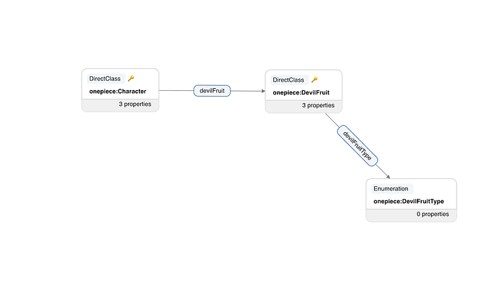
*The graph representation of the onepiece: domain model from our UI. Depicted here you can see how Characters are related to Devil Fruit, and that each Devil Fruit has a type.*

**Upper domain models are data**. They are expressed as [conceptual RDF](https://www.w3.org/TR/rdf12-concepts/) and organized into named graphs, making them introspectable, queryable, and versionable within the UDA knowledge graph. This graph unifies not just the domain models themselves, but also the schemas they transpile to — GraphQL, Avro, Iceberg, Java — and the mappings that connect domain concepts to concrete data containers, such as GraphQL type resolvers served by a [Domain Graph Service](./open-sourcing-the-netflix-domain-graph-service-framework-graphql-for-spring-boot-92b9dcecda18.md), [Data Mesh sources](./data-mesh-a-data-movement-and-processing-platform-netflix-1288bcab2873.md), or Iceberg tables, through their representations. Upper raises the level of abstraction above traditional ontology languages: it defines a strict subset of [semantic technologies](https://www.w3.org/2001/sw/wiki/Main_Page) from the W3C tailored and generalized for domain modeling. It builds on ontology frameworks like RDFS, OWL, and SHACL so domain authors can model effectively without even needing to learn what an ontology is.

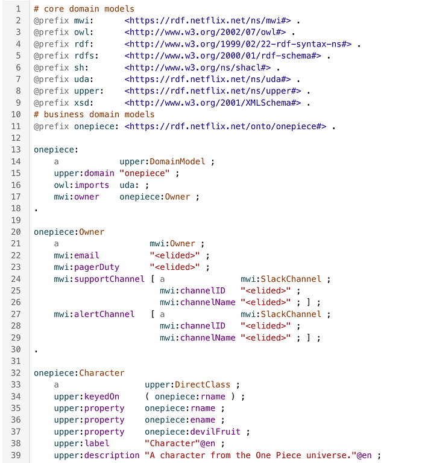
*UDA domain model for One Piece. Link to full definition.*

**Upper is the metamodel for Connected Data in UDA — the model for all models**. It is designed as a bootstrapping [upper ontology](https://en.wikipedia.org/wiki/Upper_ontology), which means that Upper is _self-referencing_, because it models itself as a domain model; _self-describing_, because it defines the very concept of a domain model; and _self-validating_, because it conforms to its own model. This approach enables UDA to bootstrap its own infrastructure: Upper itself is projected into a generated Jena-based Java API and GraphQL schema used in GraphQL service federated into Netflix’s Enterprise GraphQL gateway. These same generated APIs are then used by the projections and the UI. Because all domain models are [conservative extensions](https://en.wikipedia.org/wiki/Conservative_extension) of Upper, other system domain models — including those for GraphQL, Avro, Data Mesh, and Mappings — integrate seamlessly into the same runtime, enabling consistent data semantics and interoperability across schemas.

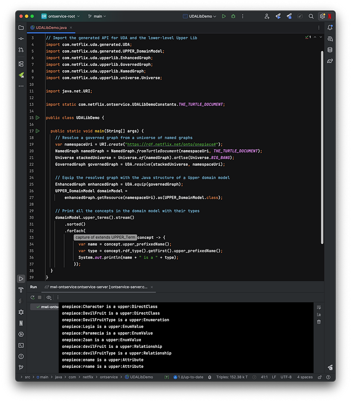
*Traversing a domain model programmatically using the Java API generated from the Upper metamodel.*

### Data Container Representations

**Data containers are repositories of information. **They contain instance data that conform to their own schema languages or type systems: federated entities from GraphQL services, Avro records from Data Mesh sources, rows from Iceberg tables, or objects from Java APIs. Each container operates within the context of a system that imposes its own structural and operational constraints.

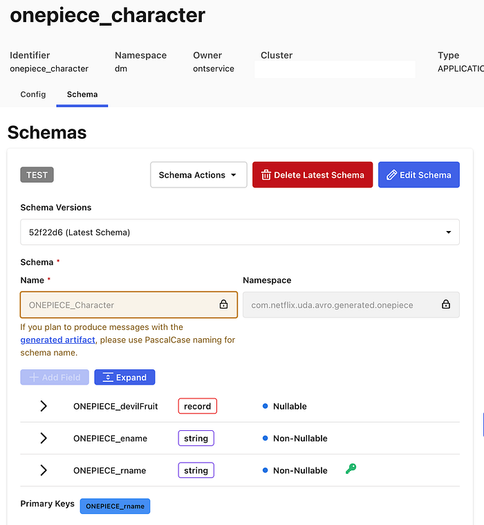
*A Data Mesh source is a data container.*

**Data container **[**representations**](https://en.wikipedia.org/wiki/Knowledge_representation_and_reasoning)** are data.** They are faithful interpretations of the members of data systems as graph data. UDA captures the definition of these systems as their own domain models, the system domains. These models encode both the information architecture of the systems and the schemas of the data containers within. They provide a blueprint for translating the systems into graph representations.

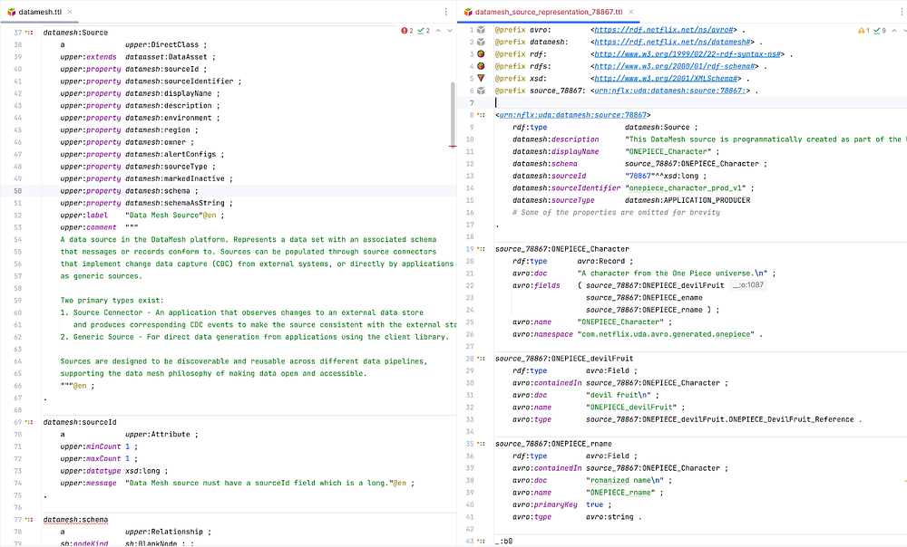
*Side by side/super imposed image of data container schema and representation. Link to full data container representation.*

**UDA catalogs the data container representations into the knowledge graph.** It records the coordinates and metadata of the underlying data assets, but unlike a traditional catalog, it only tracks assets that are semantically connected to domain models. This enables users and systems to connect concepts from domain models to the concrete locations where corresponding instance data can be accessed. Those connections are called _Mappings_.

### Mappings

**Mappings are data that connect domain models to data containers.** Every element in a domain model is addressable, from the domain model itself down to specific attributes and relationships. Likewise, data container representations make all components addressable, from an Iceberg table to an individual column, or from a GraphQL type to a specific field. A Mapping connects nodes in a subgraph of the domain model to nodes in a subgraph of a container representation. Visually, the Mapping is the set of arcs that link those two graphs together.

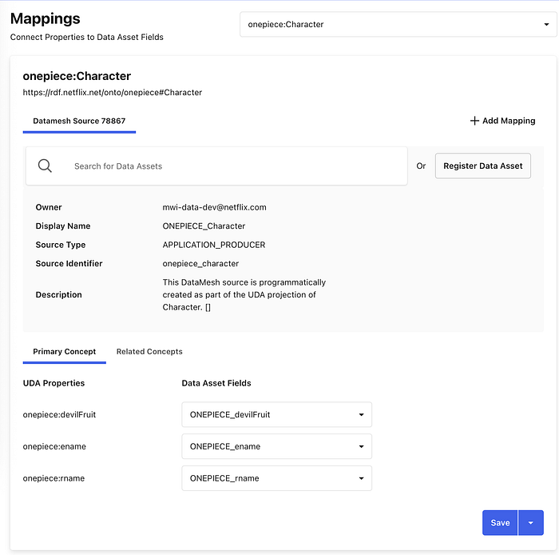
*A mapping between a domain model and a Data Mesh Source from the UDA UI. Link to full mapping.*

**Mappings enable discovery.** Starting from a domain concept, users and systems can walk the knowledge graph to find where that concept is materialized — in which data system, in which container, and even how a specific attribute or relationship is physically accessed. The inverse is also supported: given a data container, one can trace back to the domain concepts it participates in.

**Mappings shape UDA’s approach to semantic data integration.** Most existing schema languages are not expressive enough in capturing richer semantics of a domain to address requirements for data integration ([for example](https://doi.org/10.1007/978-3-319-49340-4_8), “accessibility of data, providing semantic context to support its interpretation, and establishing meaningful links between data”). A trivial example of this could be seen in the lack of built-in facilities in Avro to represent foreign keys, making it very hard to express how entities relate across Data Mesh sources. Mappings, together with the corresponding system domain models, allow for such relationships, and many other constraints, to be defined in the domain models and used programmatically in actual data systems.

**Mappings enable intent-based automation.** Data is not always available in the systems where consumers need it. Because Mappings encode both meaning and location, UDA can reason about how data should move, preserving semantics, without requiring the consumer to specify how it should be done. Beyond the cataloging use case, connecting to existing containers, UDA automatically derives _canonical Mappings_ from registered domain models as part of the projection process.

### Projections

**A projection produces a concrete data container.** These containers, such as a GraphQL schema or a Data Mesh source, implement the characteristics derived from a registered domain model. Each projection is a concrete realization of Upper’s denotational semantics, ensuring [semantic interoperability](https://en.wikipedia.org/wiki/Semantic_interoperability) across all containers projected from the same domain model.

**Projections produce consistent public contracts across systems.** The data containers generated by projections encode data contracts in the form of schemas, derived by transpiling a domain model into the target container’s schema language. UDA currently supports transpilation to GraphQL and Avro schemas.

The GraphQL transpilation produces a schema that adheres to the [official GraphQL spec](https://spec.graphql.org/October2021/#sec-Overview) with the ability to generate all GraphQL types defined in the spec. Given that the UDA domain model can be federated, it also supports generating federated graphQL schemas. Below is an example of a transpiled GraphQL schema.

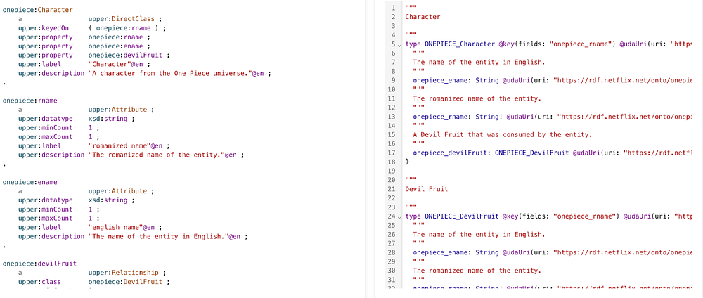
*Domain model on the left, with transpiled GraphQL schema on the right. Link to full transpiled GraphQL schema.*

The Avro transpilation produces a schema that is a Data Mesh flavor of Avro, which includes some customization on top of the [official Avro spec](https://avro.apache.org/docs/1.12.0/specification/). This schema is used to automatically create a Data Mesh source container. Below is an example of a transpiled Avro schema.

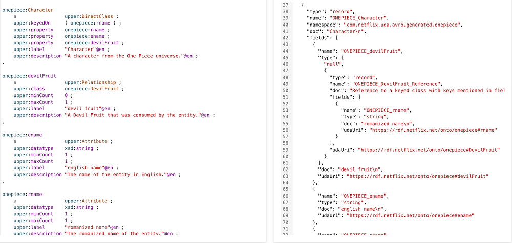
*Domain model on the left, with transpiled Avro schema on the right. Link to full transpiled Avro schema.*

**Projections can automatically populate data containers. **Some projections, such as those to GraphQL schemas or Data Mesh sources produce empty containers that require developers to populate the data. This might be creating GraphQL APIs or pushing events onto Data Mesh sources. Conversely, other containers, like Iceberg Tables, are automatically created and populated by UDA. For Iceberg Tables, UDA leverages the Data Mesh platform to automatically create data streams to move data into tables. This process utilizes much of the same infrastructure detailed in this blog post [here](./data-movement-in-netflix-studio-via-data-mesh-3fddcceb1059.md).

**Projections have mappings. **UDA automatically generates and manages mappings between the newly created data containers and the projected domain model.

## Early Adopters

### Controlled Vocabularies (PDM)

The full range of Netflix’s business activities relies on a sprawling data model that captures the details of our many business processes. Teams need to be able to coordinate operational activities to ensure that content production is complete, advertising campaigns are in place, and promotional assets are ready to deploy. We implicitly depend upon a singular definition of shared concepts, such as content production is complete. Multiple definitions create coordination challenges. Software (and humans) don’t know that the definitions mean the same thing.

We started the Primary Data Management (PDM) initiative to create unified and consistent definitions for the core concepts in our data model. These definitions form **controlled vocabularies**, standardized and governed lists for what values are permitted within certain fields in our data model.

**Primary Data Management (PDM) is a single place where business users can manage controlled vocabularies. **Our data model governance has been scattered across different tools and teams creating coordination challenges. This is an information management problem relating to the definition, maintenance and consistent use of reference data and taxonomies. This problem is not unique to Netflix, so we looked outward for existing solutions to this problem.

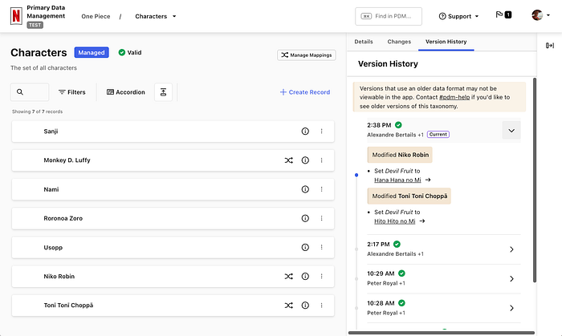
*Managing the taxonomy of One Piece characters in PDM.*

**PDM uses the Simple Knowledge Organization System (**[**SKOS**](https://www.w3.org/TR/skos-primer)**)** **model**. It is a W3C data standard designed for modeling knowledge. Its terminology is abstract, with Concepts that can be organized into ConceptSchemes and properties to describe various types of relationships. Every system is hardcoded against _something_, that’s how software knows how to manipulate data. We want a system that can work with a data model as its input, so we still need _something_ concrete to build the software against. This is what SKOS provides, a generic basis for modeling knowledge that our system can understand.

**PDM uses Domain Models to integrate SKOS into the rest of Content Engineering’s ecosystem. **A core premise of the system is that it takes a domain model as input, and everything that _can_ be derived _is_ derived from that model. PDM builds a user interface based upon the model definition and leverages UDA to project this model into type-safe interfaces for other systems to use. The system will provision a Domain Graph Service (DGS) within our federated GraphQL API environment using a GraphQL schema that UDA projects from the domain model. UDA is also used to provision data movement pipelines which are able to feed our [GraphSearch](./how-netflix-content-engineering-makes-a-federated-graph-searchable-5c0c1c7d7eaf.md) infrastructure as well as move data into the warehouse. The data movement systems use Avro schemas, and UDA creates a projection from the domain model to Avro.

**Consumers of controlled vocabularies never know they’re using SKOS. **Domain models use terms that fit in with the domain. SKOS’s generic notion of _broader_ and _narrower_ to define a hierarchy are hidden from consumers as super-properties within the model. This allows consumers to work with language that is familiar to them while enabling PDM to work with any model. The best of both worlds.

### Operational Reporting (Sphere)

**Operational reporting serves the detailed day-to-day activities and processes of a business domain.** It is a reporting paradigm specialized in covering high-resolution, low-latency data sets.

**Operational reporting systems should generate reports without relying on technical intermediaries. **Operational reporting systems need to address the persistent challenge of empowering business users to explore and obtain the data they need, when they need it. Without such self-service systems, requests for new reports or data extracts often result in back-and-forth exchanges, where the initial query may not exactly meet business users’ expectations, requiring further clarification and refinement.

**Data discovery and query generation are two relevant aspects of data integration. **Supplying end-users with an accurate, contextual, and user-friendly data discovery experience provides a basis for query generation mechanism which produces syntactically correct and semantically reliable queries.

**Operational reports are predominantly run on data hydrated from GraphQL services into the Data Warehouse. **You can read about our journey from conventional data movement to streaming data pipelines based on CDC and GraphQL hydration in [this blog post](./data-movement-in-netflix-studio-via-data-mesh-3fddcceb1059.md). Among the challenging byproducts of this approach was that a single, distinct data concept is now present in two places (GraphQL and data warehouse), with some disparity in semantic context to guide and support the interpretations and connectivity of that data. To address this, we formulate a mechanism to use the syntax and semantics captured in the federated schema from [Netflix’s Enterprise GraphQL](./how-netflix-scales-its-api-with-graphql-federation-part-1-ae3557c187e2.md) and populate _representational domain models_ in UDA to preserve those details and add more.

**Domain models enable the data discovery experience. **Metadata aggregated from various data-producing systems is captured in UDA domain models using a unified vocabulary. This metadata is surfaced for the users’ search and discovery needs; instead of specifying exact tables and join keys, users simply can search for familiar business concepts such as ‘actors’ or ‘movies’. We use UDA models to disambiguate and resolve the intended concepts and their related data entities.

**UDA knowledge graph is the data landscape for query generation. **Once concepts are discovered and their mappings to corresponding data containers are identified and located in the knowledge graph, we use them to establish join strategies. Through graph traversal, we identify _boundaries_ and _islands_ within the data landscape. This ensures only feasible, joinable combinations are selected while weeding out semantically incorrect and non-executable query candidates.

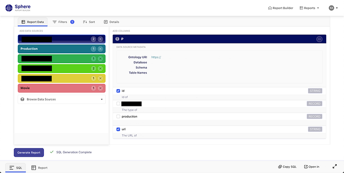
*Generating a report in Sphere.*

**Sphere is a UDA-powered self-service operational reporting system. **The solution based on knowledge graphs described above is called Sphere. Seeing self-service operational reporting through this lens, we can improve business users’ agency in access to operational data. They are empowered to explore, assemble, and refine reports at the conceptual level, while technical complexities are managed by the system.

## Stay Tuned

UDA marks a fundamental shift in how we approach data modeling within Content Engineering. By providing a unified knowledge graph composed of what we know about our various data systems and the business concepts within them, we’ve made information more consistent, connected, and discoverable across our organization. We’re excited about future applications of these ideas such as:

- Supporting additional projections like Protobuf/gRPC
- Materializing the knowledge graph of instance data for querying, profiling, and management
- Finally solving some of the initial [challenges](./how-netflix-content-engineering-makes-a-federated-graph-searchable-5c0c1c7d7eaf.md) posed by Graph Search (that actually inspired some of this work)

If you’re interested in this space, we’d love to connect — whether you’re exploring new roles down the road or just want to swap ideas.

Expect to see future blog posts exploring PDM and Sphere in more detail soon!

### Credits

Thanks to [Andreas Legenbauer](https://www.linkedin.com/in/andreaslegenbauer/), [Bernardo Gomez Palacio Valdes](https://www.linkedin.com/in/bernardo-g-4414b41/), [Charles Zhao](https://www.linkedin.com/in/czhao/), [Christopher Chong](https://www.linkedin.com/in/christopherchonguw/), [Deepa Krishnan](https://www.linkedin.com/in/deepa-krishnan-593b60/), [George Pesmazoglou](https://www.linkedin.com/in/gpesma/), [Jessica Silva](https://www.linkedin.com/in/jsilvax/), [Katherine Anderson](https://www.linkedin.com/in/katherine-anderson-77074159/), [Malik Day](https://www.linkedin.com/in/malikday/), [Rita Bogdanova](https://www.linkedin.com/in/ritabogdanovashapkina/), [Ruoyun Zheng](https://www.linkedin.com/in/ruoyunzheng/), [Shawn Stedman](https://www.linkedin.com/in/shawn-s-b80821b0/), [Suchita Goyal](https://www.linkedin.com/in/suchitagoyal/), [Utkarsh Shrivastava](http://www.linkedin.com/in/utkarshshrivastava/), [Yoomi Koh](https://www.linkedin.com/in/yoomikoh/), [Yulia Shmeleva](https://www.linkedin.com/in/yuliashmeleva/)

---
**Tags:** Knowledge Management · Data Management · Data Engineering · Rdf · Data Catalog
