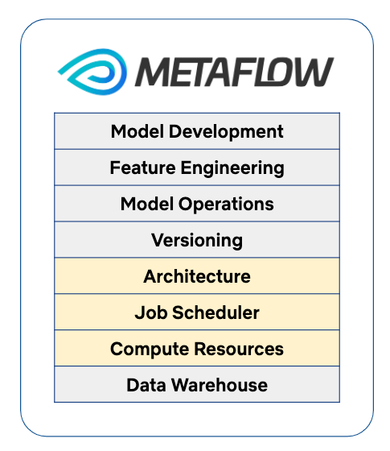
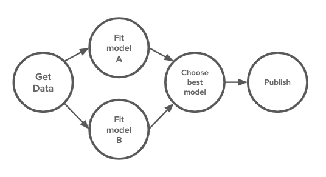
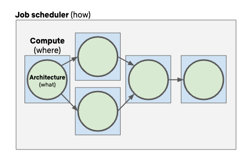

# Unbundling Data Science Workflows with Metaflow and AWS Step Functions

by [David Berg](http://www.linkedin.com/in/david-j-berg), [Ravi Kiran Chirravuri](https://www.linkedin.com/in/crkgoogle/), [Romain Cledat](https://www.linkedin.com/in/romain-cledat-4a211a5), [Jason Ge](https://www.linkedin.com/in/jiange/), [Savin Goyal](http://www.linkedin.com/in/savingoyal), [Ferras Hamad](https://www.linkedin.com/in/ferras-hamad), [Ville Tuulos](https://www.linkedin.com/in/villetuulos/)

_tl;dr _**_Today, we are releasing a new job scheduler integration with _**[**_AWS Step Functions_**](https://aws.amazon.com/step-functions/)**_._**_ This integration allows the users of Metaflow to schedule their production workflows using a highly available, scalable, maintenance-free service, without any changes in their existing Metaflow code._

The idea of abstraction layers is a fundamental way to manage complexity in computing: Atoms make transistors, transistors make functional units in CPUs, CPUs implement instruction sets that are targeted by compilers for higher-level languages. A key benefit of these layers is that they can be developed independently by separate groups of people, as they are coupled together only through a well-scoped interface. The layers can have independent life cycles that enable higher layers of the stack to maintain a semblance of stability without hindering innovation at the layers below.

Metaflow, [a data science framework that Netflix open-sourced in December 2019](./open-sourcing-metaflow-a-human-centric-framework-for-data-science-fa72e04a5d9.md), is designed around the idea of independent layers. Already years ago, when we started building Metaflow, we recognized that there are excellent solutions available for each layer of the typical data science stack, but stitching the layers together was a challenge for data science projects. We wanted Metaflow to become a substrate that integrates the layers into an easy-to-use productivity tool, optimized for data science use cases.

In contrast to many other frameworks, Metaflow doesn’t try to abstract away the existence of the separate layers. We believe that [problems are solved by people, not by tools](https://docs.metaflow.org/introduction/what-is-metaflow#3-fanatic-focus-on-the-usability-and-ergonomics). Following our human-centric, usability-driven approach, data scientists shouldn’t have to care about the lower layers of the stack — they should just work — but we believe that there is no benefit in trying to pretend that the stack doesn’t exist, which would be problematic especially when things fail.

This article focuses on the job scheduler layer and the two layers that surround it: The architecture layer that defines the structure of the user’s code, and the compute layer that defines how the code is executed.

Since the initial open-source release of Metaflow, we have heard questions about [how Metaflow compares to other workflow schedulers](https://twitter.com/mahdiech/status/1249542824141287425) or [how Metaflow workflows should be executed in production](https://twitter.com/vtuulos/status/1254832644572905473). The answer to both of these questions is the same: **Metaflow is designed to be used in conjunction with a production-grade job scheduler**. **Today, we are releasing the first open-source integration with such a scheduler, AWS Step Functions**, which you can use to execute your Metaflow workflows in a scalable and highly-available manner.

Before going into details about AWS Step Functions, we want to highlight the role of the job scheduling layer in the Metaflow stack.

## Unbundling the DAG

Similar to [many](https://dvc.org/) [other](https://pachyderm.io/) [frameworks](https://airflow.apache.org/) that help to manage data science workflows, Metaflow asks the user to [organize their work as a Directed Acyclic Graph of compute steps](https://docs.metaflow.org/metaflow/basics), like in this hypothetical example:

We find the DAG abstraction to be a natural way to think about data science workflows. For instance, a data scientist might draw the above DAG on a whiteboard, when asked how she wants to organize her modeling pipeline. At this level, the DAG doesn’t say anything about **what** code gets executed or **where** it is executed; it is only about **how** the data scientist wants to structure their code.

The idea of [scheduling scientific workflows as a DAG](https://en.wikipedia.org/wiki/Scientific_workflow_system) is decades old. Many existing systems require tight coupling between the layers of the data science stack, which was often necessitated by infrastructural limitations that predate the cloud. In some systems, the user may need to specify the **what** part, the modeling code itself, using a custom DSL. The DSL may have to be executed with a built-in job scheduler that is tightly coupled with a compute layer, e.g. an HPC cluster which defines where the code is executed.

For specific use cases, a tight coupling may be well justified. However, since its inception, Metaflow has supported hundreds of different real-life data science use cases from natural language processing and computer vision to classical statistics using R, which makes it much harder to define a tightly coupled stack of what-how-and-where that would work well for all use cases. For instance, the user may want to use [a compute layer that is optimized for computer vision](https://netflixtechblog.com/simplifying-media-innovation-at-netflix-with-archer-3f8cbb0e2bcb) in certain steps of their workflow.

Metaflow unbundles the DAG into separate architecture (what), scheduler (how), and compute (where) layers:

The user may use languages and libraries that they are familiar with, leveraging the rich data science ecosystems in R and Python to architect their modeling code. The user’s code gets packaged for the compute layer by Metaflow, so the user can focus on their code rather than e.g. writing Dockerfiles. Finally, the scheduling layer takes care of executing the individual functions using the compute layer. From the data scientist’s point of view, the infrastructure works exactly as it should: They can write idiomatic modeling code using familiar abstractions and it gets executed without hassle, even at massive scale.

## The Scheduler Layer

Before a DAG can be scheduled, the user must define it. Metaflow comes with an opinionated syntax and a set of utilities for crafting data science workflows in Python and R (coming soon). We provide plenty of support for **architecting** robust data science code, which empowers data scientists to create and operate workflows autonomously even if they don’t have years of experience in writing scalable systems software. In particular, Metaflow takes care of [data flow and state transfer](https://docs.metaflow.org/metaflow/basics#data-flow-through-the-graph) at this layer, independent of the scheduler.

Metaflow provides strong guarantees about the backwards compatibility of the user-facing API, so the user can write their code confidently knowing that Metaflow will schedule and execute it without changes, even if the underlying layers will evolve over time. In the user’s point of view, the core value-add of Metaflow is these APIs, rather than any specific implementation of the underlying layers.

Once the user has specified a workflow, orchestrating the execution of the DAG belongs to the **job scheduler** layer. The scheduling layer doesn’t need to care about what code is being executed. Its sole responsibility is to schedule the steps in [the topological order](https://en.wikipedia.org/wiki/Topological_sorting), making sure that a step finishes successfully before its successors in the graph are executed.

While this may sound deceptively simple, consider what this means in the context of real-life data science at a company like Netflix:

- The graphs may be almost arbitrarily large, especially thanks to dynamic fan-outs, i.e. the [foreach construct](https://docs.metaflow.org/metaflow/basics#foreach). For instance, some of the existing Metaflow workflows train a model for every country (a 200-way foreach), and for every model they perform a hyperparameter search over 100 parametrizations (a 100-way foreach), which results in 20,000 tasks in a single workflow. Hence scalability is a critical feature of the scheduler.
- There are arbitrarily many workflows running concurrently. For instance, the country-level workflow may have 10 different variations scheduled simultaneously. At Netflix-scale, the scheduler needs to be able to handle hundreds of thousands of active workflows.
- Besides scale, the scheduler needs to be highly available. It is the responsibility of the scheduler to make sure that business-critical workflows get executed on time. Achieving both scalability and high-availability in the same system is a non-trivial engineering challenge.
- The scheduler may provide various ways to trigger an execution of the workflow: A workflow may be started based on time (simple Cron-style scheduling), or an external signal may trigger its execution. At Netflix, most workflows are triggered based on the availability of upstream data, i.e. an ML workflow starts whenever fresh data is available. How to best organize a web of workflows is a deep topic in itself which we will cover in more detail later.
- The scheduler should include tools for observability and alerting: It is convenient to monitor the execution of a workflow on a GUI and get alerted by various means if a critical execution fails.

It is important to note that the scheduling layer doesn’t execute any user code. Execution of the user code is the responsibility of the **compute** layer. Out of the box, Metaflow provides a local compute layer that executes tasks as local processes, taking advantage of multiple CPU cores. When more compute resources are needed, both the local scheduler and AWS Step Functions can utilize [AWS Batch for executing tasks as independent containers](https://docs.metaflow.org/metaflow/scaling#using-aws-batch).

### Local Scheduler

Metaflow comes with a built-in scheduler layer which makes it easy to test workflows locally on a laptop or in a development sandbox. While the built-in scheduler is fully functional in the sense that it executes steps in the topological order and it can handle workflows with tens of thousands of tasks, it lacks support for high-availability, triggering, and alerting by design.

Since Metaflow has been designed with interchangeable layers in mind, we don’t need to reinvent the wheel by building yet another production-grade DAG scheduler. Instead, the local scheduler focuses on providing quick develop-test-debug cycles during development. The user can deploy their workflow to a production-grade scheduler, such as AWS Step Functions when they are happy with the results. Many production-grade schedulers don’t provide a first-class local development experience, so having a local scheduler ensures a smooth transition from prototyping to production.

Metaflow recognizes that “deploying to production” is not a linear process. Rather, we expect the user to use both the local scheduler and the production scheduler in parallel. For instance, after the initial deployment, the data scientist typically wants to continue working on the project locally. Eventually, they might want to deploy a new, experimental version on the production scheduler to run in parallel with the production version as an A/B test. Also, things fail in production. Metaflow allows the user to reproduce issues that occur on the production scheduler locally, simply by using [the resume command](https://docs.metaflow.org/metaflow/debugging#how-to-use-the-resume-command) to continue the execution on their local machine.

## AWS Step Functions

Metaflow’s built-in local scheduler is a great solution for running isolated workflows during testing and development when quick, manual iterations are preferred over high availability and unattended execution. At Netflix, when data scientists are ready to deploy their Metaflow workflows to production, they use [an internal scheduler called Meson](https://www.youtube.com/watch?v=0R58_tx7azY). Internally, Meson fulfills the requirements for a production scheduler that we laid out above.

Since open-sourcing of Metaflow, we have wanted to find a publicly available replacement for Meson which all users of Metaflow could benefit from. We considered a number of existing, popular open-source workflow schedulers such as [Luigi](https://github.com/spotify/luigi) and [Airflow](https://airflow.apache.org/). While these systems have many benefits, we found them lacking when it comes to high availability and scalability, which are our key requirements for a production scheduler.

After careful consideration, we chose [AWS Step Functions](https://aws.amazon.com/step-functions/features/) (SFN) as the target for our first open-source production scheduler integration. We found the following features of SFN appealing, roughly in the order of importance:

1. AWS has a proven track record for delivering a high SLA, which addresses our** high availability** requirements.
2. High availability is delivered with **zero operational burden**. At Netflix, a team of senior engineers is required to develop and operate the internal scheduler. We expect that most smaller companies don’t want to dedicate a full team to maintain a scheduler. It is likely that [SFN is a more cost-effective solution](https://aws.amazon.com/step-functions/pricing/).
3. We are optimistic that SFN is **highly scalable**, especially in terms of the number of concurrent workflows. As of today, the size of an individual workflow is [limited to 25k state transitions](https://docs.aws.amazon.com/step-functions/latest/dg/limits.html#service-limits-state-machine-executions) which should be enough for the vast majority of use cases. Quite uniquely, SFN has a very high limit for the workflow execution time, one year, which is convenient for demanding ML workflows that may take a very long time to execute.
4. There are existing mechanisms for **triggering workflows** based on external events. Over time, one can leverage this functionality to build a web of data and ML workflows, similar to what Netflix operates internally.
5. One can use well-known AWS tools such as [CloudWatch](https://aws.amazon.com/cloudwatch/) for **monitoring and alerting**.

It is remarkable that today companies of any size can benefit from off-the-shelf tooling of this caliber for, in many cases, a negligible cost. This aligns well with the vision of Metaflow: We can use the best publicly available infrastructure for each layer of the ML stack. Metaflow then takes care of removing any gaps in the stack. In the data scientist point of view, they can deploy their workflows to production simply by executing

_python myflow.py step-functions create_

For more details about how to use Step Functions with Metaflow, [see the documentation](https://docs.metaflow.org/going-to-production-with-metaflow/scheduling-metaflow-flows).

### Under the hood

When the user executes _step-functions create_, Metaflow statically analyzes the user’s workflow defined in the FlowSpec class. We parse the DAG structure and compile it to [Amazon States Language](https://states-language.net/spec.html) which is how workflows are specified for AWS Step Functions.

Besides compiling the DAG, we automatically translate [Parameters](https://docs.metaflow.org/metaflow/basics#how-to-define-parameters-for-flows) and relevant decorators such as [@resources](https://docs.metaflow.org/metaflow/scaling#requesting-resources-with-resources-decorator) and [@retry](https://docs.metaflow.org/metaflow/failures#retrying-tasks-with-the-retry-decorator) to SFN configuration. The user code and [its dependencies](https://docs.metaflow.org/metaflow/dependencies) are snapshot and stored in S3, to guarantee that production workflows are not impacted by any external changes other than input data.

Today, the only compute layer supported by SFN is [AWS Batch](https://docs.metaflow.org/metaflow/scaling#using-aws-batch). All user-defined code, i.e. Metaflow tasks are executed on containers managed by AWS Batch. In the future, workflows scheduled by SFN may leverage other compute layers as well.

This translation ensures that the user’s Metaflow workflow can be executed either with the local scheduler or SFN without any changes in the code. Data scientists can focus on writing modeling code, test it locally in rapid iterations, and finally deploy the code to production with a single command. Most importantly, they can repeat the cycle as often as needed with minimal overhead.

## Next Steps

With the AWS Step Functions integration that we released today, all users of Metaflow can start leveraging a production-grade workflow scheduler similar to the setup that Netflix has been operating successfully over the past three years.

If you are a data scientist who uses (or plans to use) Metaflow, you can learn more about [deploying to Step Functions](https://docs.metaflow.org/going-to-production-with-metaflow/scheduling-metaflow-flows) in our documentation. If you are an infrastructure person wanting to leverage Metaflow and Step Functions in your organization, you should take a look at our brand new [Administrator’s Guide to Metaflow](https://admin-docs.metaflow.org/).

We believe that AWS Step Functions is an excellent choice for scheduling Metaflow workflows in production. However, the layers of the Metaflow stack are pluggable by design. If you have had a good experience with another job scheduler that could fulfill the requirements set above or need help in getting started with Step Functions, [please get in touch](https://docs.metaflow.org/introduction/getting-in-touch).

---
**Tags:** Machine Learning · Infrastructure · AWS
