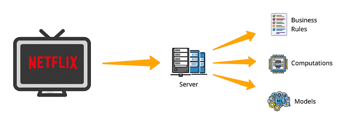
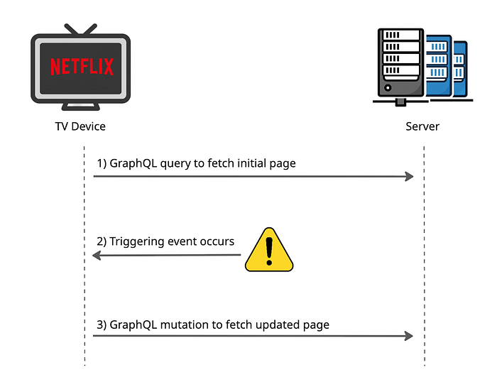
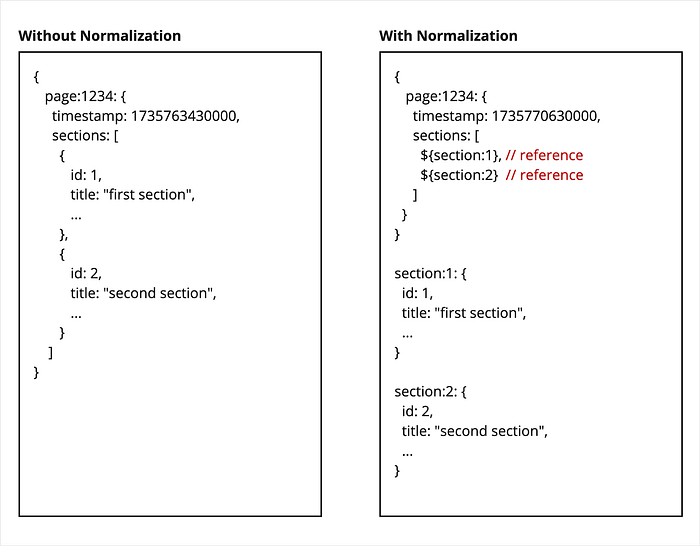
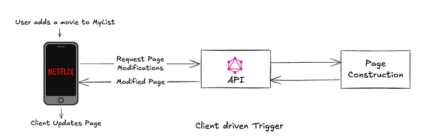
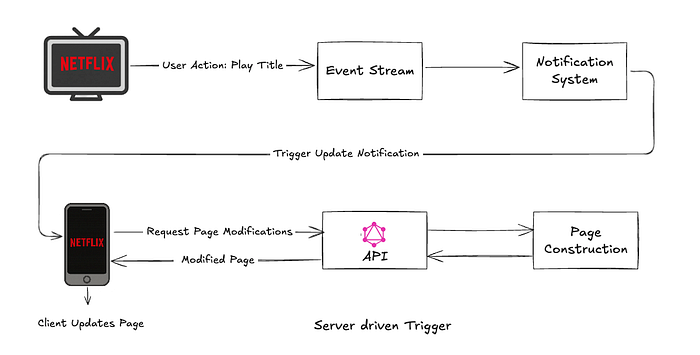

# Unlocking Dynamic Pages: The Evolution of Netflix’s Client-Server GraphQL APIs

By [Sreekanth Ramakrishnan](https://www.linkedin.com/in/sr33kanth/), [David Shin](https://www.linkedin.com/in/shinda/), [Mehmet Yilmaz](https://www.linkedin.com/in/mehmet-mustafa-yilmaz-255a091a/)

When a user opens the Netflix app, a flurry of activity happens behind the scenes. The app requests the homepage from a server, which assembles a personalized page using a combination of business rules, computations, and machine learning models.


*Figure 1. Device and server activity behind the scenes*

In the past, once the homepage was constructed, it would remain static and unchanged for the remainder of that user’s session, with some notable exceptions such as My List and Continue Watching. A few years ago, we began experimenting with making the experience more personalized for that precise moment in time, and we updated the page dynamically based on the user’s behavior during that session. For example, after viewing multiple comedy show trailers, a user would see an updated page that included relevant comedy titles.

Enabling this experience required modifications to device call patterns, APIs, and backend page construction systems. However, as these changes were limited in nature, our systems were still largely operating with a static page paradigm. This imposed significant constraints on the nature and scope of page updates possible. To support more dynamic pages, our systems required much larger foundational investments.

Since then, driven by evolving business needs, we have made significant progress toward this goal. In this blog post, we will share our work in GraphQL APIs and triggers. From the device perspective, these two work together to enable dynamic updates — APIs for fetching page data and subsequent updates and triggers to initiate those page updates.

## GraphQL APIs for Page Updates

Supporting dynamic page updates naturally required focusing on GraphQL APIs utilized by Netflix devices. Our technical choices in the GraphQL space involved selecting appropriate operations and designing the schema.

Our approach was fairly straightforward:

1. The device sends a GraphQL query to retrieve the initial page data.
2. A triggering event occurs, indicating that the page needs to be updated (more details on triggers will be provided later).
3. The device sends a GraphQL mutation request to update the page.


*Figure 2. Sequence of GraphQL calls*

Specifically for step 3, we evaluated queries and subscriptions as alternative options. We ended up selecting mutations for the GraphQL operation for the reasons explained below.

## Mutations Over Queries

As queries are generally used for read operations and mutations for modifying server data, GraphQL mutations were a better conceptual fit. Additionally, we found a compelling technical reason in favor of mutations as we examined GraphQL client caching behavior. **For queries, GraphQL client libraries often cache data locally and use it to fulfill subsequent queries as a desirable optimization.** Unfortunately, this caching behavior hindered our ability to fetch new page data using queries, requiring us to manage our queries carefully to avoid issues. With mutations, client libraries always fetched server data without issue, even for repeated identical calls.

## Mutations Over Subscriptions

In contrast to queries, GraphQL subscriptions were conceptually well-suited for our use case. However, we decided against using subscriptions due to the practical considerations of cost and risk associated with Netflix’s GraphQL subscription infrastructure. At that time, subscriptions had limited adoption, primarily in a few studio content applications and none within the Netflix member space. A subscription-based solution would have demanded significant infrastructure investment to support the vast scale of the Netflix member streaming experience. While we considered this investment unnecessary at the time, we developed our mutations approach to be compatible with subscriptions, allowing for a seamless transition if our strategy evolves in the future.

## Schema Design

With the GraphQL operation set, we turned our attention to the schema design. There, we encountered some technical challenges which we will illustrate next.

First, consider the following schema in GraphQL with a basic page that contains a list of sections.

```
type Page {
  id: ID
  timestamp: Long
  sections: [Section]
}

type Section {
  id: ID
  title: String
}
```

Next, we have a query to fetch the initial page and a mutation to fetch the updated page.

```
type Query {
  getPage(pageType: String): Page // pageType = "home"
}

type Mutation {
  updatePage(id: ID!): UpdatePageResult
}

type UpdatePageResult {
  page: Page
}
```

Using the query to fetch the initial page, the device receives a response containing a page with two sections:

```
{
   id: 1234
   timestamp: 1735763430000,
   sections: [
     {
          id: 1,
          title: "first section"
     },
     {
          id: 2,
          title: "second section"
      }
   ]
}
```

This page data is stored in the device’s local cache and propagated to the appropriate layers for rendering or other purposes.

Later on, a triggering event occurs such as the user initiating a video playback, and the device needs to fetch a page update. It uses the mutation and fetches the updated page. This time, the server returns an updated page with a new timestamp as well as a new section in addition to the previous two sections.

The mutation response is:

```
{
   id: 1234
   timestamp: 1735770630000, // updated value
   sections: [
     {
        id: 1,
        title: "first section"
     },
     {
        id: 3,
        title: "new" // new section
     },
     {
        id: 2,
        title: "second section"
     }
  ]
}
```

For a scalar value such as the timestamp, the device fetches the new value and overwrites its locally cached value accordingly. However, updating a list of types, such as the list of sections, is much more complex.

A simple approach would be for the device to fetch the new list of sections and replace its current list entirely, stomping over everything in the device client cache. The new list contains the previously fetched sections as well as the new one.

This is problematic when the Section type becomes expensive to fetch. Since Section in practice includes tens of fields and nested fields, fetching all of them would not only result in a very large data payload but also necessitate the execution of costly server-side resolvers.

To put this into perspective using a more extreme case, imagine that the device has a list of 100 Sections and one new Section is added during a page update. Fetching all 101 Sections becomes both prohibitively expensive and wasteful given that 100 Sections are unchanged and only 1 is new.

The fundamental problem here is how we can update a list of complex types efficiently in GraphQL.

## Cache Normalization for Sections

To help address the efficiency aspect, we worked with Netflix TV and mobile client engineers to explore GraphQL client cache normalization for Sections. Rather than storing the Sections and all of the corresponding data under the Page entry in the client cache, we stored separate entries for each Section using normalization ids and used references to those Sections in the Page entry. Here is a visual representation of this difference:



## Mutation API with Section Normalization

With a solid grasp of GraphQL client normalization, we focused on designing a mutation schema that took advantage of Section normalization to enable devices to fetch the modified data efficiently. Returning to our page update example of inserting a new section in the middle of the list, specifically, we needed to be able to:

1. Fetch the full payload of a newly inserted Section
2. Skip fetching the full payloads of unchanged Sections
3. Update the list of references to the Sections in the Page

We can do this by adding a new field to the previous UpdatePageResult type that contains the newly inserted sections. [Note that for simplicity and ease of understanding, we will focus on insertions as the main type of page modification in this blog post. In practice, our schema is quite a bit more complex but supports a variety of page modifications.]

```
type UpdatePageResult {
  page: Page
  insertedSections: [Section] // new field
}
```

Using a mutation query, the device fetches the page field of the UpdatePageResult but requests only the normalization ids for the sections. It also fetches the insertedSections field but this time with the full list of Section fields.

Here is a sample mutation and response:

```
mutation updatePage(pageId: 1234) {
  page {
    sections {
      id // fetch normalized ids only
    }
  }
  insertedSections {
    id
    title // fetch full data of new Sections
  }
}
```

```
updatePageResult: {
  page: {
    sections: [
      {
         id: 1
      },
      {
         id: 3 // newly inserted section id
      },
      {
         id: 2
      }
    ]
  },
  insertedSections: [
    {
       id: 3, // newly inserted section id
       title: "new"
    }
  ]
}
```

Afterward, a device’s internal GraphQL client cache is updated to look like this:

```
{
  "page:1234": {
    "timestamp": 1735770630000,
    "sections": [
      "${section:1}", // Reference
      "${section:3}", // Reference to new
      "${section:2}"  // Reference
    ]
  },
  "section:1": {
    "id": 1,
    "title": "first section"
  },
  "section:2": {
    "id": 2,
    "title": "second section"
  },
  "section:3": {
    "id": 3,
    "title": "new"
  }
}
```

In practice, each GraphQL client had implementation differences for handling normalization but the concept remained largely the same. After several rounds of prototyping and successfully validating this approach with different Netflix device teams, we were able to design the mutation API to meet our needs.

## Triggers for Page Updates

Now that we’ve explained the mechanics behind the GraphQL mutation schema, we will discuss when the device will use it to fetch a page update. For this, we introduce the concept of triggers. A trigger is an event that causes the device to ask the server for a page update. These include user-initiated actions as well as app-driven events such as expirations and server notifications.

When a device initially requests the homepage during app start, the server returns a set of triggers for the page as part of the page payload. See the schema below which now has triggers added at the page level and the section level.

```
type Page {
   id: ID
   timestamp: Long
   sections: [Section]
   triggers : [Trigger] // added 
}

type Section {
   id: ID
   title: String
   triggers : [Trigger] // added
}

type PlaybackEndTrigger {
 id: ID
 action: Action
}

type ServerNotificationTrigger {
 id: ID
 serverNotificationMessage: String
 action: Action
}

type AddToMyListTrigger {
 id: ID
 action: Action
}

union Trigger = PlaybackEndTrigger | ServerNotificationTrigger | AddToMyListTrigger

union Action = UpdatePageAction | NewPageAction | ApplyPrefetchAction
```

While the server determines which triggers to return, the client interprets the criteria for each trigger based on its specific GraphQL type. For instance, upon encountering the AddToMyListTrigger type, the client interprets this as an instruction to monitor when users add items to MyList.



Unlike most triggers which rely on client-managed criteria, the ServerNotificationTrigger requires a special server-to-client notification. This is used in cases where the device cannot independently detect the triggering condition.

As an example, when a user starts watching a new title on a TV, we want to update the “Continue Watching” section across all their active devices in addition to that specific TV. Server notifications are sent to those devices, which then update pages with corresponding triggers.



## Trigger Actions

The trigger schema also includes an action field, which instructs the device on how it should respond when the triggering conditions are met. Some of these actions include:

- **NewPage**: Instructs the client to load an entirely new page.
- **UpdatePage**: Tells the client to refresh specific sections without reloading the entire page.
- **ApplyPrefetchedData**: Directs the client to use data that was prefetched in anticipation of an update instead of calling the server.
- **NavigateToAppStore**: Guides the client to open the App Store, which might be needed for actions like game downloads.
- **OpenGame**: Switches the client into a gaming mode when necessary.

This flexible approach allows us to specify different client behavior based on the context as well as modify that behavior later on. For example, on the homepage, a “PlaybackEndTrigger” might result in a page update, but on a different page, it might result in a new page load using a different action.

## Handling the UpdatePageAction Type

We will now look more closely at the `UpdatePageAction` type defined below. This action can be associated with any trigger, and when the trigger occurs, the client calls the server using the `updatePage` mutation, passing in the associated action id as a parameter to the mutation.

```
type UpdatePageAction {
   actionId: ID
}

mutation updatePage(pageId: String!, actionId: ID): UpdatePageResult // new actionId parameter
```

The `actionId` is a token generated by the server and encoded with information about the associated context including the originating section and page. This allows the server to independently decide how to modify the page. Potential modifications include modifying a section to add or remove items, inserting a new section at a specific location, or removing a section from the page.

## UpdatePageAction and the UpdatePage Mutation

Let’s tie this together using an example.

First, the device fetches the following page payload from the server. It contains a single “Continue Watching” section with a single video and a `PlaybackEndTrigger`.

```
{// original page response
   "sections": [
       {
          "id": 1,
          "title": "Continue Watching",
          "videos": [
            {
               "id": "video1",
               "title": "Stranger Things",
               "duration": 50
            }
          ],
          "triggers": [
            {
               "__typename": "PlaybackEndTrigger",
               "id": "trigger1",
               "action": {
                  "__typename": "UpdatePageAction",
                  "id": "encodedCwPlaybackActionId1"
               }
            }
         ]
      }
   ]
}
```

The user then plays “Stranger Things” from the “Continue Watching” section. When the playback ends, it triggers the registered PlaybackEndTrigger and its associated UpdatePageAction. As a result, the client makes an updatePage mutation call and passes in the “encodedCwPlaybackActionId1” action id as a parameter.

From this action ID, the server understands that a playback occurred from the “Continue Watching” row on this specific page. The server determines that the user might be interested in similar content. It calls backend services to understand that “Stranger Things” was played and then inserts a new “Because You Watched Stranger Things” section on the page. In the updatePage mutation response, the server returns the UpdatePageResult, complete with the new section ID inserted in the appropriate position and a fully populated new section as an insertSection modification.

```
updatePageResult: {
  page: {
    sections: [
    {
         id: 1
    },
    {
        id: 2 // newly inserted section
    }
    ]
  },
  insertedSections: [
    {
       id: 2, // newly inserted section
       title: "Because You Watched Stranger Things"
    }
  ]
}
```

Upon receiving the response, the device renders the updated page to the member who now sees the new “Because You Watched Stranger Things” section with related titles.

## Conclusion

For simplicity, this blog post focused on modifying the page by inserting new sections. In practice, however, our GraphQL schema is more complex and supports a variety of modifications though it uses the same fundamental concepts presented here. Beyond inserting sections, it supports reordering, removing, and replacing multiple sections with a broader set of triggers and actions. Altogether, this system offers significant flexibility in creating a dynamic member experience.

It’s worth pointing out that a key aspect of this design is the server-driven approach to control the triggers, actions, and page modifications. This has streamlined device business logic by removing the need for bespoke implementations previously required for features like “Continue Watching” and “My List”. Moreover, this allows us to change the behavior of dynamic pages uniformly across all devices without additional device-specific changes or app updates.

Our move from static to dynamic pages at Netflix represents just the beginning of a much larger journey. This flexible GraphQL mutation and triggers system is an important part of that path as it provides a solid foundation for us to innovate for years to come. We’re excited to keep evolving our platform, making it even more responsive and personalized for every Netflix member.

## Acknowledgment

We would like to express our sincere gratitude to the following individuals for their contributions: Ara Avanesyan, Donnie DeBoer, Raymond Kim, Jay Phelps, Rohan Dhruva, Ragavika Tarigopula, Amir Raminfar, Suudhan Rangarajan, David Gevorkyan, Varun Khaitan.

If you are interested in helping us solve these types of problems and helping entertain the world, please take a look at some of our open positions on the [Netflix jobs page](https://jobs.netflix.com/).

---
**Tags:** GraphQL · API · Netflix · Mutation · Recommendations
