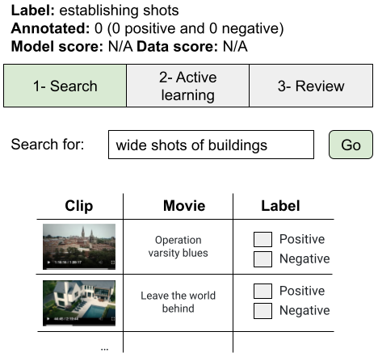
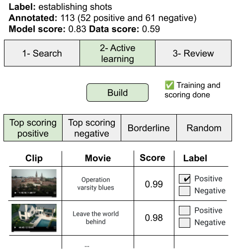

# Video annotator: a framework for efficiently building video classifiers using vision-language models and active learning

[Amir Ziai](https://www.linkedin.com/in/amirziai/), [Aneesh Vartakavi](https://www.linkedin.com/in/aneeshvartakavi), [Kelli Griggs](https://www.linkedin.com/in/kelli-griggs-32990125/), [Eugene Lok](https://www.linkedin.com/in/eugene-lok-6465045b), [Yvonne Jukes](https://www.linkedin.com/in/yvonne-jukes-814ba04), [Alex Alonso](https://www.linkedin.com/in/alejandro-alonso-ba733548), [Vi Iyengar](https://www.linkedin.com/in/vi-pallavika-iyengar-144abb1b/), [Anna Pulido](https://www.linkedin.com/in/anna-pulido-61025063)

## Introduction

### Problem

High-quality and consistent **annotations** are fundamental to the successful development of robust machine learning models. Conventional techniques for training machine learning classifiers are **resource intensive**. They involve a cycle where domain experts annotate a dataset, which is then transferred to data scientists to train models, review outcomes, and make changes. This labeling process tends to be time-consuming and inefficient, sometimes halting after a few annotation cycles.

### Implications

Consequently, less effort is invested in annotating high-quality datasets compared to iterating on complex models and algorithmic methods to improve performance and fix edge cases. As a result, ML systems grow rapidly in complexity.

Furthermore, constraints on time and resources often result in leveraging third-party annotators rather than **domain experts**. These annotators perform the labeling task without a deep **understanding** of the model’s intended deployment or usage, often making consistent labeling of borderline or **hard examples**, especially in more subjective tasks, a challenge.

This necessitates multiple review rounds with domain experts, leading to unexpected costs and delays. This lengthy cycle can also result in model **drift**, as it takes longer to fix edge cases and deploy new models, potentially hurting usefulness and stakeholder trust.

### Solution

We suggest that more direct involvement of domain experts, using a **human-in-the-loop** system, can resolve many of these practical challenges. We introduce a novel framework, ****Video Annotator****** (VA), which leverages ******active learning****** techniques and ******zero-shot****** capabilities of large ******vision-language****** models to guide users to focus their efforts on progressively harder examples, enhancing the model’s sample efficiency and keeping costs low.**

VA seamlessly integrates model building into the data annotation process, facilitating user validation of the model before deployment, therefore helping with building **trust** and fostering a sense of **ownership**. VA also supports a **continuous** annotation process, allowing users to rapidly deploy models, monitor their quality in production, and swiftly fix any edge cases by annotating a few more examples and deploying a new model version.

This self-service architecture empowers users to make improvements without active involvement of data scientists or third-party annotators, allowing for fast iteration.

## Video understanding

We design VA to assist in [granular video understanding](https://arxiv.org/abs/1904.11451) which requires the identification of visuals, concepts, and events within video segments. Video understanding is fundamental for numerous applications such as [search and discovery](./ava-discovery-view-surfacing-authentic-moments-b8cd145491cc.md), [personalization](https://netflixtechblog.com/artwork-personalization-c589f074ad76), and the [creation of promotional assets](./discovering-creative-insights-in-promotional-artwork-295e4d788db5.md). Our framework allows users to efficiently train machine learning models for video understanding by developing an extensible set of binary video classifiers, which power scalable scoring and retrieval of a vast catalog of content.

### Video classification

Video classification is the task of assigning a label to an arbitrary-length video clip, often accompanied by a probability or prediction score, as illustrated in Fig 1.

![Fig 1- Functional view of a binary video classifier. A few-second clip from ”Operation Varsity Blues: The College Admissions Scandal” is passed to a binary classifier for detecting the ”establishing shots” label. The classifier outputs a very high score (score is between 0 and 1), indicating that the video clip is very likely an establishing shot. In filmmaking, an establishing shot is a wide shot (i.e. video clip between two consecutive cuts) of a building or a landscape that is intended for establishing the time and location of the scene.](../images/542bb4cec792a222.png)
*Fig 1- Functional view of a binary video classifier. A few-second clip from ”Operation Varsity Blues: The College Admissions Scandal” is passed to a binary classifier for detecting the ”establishing shots” label. The classifier outputs a very high score (score is between 0 and 1), indicating that the video clip is very likely an establishing shot. In filmmaking, an establishing shot is a wide shot (i.e. video clip between two consecutive cuts) of a building or a landscape that is intended for establishing the time and location of the scene.*

### Video understanding via an extensible set of video classifiers

Binary classification allows for independence and flexibility, allowing us to add or improve one model independent of the others. It also has the additional benefit of being easier to understand and build for our users. Combining the predictions of multiple models allows us a deeper understanding of the video content at various levels of granularity, illustrated in Fig 2.

*Fig 2- Three video clips and the corresponding binary classifier scores for three video understanding labels. Note that these labels are not mutually exclusive. Video clips are from Operation Varsity Blues: The College Admissions Scandal, 6 Underground, and Leave The World Behind, respectively.*

## Video Annotator (VA)

In this section, we describe VA’s three-step process for building video classifiers.

### Step 1 — search

Users begin by finding an initial set of examples within a large, diverse corpus to bootstrap the annotation process. We leverage text-to-video search to enable this, powered by video and text encoders from a Vision-Language Model to extract embeddings. For example, an annotator working on the [establishing shots](https://en.wikipedia.org/wiki/Establishing_shot) model may start the process by searching for “wide shots of buildings”, illustrated in Fig 3.

*Fig 3- Step 1 — Text-to-video search to bootstrap the annotation process.*

### Step 2 — active learning

The next stage involves a classic Active Learning loop. VA then builds a lightweight binary classifier over the video embeddings, which is subsequently used to score all clips in the corpus, and presents some examples within feeds for further annotation and refinement, as illustrated in Fig 4.

*Fig 4- Step 2 — Active Learning loop. The annotator clicks on build, which initiates classifier training and scoring of all clips in a video corpus. Scored clips are organized in four feeds.*

The top-scoring positive and negative feeds display examples with the highest and lowest scores respectively. Our users reported that this provided a valuable indication as to whether the classifier has picked up the correct concepts in the early stages of training and spot cases of bias in the training data that they were able to subsequently fix. We also include a feed of “borderline” examples that the model is not confident about. This feed helps with discovering interesting edge cases and inspires the need for labeling additional concepts. Finally, the random feed consists of randomly selected clips and helps to annotate diverse examples which is important for generalization.

The annotator can label additional clips in any of the feeds and build a new classifier and repeat as many times as desired.

### Step 3 — review

The last step simply presents the user with all annotated clips. It’s a good opportunity to spot annotation mistakes and to identify ideas and concepts for further annotation via search in step 1. From this step, users often go back to step 1 or step 2 to refine their annotations.

## Experiments

To evaluate VA, we asked three video experts to annotate a diverse set of 56 labels across a video corpus of 500k shots. We compared VA to the performance of a few baseline methods, and observed that VA leads to the creation of higher quality video classifiers. Fig 5 compares VA’s performance to baselines as a function of the number of annotated clips.

*Fig 5- Model quality (i.e. Average Precision) as a function of the number of annotated clips for the “establishing shots” label. We observe that all methods outperform the baseline, and that all methods benefit from additional annotated data, albeit to varying degrees.*

You can find more details about VA and our experiments in [this paper](https://arxiv.org/pdf/2402.06560).

## Conclusion

We presented Video Annotator (VA), an interactive framework that addresses many challenges associated with conventional techniques for training machine learning classifiers. VA leverages the zero-shot capabilities of large vision-language models and active learning techniques to enhance sample efficiency and reduce costs. It offers a unique approach to annotating, managing, and iterating on video classification datasets, emphasizing the direct involvement of domain experts in a human-in-the-loop system. By enabling these users to rapidly make informed decisions on hard samples during the annotation process, VA increases the system’s overall efficiency. Moreover, it allows for a continuous annotation process, allowing users to swiftly deploy models, monitor their quality in production, and rapidly fix any edge cases.

This self-service architecture empowers domain experts to make improvements without the active involvement of data scientists or third-party annotators, and fosters a sense of ownership, thereby building trust in the system.

We conducted experiments to study the performance of VA, and found that it yields a median 8.3 point improvement in Average Precision relative to the most competitive baseline across a wide-ranging assortment of video understanding tasks. We [release a dataset](https://github.com/netflix/videoannotator) with 153k labels across 56 video understanding tasks annotated by three professional video editors using VA, and also release [code](https://github.com/netflix/videoannotator) to replicate our experiments.

---
**Tags:** Machine Learning · Artificial Intelligence · Video Editing
