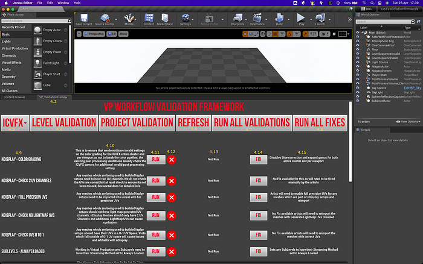

# Virtual Production — A Validation Framework For Unreal Engine

By Adam Davis, Jimmy Fusil, Bhanu Srikanth and Girish Balakrishnan

**Game Engines in Virtual Production**

The use of Virtual Production and real time technologies has markedly accelerated in the past few years. At Netflix, we are always thrilled to see technology enable new ways of telling stories, and the use of these techniques on some of our shows like 1899 and Super Giant Robot Brothers has given us a front row seat to this exciting evolution in filmmaking. Each production that deploys these methods is an opportunity for the crew, tech manufacturers and us–the Netflix Production Innovation team–to learn, innovate and collaborate towards a common goal: universally accessible workflows that will enable creative opportunities and technical success for all filmmakers regardless of the size, location or scope of their project.

Game engines have been a major part of driving the democratization of advanced virtual production techniques such as pre-visualization and in-camera visual effects. While these platforms were initially developed to build games, their open and versatile design and development environment offer other capabilities. In the hands of film and TV artists and technicians–combined with techniques and technologies such as LED Panels and tracking systems–they’ve become powerful creation tools for filmmakers.

The incredible depth and flexibility of game engines also means there are infinite permutations and combinations of configurations and settings available to the operator. But not getting the configuration right can have a significant impact on the results. Could we harness the benefits of this depth and flexibility while also supporting the predictability and repeatability expected from high pressure shooting environments? Or put more simply: could we offer productions a shortcut to achieving the right configuration for their scenario every time?

The Netflix Production Innovation Team is always asking itself versions of this question: “How do we ensure a high level of creative opportunity and flexibility, while achieving technical consistency and quality? How do we reduce the potential for accidents and errors, while making sure artists and technicians still have the agency to stay true to their vision and their practice?” One past approach to enabling excellence while mitigating risk has been creating knowledge resources for our productions and partners, while also working with the industry to develop standards and best practices. But in this instance, the open development framework of the game engine itself, as well as its central place in Virtual Production workflows, offered another compelling solution.

**The Validation Framework as Helper, Teacher and Enabler**

Many large scale operations use quality control methods and validation frameworks to ensure successful outcomes. Validation frameworks can act as a flexible and unobtrusive assistant, while offering a safety net for the operator. We’ve had success with this type of validation in the past with [Photon](https://netflixtechblog.com/netflix-and-the-imf-community-7117a66b3c47), which acted as a library, reference implementation and validation tool for IMF packages, the delivery format for all of our Netflix original programming.

An excellent validation framework is designed with the following characteristics:

1. It is informative and instructive, providing useful information as to why an issue has arisen, what problems will be caused if not resolved, and what can be done to resolve it.
2. It acts as dynamic documentation, a checklist, and a co-pilot to allow the operator to focus on the creative aspects.
3. It promotes standards and consistency across individuals and teams, regardless of how bespoke the workflow is, and allows them to operate along a common and agreed set of expectations and checks.
4. It enhances efficiency in complex interconnected workflows by looking across multiple components, roles and responsibilities and reporting on the system as a whole.

With such a validation framework in place, we can avoid:

- Locking users behind layers of confining procedures and tooling, which can limit the evolution of new ways of working by constraining the options available to the operator and creator to adapt to new scenarios, as well as preventing them from learning what’s really going on under the hood.
- Creating piles of documentation, sticky notes, runbooks… While all of that material is often useful as learning aids or during prep, it’s rarely practical to be flicking through pages of documentation to solve a problem during production.

Furthermore, by incorporating the validation framework within the game engine itself, we could ensure that everything is set up for success, maintaining flexibility while minimizing the risk of error. Because when the camera rolls, creators don’t want to assume everything is ok; they need to_ _know that all the possible steps were taken to prevent errors.

**Netflix’s Unreal Engine Validation Framework**

_Functionality_

Our Validation Framework, which we have developed as a plugin to Unreal Engine, is extensible and customizable. It hosts and manages automated validation checks and fixes, which help identify and address technical problems within a given workflow.

The Validation Framework builds upon Unreal’s EditorUtility functionality and provides a simple base–the Validation Base–from which all other validations are built. The core also provides a registration to find all validations built atop this base within the Unreal project itself. This allows us to execute the validations from either blueprints or from C++, serving a variety of users: from developers extending the execution into a CI/CD from the C++ side, to an artist executing via a widget or the UI in the editor.

Regardless of how many validations there are or where in the project they live, they are always accessible and can be run from either entry point thanks to the registration mechanics. This gives teams a lot of freedom and flexibility as to how they extend validations into their workflows. For example, a core library of validations can be shared across projects within a company, or across a production–including with other vendors. Or project-specific validations can be deployed, encapsulated within an Unreal project until it is delivered.

While we aim to keep as much exposed in blueprints as possible, having a thin underlying C++ layer is a convenient way to grant the framework access to some of the objects, settings and parameters which are inaccessible via blueprinting alone.

All of the Validations provide two simple hooks: the _Validation _itself, which checks something, and a _Fix_, which can apply a correction. What the validation framework checks for, and what and how failures are fixed is entirely up to the artists and developers!

Validations can be grouped to a dedicated Scope, specifically either Level or Project. This enables a hierarchy in the assignment of validations, as some will be applied on Project settings and configurations, while others will be inspecting the content of the Levels.

A second layer of organizational tagging can then be applied to create Workflows. While the validations can only apply to a single Scope (either Level or Project), they can belong to multiple workflows, each with its own set of validations. Several workflow “presets” are available in the initial release, along with the capability for users to define their own workflows.

Users can also define new validations, but the tool requires that they provide a description of what they are checking for, as well as a description of what and how non-conformities (invalid settings or configurations) can be corrected. While we can’t police it, we encourage users to describe not only _what_ the new validation checks, but also _why_, as well as _how_ failing to resolve non-conformities will impact the workflow results. This will help ensure that the validation framework is useful not only as a risk management tool but also as an educational resource.

The UI is built almost entirely in blueprints, and utilizes a few helper blueprint nodes implemented in C++. Again, this allows users to use what’s there, replace it with their own, or integrate it into their existing UIs.

Finally, the framework generates validation reports, in either JSON or CSV format. Each time it runs, it writes a validation report for the project/level that was just inspected. This allows users to share results with others, such as support teams, or create a record of configurations for reporting or archival purposes.

We focused our initial development on a validation tool within Epic’s Unreal Engine because of its rapid adoption across our global slate of movies and shows, and the vendors that support them. This plug-in approach is also well aligned with Epic Games’ toolkit philosophy: being open to productions of all shapes, sizes and experience levels. Given this wide applicability, we saw a lot of benefit in an easy-to-implement utility that addresses the most prevalent “gotchas” in Unreal project set-ups for Virtual Production projects.

_In-Camera VFX Validations_

The plugin ships with a set of validations for the most commonly required checks and fixes for inspecting configurations aimed at executing ICVFX techniques. This set of validations is the result of a collaborative effort between the Netflix Production Innovation team and Epic Games; it is built from our collective knowledge and experience on ICVFX productions.

We initially focused only on LED In-Camera VFX (ICVFX) applications. The goal is to help production teams catch and resolve common issues which can cause unexpected render results, data outputs, and potential performance or resource allocation challenges when working with Unreal Engine. Many of the issues this tool mitigates can sometimes be hard to spot, particularly in the complex and high pressure environment of a virtual production set.

That said, the Validation Framework is not solely for use on-set; it can also be utilized during the prep and content build phases, ensuring issues are identified and handled early, before moving further along the production pipeline. The framework can also easily be extended by users to encompass bespoke workflows with custom validations and fixes, allowing teams to create and perform their own unique checks.

**Current Usage and Next Steps**

The Validation Framework is currently being used on a number of Netflix shows, and has already significantly reduced the amount of time needed for system setup and troubleshooting. We have also received great feedback from our crews, which has led us to add new checks and fixes. Some of our partners have even begun adapting and extending this framework to better suit their proprietary workflows.

In the future, we would like to see such frameworks become commonly used in virtual production environments in two ways:

1. Continued implementation and extension of this particular validation framework by Virtual Production crews and service providers;
2. Adaptation of this automated validation approach to assist with the entire stage environment, even where Unreal is not part of the workflow: checking the settings on media servers, LED processors, workstations, tracking systems… all of which play a critical part in a Virtual Production system. In order for that to happen, we need to ensure that this wider ecosystem of devices can also be queried and monitored procedurally, which in turn will free crews to focus on the creative work, and not worry so much about the tech.

**Availability**

The validation framework can be found at: [https://github.com/Netflix-Skunkworks/UnrealValidationFramework](https://github.com/Netflix-Skunkworks/UnrealValidationFramework)

The system can be integrated into pipelines and additional tooling around CI/CD to generate validation reports.

We look forward to receiving your feedback and suggestions via the “Issues” tab on our git repo (above).

---
**Tags:** Unreal Engine · Virtual Production · Game Engine · Icvfx · Validation
