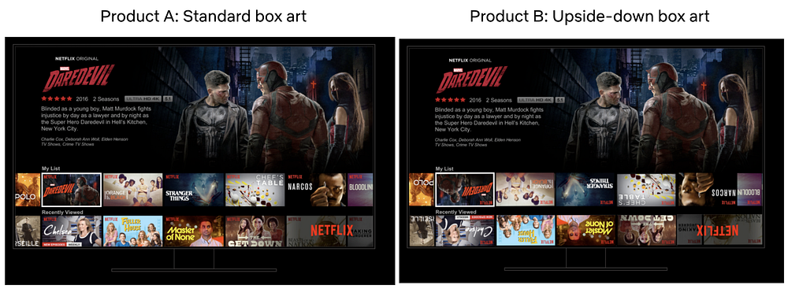
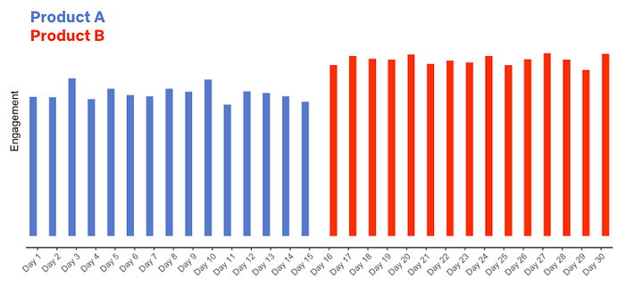
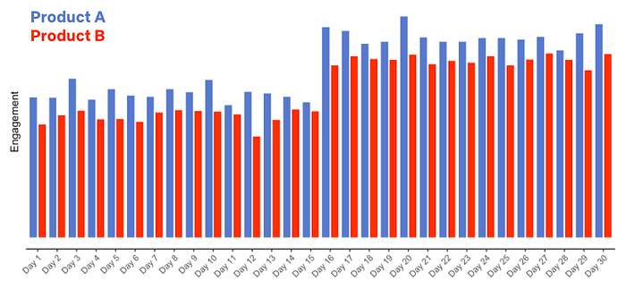

# What is an A/B Test?

[_Martin Tingley_](https://www.linkedin.com/in/martintingley/)_ with _[_Wenjing Zheng_](https://www.linkedin.com/in/wenjing-zheng/)_, _[_Simon Ejdemyr_](https://www.linkedin.com/in/simon-ejdemyr-22b920123/)_, _[_Stephanie Lane_](https://www.linkedin.com/in/stephanielane1/)_, and _[_Colin McFarland_](https://www.linkedin.com/in/mcfrl/)

_This is the second post in a multi-part series on how Netflix uses A/B tests to inform decisions and continuously innovate on our products. See _[_here_](./decision-making-at-netflix-33065fa06481.md)_ for Part 1: Decision Making at Netflix. Subsequent posts will go into more details on the statistics of A/B tests, experimentation across Netflix, how Netflix has invested in infrastructure to support and scale experimentation, and the importance of the culture of experimentation within Netflix._

An A/B test is a simple controlled experiment. Let’s say — this is a hypothetical! — we want to learn if a new product experience that flips all of the boxart upside down in the TV UI is good for our members.

*Figure 1: How do we decide if Product Experience B, with the Upside Down box art, is a better experience for our members?*

To run the experiment, we take a subset of our members, usually a [simple random sample](https://en.wikipedia.org/wiki/Sampling_(statistics)#Simple_random_sampling), and then use [random assignment](https://en.wikipedia.org/wiki/Random_assignment) to evenly split that sample into two groups. Group “A,” often called the “control group,” continues to receive the base Netflix UI experience, while Group “B,” often called the “treatment group”, receives a different experience, based on a specific hypothesis about improving the member experience (more on those hypotheses below). Here, Group B receives the Upside Down box art.

We wait, and we then compare the values of a variety of metrics from Group A to those from Group B. Some metrics will be specific to the given hypothesis. For a UI experiment, we’ll look at engagement with different variants of the new feature. For an experiment that aims to deliver more relevant results in the search experience, we’ll measure if members are finding more things to watch through search. In other types of experiments, we might focus on more technical metrics, such as the time it takes the app to load, or the quality of video we are able to provide under different network conditions.

*Figure 2: A simple A/B test. We split a random sample of Netflix members into two groups using random assignment. Group “A” receives the current product experience, while Group “B” receives some change that we think is an improvement to the Netflix experience. Here, Group “B” receives the “Upside Down” product experience. We then compare metrics between the two groups. Critically, random assignment ensures that, on average, everything else is held constant between the two groups.*

With many experiments, including the Upside Down box art example, we need to think carefully about what our metrics are telling us. Suppose we look at the click through rate, measuring the fraction of members in each experience that clicked on a title. This metric alone may be a misleading measure of whether this new UI is a success, as members might click on a title in the Upside Down product experience only in order to read it more easily. In this case, we might also want to evaluate what fraction of members subsequently navigate away from that title versus proceeding to play it.

In all cases, we also look at more general metrics that aim to capture the joy and satisfaction that Netflix is delivering to our members. These metrics include measures of member engagement with Netflix: are the ideas we are testing helping our members to choose Netflix as their entertainment destination on any given night?

There’s a lot of statistics involved as well — how large a difference is considered significant? How many members do we need in a test in order to detect an effect of a given magnitude? How do we most efficiently analyze the data? We’ll cover some of those details in subsequent posts, focussing on the high level intuition.

### Holding everything else constant

**Because we create our control (“A”) and treatment (“B”) groups using random assignment, we can ensure that individuals in the two groups are, on average, balanced on all dimensions that may be meaningful to the test.** Random assignment ensures, for example, that the average length of Netflix membership is not markedly different between the control and treatment groups, nor are content preferences, primary language selections, and so forth. The only remaining difference between the groups is the new experience we are testing, ensuring our estimate of the impact of the new experience is not biased in any way.

To understand how important this is, let’s consider another way we could make decisions: we could roll out the new Upside Down box art experience (discussed above) to all Netflix members, and see if there’s a big change in one of our metrics. If there’s a positive change, or no evidence of any meaningful change, we’ll keep the new experience; if there’s evidence of a negative change, we’ll roll back to the prior product experience.

Let’s say we did that (again — this is a hypothetical!), and flipped the switch to the Upside Down experience on the 16th day of a month. How would you act if we gathered the following data?

*Figure 3: Hypothetical data for the release of the new Upside Down box art product experience on Day 16.*

The data look good: we release a new product experience and member engagement goes way up! But if you had these data, plus the knowledge that Product B flips all the box art in the UI upside down, how confident would you be that the new product experience really is good for our members?

**Do we really know that the new product experience is what ****_caused_**** the increase in engagement? What other explanations are possible?**

What if you also knew that Netflix released a hit title, like a new season of [Stranger Things](https://www.netflix.com/title/80057281) or [Bridgerton](https://www.netflix.com/title/80232398), or a hit movie like [Army of the Dead](https://www.netflix.com/title/81046394), on the same day as the (hypothetical) roll out of the new Upside Down product experience? Now we have more than one possible explanation for the increase in engagement: it could be the new product experience, it could be the hit title that’s all over social media, it could be both. Or it could be something else entirely. The key point is that we don’t know if the new product experience **_caused_** the increase in engagement.

What if instead we’d run an A/B test with the Upside Down box art product experience, with one group of members receiving the current product (“A”) and another group the Upside Down product (“B”) over the entire month, and gathered the following data:

*Figure 4: Hypothetical data for an A/B test of a new product experience.*

In this case, we are led to a different conclusion: the Upside Down product results in generally lower engagement (not surprisingly!), and both groups see an increase in engagement concurrent with the launch of the big title.

A/B tests let us make causal statements. We’ve introduced the Upside Down product experience to Group B only, and because we’ve randomly assigned members to groups A and B, everything else is held constant between the two groups. We can therefore conclude with high probability (more on the details next time) that the Upside Down product **_caused_** the reduction in engagement.

**This hypothetical example is extreme, but the broad lesson is that there is always something we won’t be able to control.** If we roll out an experience to everyone and simply measure a metric before and after the change, there can be relevant differences between the two time periods that prevent us from making a causal conclusion. Maybe it’s a new title that takes off. Maybe it’s a new product partnership that unlocks Netflix for more users to enjoy. There’s always something we won’t know about. **Running A/B tests, where possible, allows us to substantiate causality and confidently make changes to the product knowing that our members have voted for them with their actions.**

### It all starts with an idea

An A/B test starts with an idea — some change we can make to the UI, the personalization systems that help members find content, the signup flow for new members, or any other part of the Netflix experience that we believe will produce a positive result for our members. Some ideas we test are incremental innovations, like ways to improve the text copy that appears in the Netflix product; some are more ambitious, like the test that led to “Top 10” lists that Netflix now shows in the UI.

As with all innovations that are rolled out to Netflix members around the globe, Top 10 started as an idea that was turned into a testable hypothesis. Here, the core idea was that surfacing titles that are popular in each country would benefit our members in two ways. First, by surfacing what’s popular we can help members have shared experiences and connect with one another through conversations about popular titles. Second, we can help members choose some great content to watch by fulfilling the intrinsic human desire to be part of a shared conversation.

*Figure 5: An example of the Top 10 experience on the Web UI.*

We next turn this idea into a testable hypothesis, a statement of the form “If we make change X, it will improve the member experience in a way that makes metric Y improve.” With the Top 10 example, the hypothesis read: “_Showing members the Top 10 experience will help them find something to watch, increasing member joy and satisfaction.” _The primary decision metric for this test (and many others) is a measure of member engagement with Netflix: are the ideas we are testing helping our members to choose Netflix as their entertainment destination on any given night? Our research shows that this metric (details omitted) is correlated, in the long term, with the probability that members will retain their subscriptions. Other areas of the business in which we run tests, such as the signup page experience or server side infrastructure, make use of different primary decision metrics, though the principle is the same: what can we measure, during the test, that is aligned with delivering more value in the long-term to our members?

Along with the primary decision metric for a test, we also consider a number of secondary metrics and how they will be impacted by the product feature we are testing. The goal here is to articulate the causal chain, from how user behavior will change in response to the new product experience to the change in our primary decision metric.

Articulating the causal chain between the product change and changes in the primary decision metric, and monitoring secondary metrics along this chain, helps us build confidence that any movement in our primary metric is the result of the causal chain we are hypothesizing, and not the result of some unintended consequence of the new feature (or a false positive — much more on that in later posts!). For the Top 10 test, engagement is our primary decision metric — but we also look at metrics such as title-level viewing of those titles that appear in the Top 10 list, the fraction of viewing that originates from that row vs other parts of the UI, and so forth. If the Top 10 experience really is good for our members in accord with the hypothesis, we’d expect the treatment group to show an increase in viewing of titles that appear in the Top 10 list, and for generally strong engagement from that row.

Finally, because not all of the ideas we test are winners with our members (and sometimes new features have bugs!) we also look at metrics that act as “guardrails.” Our goal is to limit any downside consequences and to ensure that the new product experience does not have unintended impacts on the member experience. For example, we might compare customer service contacts for the control and treatment groups, to check that the new feature is not increasing the contact rate, which may indicate member confusion or dissatisfaction.

### Summary

This post has focused on building intuition: the basics of an A/B test, why it’s important to run an A/B test versus rolling out a feature and looking at metrics pre- and post- making a change, and how we turn an idea into a testable hypothesis. Next time, we’ll jump into the basic statistical concepts that we use when comparing metrics from the treatment and control experiences. Follow the[ Netflix Tech Blog](http://netflixtechblog.com/) to stay up to date. [Part 3](https://medium.com/p/c1522d0db27a) is already available.

---
**Tags:** Ab Testing · Experimentation · Causal Inference · Decision Making
