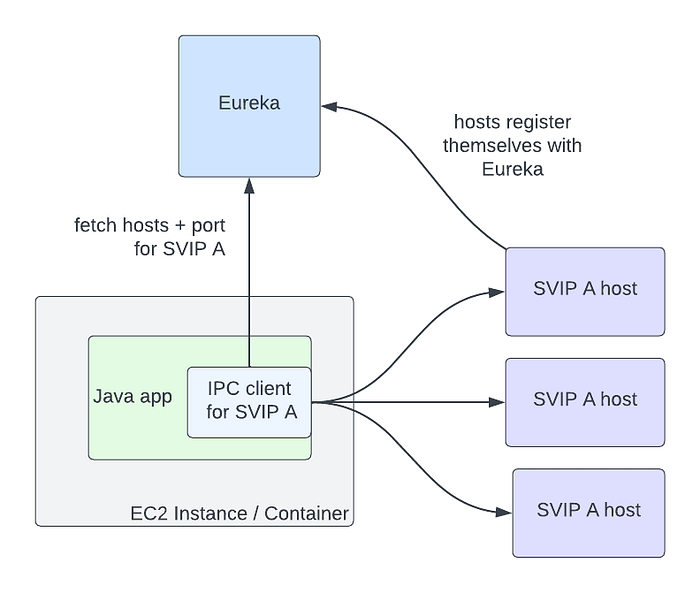

# Zero Configuration Service Mesh with On-Demand Cluster Discovery

_by David Vroom, James Mulcahy, Ling Yuan, Rob Gulewich_

In this post we discuss Netflix’s adoption of service mesh: some history, motivations, and how we worked with Kinvolk and the Envoy community on a feature that streamlines service mesh adoption in complex microservice environments: on-demand cluster discovery.

## A brief history of IPC at Netflix

Netflix was early to the cloud, particularly for large-scale companies: we began the migration in 2008, and by 2010, [Netflix streaming was fully run on AWS](https://netflixtechblog.com/four-reasons-we-choose-amazons-cloud-as-our-computing-platform-4aceb692afec). Today we have a wealth of tools, both OSS and commercial, all designed for cloud-native environments. In 2010, however, nearly none of it existed: the [CNCF](https://www.cncf.io/) wasn’t formed until 2015! Since there were no existing solutions available, we needed to build them ourselves.

For Inter-Process Communication (IPC) between services, we needed the rich feature set that a mid-tier load balancer typically provides. We also needed a solution that addressed the reality of working in the cloud: a highly dynamic environment where nodes are coming up and down, and services need to quickly react to changes and route around failures. To improve availability, we designed systems where components could fail separately and avoid single points of failure. These design principles led us to client-side load-balancing, and the [2012 Christmas Eve outage](https://netflixtechblog.com/a-closer-look-at-the-christmas-eve-outage-d7b409a529ee) solidified this decision even further. **During these early years in the cloud, ****[we built Eureka](https://netflixtechblog.com/netflix-shares-cloud-load-balancing-and-failover-tool-eureka-c10647ef95e5)**** for Service Discovery and ****[Ribbon (internally known as NIWS) for IPC](https://netflixtechblog.com/announcing-ribbon-tying-the-netflix-mid-tier-services-together-a89346910a62)****. Eureka solved the problem of how services discover what instances to talk to, and Ribbon provided the client-side logic for load-balancing, as well as many other resiliency features.** These two technologies, alongside a host of other resiliency and chaos tools, made a massive difference: our reliability improved measurably as a result.

Eureka and Ribbon presented a simple but powerful interface, which made adopting them easy. In order for a service to talk to another, it needs to know two things: the name of the destination service, and whether or not the traffic should be secure. The abstractions that Eureka provides for this are Virtual IPs (VIPs) for insecure communication, and Secure VIPs (SVIPs) for secure. A service advertises a VIP name and port to Eureka (eg: _myservice_, port _8080_), or an SVIP name and port (eg: _myservice-secure_, port 8443), or both. IPC clients are instantiated targeting that VIP or SVIP, and the Eureka client code handles the translation of that VIP to a set of IP and port pairs by fetching them from the Eureka server. The client can also optionally enable IPC features like retries or circuit breaking, or stick with a set of reasonable defaults.

In this architecture, service to service communication no longer goes through the single point of failure of a load balancer. The downside is that Eureka is a new single point of failure as the source of truth for what hosts are registered for VIPs. However, if Eureka goes down, services can continue to communicate with each other, though their host information will become stale over time as instances for a VIP come up and down. **The ability to run in a degraded but available state during an outage is still a marked improvement over completely stopping traffic flow.**

## Why mesh?

The above architecture has served us well over the last decade, though changing business needs and evolving industry standards have added more complexity to our IPC ecosystem in a number of ways. First, we’ve grown the number of different IPC clients. Our internal IPC traffic is now a mix of plain REST, [GraphQL](./how-netflix-scales-its-api-with-graphql-federation-part-1-ae3557c187e2.md), and [gRPC](./practical-api-design-at-netflix-part-1-using-protobuf-fieldmask-35cfdc606518.md). Second, we’ve moved from a Java-only environment to a Polyglot one: we now also support [node.js](https://netflixtechblog.com/debugging-node-js-in-production-75901bb10f2d), [Python](./python-at-netflix-bba45dae649e.md), and a variety of OSS and off the shelf software. Third, we’ve continued to add more functionality to our IPC clients: features such as [adaptive concurrency limiting](https://netflixtechblog.medium.com/performance-under-load-3e6fa9a60581), [circuit breaking](https://netflixtechblog.com/making-the-netflix-api-more-resilient-a8ec62159c2d), hedging, and fault injection have become standard tools that our engineers reach for to make our system more reliable. Compared to a decade ago, we now support more features, in more languages, in more clients. Keeping feature parity between all of these implementations and ensuring that they all behave the same way is challenging: what we want is a single, well-tested implementation of all of this functionality, so we can make changes and fix bugs in one place.

This is where service mesh comes in: we can centralize IPC features in a single implementation, and keep per-language clients as simple as possible: they only need to know how to talk to the local proxy. [Envoy](https://www.envoyproxy.io/) is a great fit for us as the proxy: it’s a battle-tested OSS product at use in high scale in the industry, with [many critical resiliency features](https://github.com/envoyproxy/envoy/issues/7789), and [good extension points](https://www.envoyproxy.io/docs/envoy/latest/configuration/listeners/network_filters/wasm_filter.html) for when we need to extend its functionality. The ability to [configure proxies via a central control plane](https://www.envoyproxy.io/docs/envoy/latest/intro/arch_overview/operations/dynamic_configuration) is a killer feature: this allows us to dynamically configure client-side load balancing as if it was a central load balancer, but still avoids a load balancer as a single point of failure in the service to service request path.

## Moving to mesh

Once we decided that moving to service mesh was the right bet to make, the next question became: how should we go about moving? We decided on a number of constraints for the migration. First: we wanted to keep the existing interface. The abstraction of specifying a VIP name plus secure serves us well, and we didn’t want to break backwards compatibility. Second: we wanted to automate the migration and to make it as seamless as possible. These two constraints meant that we needed to support the Discovery abstractions in Envoy, so that IPC clients could continue to use it under the hood. Fortunately, Envoy had [ready to use abstractions](https://www.envoyproxy.io/docs/envoy/latest/intro/arch_overview/intro/terminology) for this. VIPs could be represented as Envoy Clusters, and proxies could fetch them from our control plane using the Cluster Discovery Service (CDS). The hosts in those clusters are represented as Envoy Endpoints, and could be fetched using the Endpoint Discovery Service (EDS).

We soon ran into a stumbling block to a seamless migration: Envoy requires that clusters be specified as part of the proxy’s config. If service A needs to talk to clusters B and C, then you need to define clusters B and C as part of A’s proxy config. This can be challenging at scale: any given service might communicate with dozens of clusters, and that set of clusters is different for every app. In addition, Netflix is always changing: we’re constantly adding new initiatives like live streaming, [ads](./ensuring-the-successful-launch-of-ads-on-netflix-f99490fdf1ba.md) and games, and evolving our architecture. This means the clusters that a service communicates with will change over time. There are a number of different approaches to populating cluster config that we evaluated, given the Envoy primitives available to us:

1. Get service owners to define the clusters their service needs to talk to. This option seems simple, but in practice, service owners don’t always know, or want to know, what services they talk to. Services often import libraries provided by other teams that talk to multiple other services under the hood, or communicate with other operational services like telemetry and logging. This means that service owners would need to know how these auxiliary services and libraries are implemented under the hood, and adjust config when they change.
2. Auto-generate Envoy config based on a service’s call graph. This method is simple for pre-existing services, but is challenging when bringing up a new service or adding a new upstream cluster to communicate with.
3. Push all clusters to every app: this option was appealing in its simplicity, but back of the napkin math quickly showed us that pushing millions of endpoints to each proxy wasn’t feasible.

Given our goal of a seamless adoption, each of these options had significant enough downsides that we explored another option: what if we could fetch cluster information on-demand at runtime, rather than predefining it? At the time, the service mesh effort was still being bootstrapped, with only a few engineers working on it. We approached [Kinvolk](https://kinvolk.io/) to see if they could work with us and the Envoy community in implementing this feature. The result of this collaboration was [On-Demand Cluster Discovery](https://github.com/envoyproxy/envoy/pull/18723) (ODCDS). With this feature, proxies could now look up cluster information the first time they attempt to connect to it, rather than predefining all of the clusters in config.

With this capability in place, we needed to give the proxies cluster information to look up. We had already developed a service mesh control plane that implements the Envoy XDS services. We then needed to fetch service information from Eureka in order to return to the proxies. We represent Eureka VIPs and SVIPs as separate Envoy Cluster Discovery Service (CDS) clusters (so service _myservice_ may have clusters _myservice.vip_ and _myservice.svip_). Individual hosts in a cluster are represented as separate Endpoint Discovery Service (EDS) endpoints. This allows us to reuse the same Eureka abstractions, and IPC clients like Ribbon can move to mesh with minimal changes. With both the control plane and data plane changes in place, the flow works as follows:

1. Client request comes into Envoy
2. Extract the target cluster based on the Host / :authority header (the header used here is configurable, but this is our approach). If that cluster is known already, jump to step 7
3. The cluster doesn’t exist, so we pause the in flight request
4. Make a request to the Cluster Discovery Service (CDS) endpoint on the control plane. The control plane generates a customized CDS response based on the service’s configuration and Eureka registration information
5. Envoy gets back the cluster (CDS), which triggers a pull of the endpoints via Endpoint Discovery Service (EDS). Endpoints for the cluster are returned based on Eureka status information for that VIP or SVIP
6. Client request unpauses
7. Envoy handles the request as normal: it picks an endpoint using a load-balancing algorithm and issues the request

This flow is completed in a few milliseconds, but only on the first request to the cluster. Afterward, Envoy behaves as if the cluster was defined in the config. Critically, this system allows us to seamlessly migrate services to service mesh with no configuration required, satisfying one of our main adoption constraints. The abstraction we present continues to be VIP name plus secure, and we can migrate to mesh by configuring individual IPC clients to connect to the local proxy instead of the upstream app directly. We continue to use Eureka as the source of truth for VIPs and instance status, which allows us to support a heterogeneous environment of some apps on mesh and some not while we migrate. There’s an additional benefit: we can keep Envoy memory usage low by only fetching data for clusters that we’re actually communicating with.

There is a downside to fetching this data on-demand: this adds latency to the first request to a cluster. We have run into use-cases where services need very low-latency access on the first request, and adding a few extra milliseconds adds too much overhead. For these use-cases, the services need to either predefine the clusters they communicate with, or prime connections before their first request. We’ve also considered pre-pushing clusters from the control plane as proxies start up, based on historical request patterns. Overall, we feel the reduced complexity in the system justifies the downside for a small set of services.

We’re still early in our service mesh journey. Now that we’re using it in earnest, there are many more Envoy improvements that we’d love to work with the community on. The porting of our [adaptive concurrency limiting](https://github.com/envoyproxy/envoy/issues/7789) implementation to Envoy was a great start — we’re looking forward to collaborating with the community on many more. We’re particularly interested in the community’s work on incremental EDS. EDS endpoints account for the largest volume of updates, and this puts undue pressure on both the control plane and Envoy.

We’d like to give a big thank-you to the folks at Kinvolk for their Envoy contributions: Alban Crequy, Andrew Randall, Danielle Tal, and in particular Krzesimir Nowak for his excellent work. We’d also like to thank the Envoy community for their support and razor-sharp reviews: Adi Peleg, Dmitri Dolguikh, Harvey Tuch, Matt Klein, and Mark Roth. It’s been a great experience working with you all on this.

This is the first in a series of posts on our journey to service mesh, so stay tuned. If this sounds like fun, and you want to work on service mesh at scale, come work with us — [we’re hiring](https://jobs.netflix.com/jobs/271057970)!

---
**Tags:** Envoy · Service Mesh · Microservices · Ipc · Cloud
