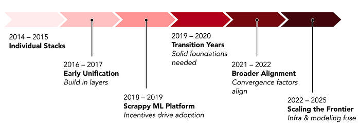
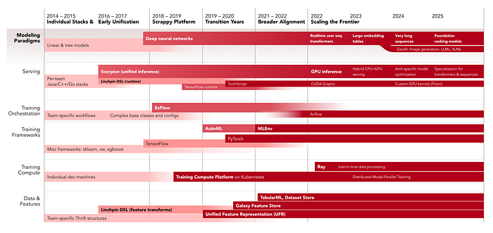
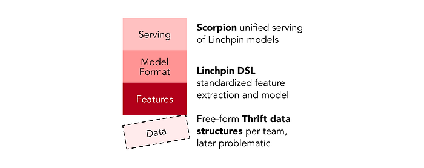
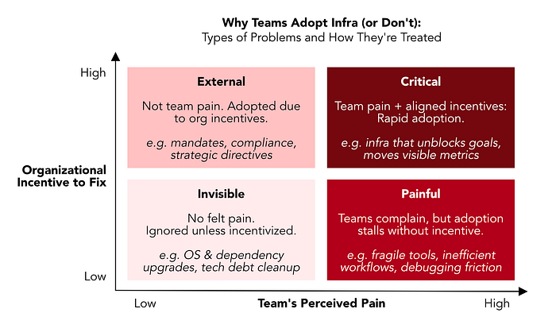
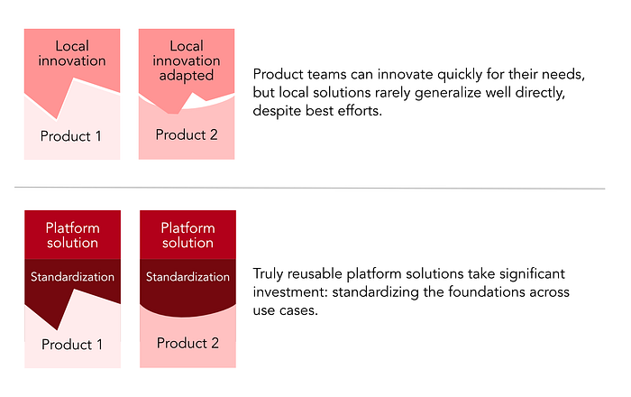
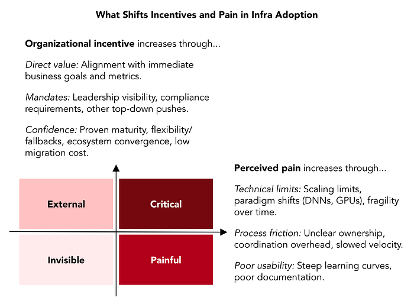
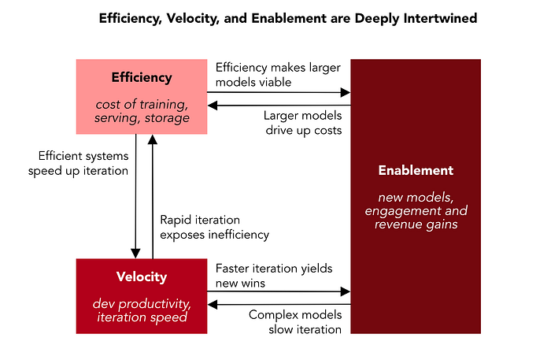

# A Decade of AI Platform at Pinterest

Lessons on building platforms, driving adoption, and evolving foundations

David Liu • Senior Director of Engineering, ML Platform

AI at Pinterest has been a proving ground for building platforms. Over the past decade, we went from ad-hoc machine learning stacks cobbled together by individual teams to a unified AI Platform that powers every major surface, spanning from recommendation and ranking models to emerging foundation and generative models.

The rapid pace of ML and AI brought new capabilities, but also new limits. What appeared to be purely technical choices often turned out to hinge on organizational structures and timing. This retrospective looks back at lessons we learned that we hope resonate with other companies on a similar journey.

1. **Adoption follows alignment. **Teams adopted infra only when it was organizationally incentivized, for example by product goals, leadership priorities, or industry timing.
2. **Foundations are layered, bottom-up, and temporary. **Each stable layer enables the next, but no foundation is permanent — every wave (DNNs, GPUs, LLMs) eventually forces a rebuild.
3. **Local innovations prove possibility, but decay without shared foundations. **Cutting-edge experiments tend to be coupled to local context and often need to be rebuilt to generalize.
4. **Enablement, efficiency, and velocity multiply each other. **Increasingly, they’re shaped by both modeling and platform advances working in tandem.

I saw these dynamics from multiple seats: cobbling together the first Related Pins ML recommendation systems, proposing our first unified inference service, then starting and growing the ML Platform team — the backbone of Pinterest’s AI infrastructure today. This platform now serves hundreds of millions of inferences per second, each user request completing thousands of model evaluations in under 100 milliseconds. Behind that, thousands of GPUs power hybrid CPU/GPU clusters that balance latency, cost, and utilization at global scale.

I’ll organize Pinterest’s ML Platform story into five eras.

- **Individual Team Stacks (2014–2015) and Early Unification (2016–2017):** Fragmentation drove the first attempts at unification with bottom-up layering.
- **Scrappy ML Platform Team (2018–2019):** A tiny two-eng team tried to unify much bigger teams’ stacks and learned that incentives, not complaints, determine adoption.
- **Transition Years (2019–2020):** Product teams built a bridge to DNNs, but struggled to generalize their solution; we needed to rebuild our data foundation.
- **Broader Alignment (2021–2022):** With exec sponsorship, standardization accelerated when tech maturity, org mandate, and industry momentum aligned.
- **Scaling the Frontier (2022–2025):** Transformer models, GPUs, and foundation models reset infra again; efficiency became the limiter, demanding deeper modeling and platform partnership.

*A timeline of Pinterest AI Platform eras.*

There were many more stories than I have space to share, but the projects I selected highlight the themes that shaped adoption in each period. This timeline below maps the overview of the projects discussed and their part in the ML lifecycle at the time.

*Evolution of Pinterest’s ML Platform (2014–2025), featuring major projects discussed in this essay.*

## Individual Team Stacks (2014–2015) and Early Unification (2016–2017)

Pinterest ML began with excitement and fragmentation. Product teams like Home Feed, Related Pins, and Ads were all eager to use ML, but each team built its own stack with different solutions for data, training, and serving. The theme of this era was discovering that unification has to happen bottom-up, one stable layer at a time.

*We built abstractions one layer at a time to unify ML stacks.*

### Initial Fragmentation

Models at the time consisted of hand-engineered features extracted with offline Hadoop jobs and fed to training in a variety of classical ML frameworks: scikit-learn, xgboost, LightGBM, and Vowpal Wabbit. Inference was often a parallel implementation of the feature extraction and inference written in the serving systems, which spanned Java, C++, and Go. But with each team building for its immediate context, we reinvented solutions repeatedly with slight variations.

With no shared abstractions and separate training and serving codepaths, one of the biggest headaches was **training-serving skew**: subtle differences between how features were generated offline and online that could silently tank model performance.

### Unifying Features and Modeling: Linchpin DSL (2015)

A senior staff engineer in Home Feed proposed a domain-specific language (DSL) called **Linchpin**. The idea was to define feature transformations once and run them in both training and serving. Linchpin programs consumed our Thrift data structures describing Pins and users and returned numeric feature vectors for ML training. The trained models (linear models and decision forests) would also be implemented in Linchpin for serving. Linchpin eliminated a whole class of training-serving mismatches and quickly became the canonical way to express feature transformations and models.

### Unifying Serving: Scorpion (2016–2017)

Now that we had a common approach for writing features and models, we aimed to unify the infrastructure across Home Feed, Related Pins, and Ads to fetch features and rank items. We designed **Scorpion**, a C++ inference service that co-located compute with cached Pin data, letting teams score thousands of Pins per request efficiently. Paired with Linchpin, it was Pinterest’s first company-wide online inference engine.

### Linchpin’s Later Challenges

Building Linchpin was technically complex and fascinating, but a custom language had real tradeoffs that we discovered years later as we wanted to use more complex data sources, feature transformations, and models. Debugging was painful with minimal tooling, and new transformations often required implementing new language elements in C++, defeating the purpose of the abstraction. Later, engineers even built Python wrappers to generate Linchpin programs programmatically (“Pynchpin”), creating a Rube Goldberg machine of generating, parsing, and interpreting Linchpin.

### Lessons

Linchpin or Scorpion both had sharp edges, but they were our first experience with _layered unification_. Linchpin was a common interface for features and models that unlocked a unified serving system.

Any unification is temporary — the future is always unknowable, and today’s stable layer will eventually give way to new abstractions. In 2015, TensorFlow 1.0 hadn’t even been released and features and models were simple, so Linchpin seemed a viable solution. But when the industry shifted to Python-native frameworks and DNNs, its design turned brittle. Scorpion targeted a more stable problem (scoring with high fanout) and lasted longer, until GPUs altered the architecture.

## ML Platform’s Scrappy Era (2018–2019)

In late 2017, Pinterest funded a two-engineer ML Platform team. It was tiny compared to the dozens of engineers on the product teams. Our job was simple in theory: prove enough value to justify further investment. We quickly discovered how uneven the ground was.

We chased pain points where we could, but were surprised to find that solving the loudest complaints didn’t guarantee quick adoption. We learned that _perceived pain_ of a problem is one ingredient for adoption, but _organizational incentive_ is another: teams are under immense pressure to move engagement or revenue metrics now, and with high divergence across the company at this time, it was hard for product team engineers to justify significant investment for unification’s sake.

*Most infra work in this era sat in the “painful” quadrant — engineers felt the friction, but adoption lagged without aligned incentives.*

### Training Orchestration: EzFlow (2018)

Iteration velocity was a common pain point. Ads teams struggled with brittle orchestration: sprawling graphs of jobs, deep inheritance chains, and growing config flags where a base-class change could silently break downstream workflows.

We built **EzFlow** to untangle this. It was code-first, emphasizing programmatic DAG creation rather than configuring monolithic workflows with flags. It was also lineage-based, addressing output data by hashing its input specifications, enabling caching and deduplication.

EzFlow improved the technical foundation, but adoption lagged. Under pressure to ship, Ads engineers resisted migrating to an unfamiliar system built by a two-person infra team. Sticking with the old stack felt safer than spending weeks on cleaner workflows with no immediate revenue gain.

Over time, with new workflows as well as softening some design ideals, EzFlow did eventually become the dominant training orchestrator at Pinterest, significantly reducing the chaos.

Many years later, as Spark and Ray made individual jobs more powerful and easier to manage, orchestration needs shrank. It was then that EzFlow finally became less relevant, and we shifted to the off-the-shelf Airflow.

### Seed Bets (2019)

Alongside EzFlow, we placed several early bets. Some took years to pay off, others shifted ownership, but many became lasting foundations.

We introduced **PySpark**, which later transitioned to a dedicated Data Engineering team and became widely adopted across Pinterest. We built the initial version of our **Training Compute Platform**, bringing TensorFlow and hyperparameter tuning onto Kubernetes. It was lightweight at the time, but soon supported much larger-scale GPU training and PyTorch. We also launched early **model management** through ModelHub, later replaced by MLflow and more recently Weights & Biases.

Another significant seed bet was **Galaxy**, a unified signal platform we inherited when the Signal Platform team merged into ML Platform. Galaxy turned a tangle of monolithic Hadoop jobs into modular signals about users, boards, and Pins, each owned by individual teams. Galaxy was a difficult migration that required coordinating with dozens of teams and carrying large parts of it ourselves. It took years, but it later became the foundation for our unified ML feature store. Like with EzFlow, long-term value accumulated slowly until reaching a tipping point.

### Lessons from the Scrappy Era

Much infra work in this era lived in the **“painful but not critical” quadrant**. ICs tolerated brittle workflows because their roadmaps rewarded product metrics, not infra migrations. Leaders voiced support for unification, but the visible priorities remained engagement and revenue. Without aligned incentives, even strong technical solutions spread slowly.

Yet the era also planted durable seeds for a larger foundation. EzFlow eventually stabilized orchestration. Galaxy’s modular signals became the backbone for our feature store. Our early Training Compute Platform paved the way for later scale-out training. A small infra team starting out faces many challenges, but their value can still compound over time.

Later, in the Broader Alignment era, as technical, org, and industry factors converged, infra issues moved into the **critical quadrant** and these seeds came to fruition.

## Transition Years (2019–2020)

By 2018, deep neural networks were quickly becoming more popular in recommendation systems. Pinterest product teams pushed ahead by building their own solutions to use DNNs, delivering big breakthroughs. But when those approaches spread beyond their original contexts, they exposed brittle foundations that needed stronger standardization.

### AutoML

The Home Feed team was building DNNs in Linchpin, with heavy manual setup to wire inputs, generate features, and define networks by hand. They built **AutoML** (unrelated to Google’s) to automate this growing work. It solved two problems: generating standardized inputs for DNNs, and defining the networks with a library of TensorFlow layers configured by flags.

For Home Feed, it was a breakthrough: engagement surged and new DNNs went into production quickly. AutoML demonstrated the potential of deep learning and gave executives confidence to push further. Under that pressure, it was adapted for Ads as well. But the system was tightly coupled to Home Feed’s data structures, and Ads’ differences forced forks. Config-driven layers ballooned into sprawling flag lists. Under the hood, AutoML relied on annotated Thrift structures parsed by a custom compiler.

This complexity was the logical outcome of local optimization and made it impossible to generalize. The deeper issue was the nature of the input data: each team’s freeform Thrift structures. Linchpin had been built to tame them, and AutoML to route around Linchpin, but the approach was becoming unmanageable.

### Rethinking the Foundation: Unified Feature Representation (UFR)

Meanwhile, ML Platform was extending the Galaxy signal platform into a unified feature store. We introduced the Unified Feature Representation (UFR), a single container convertible into tensors for frameworks like TensorFlow and PyTorch. With these expressive frameworks, feature transforms could now move into the model itself.

UFR resembled industry peers like Twitter’s DataRecord or Facebook’s FBLearner schemas, and supported both hand-engineered features and raw inputs. Over time, it became the basis for Pinterest’s feature store and enabled Linchpin’s deprecation.

### Lessons from the Transition Years

In these years we saw both the power and limits of local innovation. AutoML, built by a product team, rapidly unlocked DNNs in production and delivered huge engagement gains. But local teams’ incentives pushed them to patch local pain quickly, not to rebuild fundamentals. UFR was a longer-term effort to reset the foundation, which would later enable further advances to scale across Pinterest.

## Broader Alignment and Standardization (2021–2022)

By 2021, ML was both Pinterest’s biggest lever for growth and its biggest bottleneck. Fragmented stacks slowed iteration, and VPs in Ads and Core now saw that ML velocity directly shaped engagement and revenue. ML infra work had finally reached org-level visibility, and priorities shifted accordingly.

*Adoption accelerates when both incentives and pain rise. Incentives increase through leadership mandates, technical necessity, and external convergence. Pain rises as scaling limits, fragility, or usability barriers mount.*

### Org Alignment and Exec Sponsorship

Ads and Core orgs had internally formed efforts to provide additional ML infra. The Ads ML Infra team had grown to nearly the same scale as ML Platform, focused on urgent revenue needs. Core ML teams were building infra within their product groups to support a wide range of use cases. And ML Platform concentrated on general-purpose foundations. Each effort was valuable, but the parallel growth created duplication and drift.

Leaders recognized that these streams needed to be harnessed together. The result was ML Foundations, a cross-org partnership that coordinated investments — enabling teams to reuse components and build up shared layers, specializing where necessary but compounding progress wherever possible.

At the same time, executives elevated ML infra to an org-level priority within Ads and Core. We introduced the ML Scorecard, grading major ML products on production readiness across data, training, deployment, and monitoring. For the first time, ML velocity was explicitly tracked at the org level, creating real pressure to raise the floor everywhere.

### MLEnv: Standardizing the Trainer (2021)

Although all training now ran on the shared Training Compute Platform, the workloads inside were chaotic: 10+ frameworks, custom CI/CD pipelines, and brittle dependencies. Important advances like distributed training, mixed precision, and GPU training were nearly impossible to roll out consistently.

**MLEnv** began in ATG (Advanced Technologies Group, Pinterest’s advanced ML team) to accelerate their PyTorch-based deep learning work, but it promised to solve company-wide pain. ATG partnered with ML Platform to expand it into a shared build and runtime stack: a monorepo with Docker, CI/CD, drivers, frameworks, and standardized tooling. It supported both TensorFlow and PyTorch to ease the transition. Later, PyTorch had clearly pulled ahead in momentum and developer experience, and Pinterest formally decided to standardize on PyTorch.

Combined with the new exec sponsorship for ML Foundations, adoption jumped from <5% to ~95% of jobs in a year. [MLEnv](https://medium.com/pinterest-engineering/mlenv-standardizing-ml-at-pinterest-under-one-ml-engine-to-accelerate-innovation-e2b30b2f6768) turned a patchwork of training practices into a unified stack running reliably on TCP.

### TabularML and the ML Dataset Store: Standardizing Data (2021–2022)

While MLEnv unified training, data remained fragmented. UFR had freed us from Linchpin-era Thrift structs, but training datasets were still stored in ad-hoc containers that fragmented tooling.

We built **TabularML** to unify the dataset format, introducing a columnar Parquet format: each row was a training example and the columns were UFR. That shift halved storage costs and doubled feature backfill speeds. With Presto integration, hours of debugging could be replaced with minutes of SQL queries.

On top of this we built the **ML Dataset Store**, a central repository managing those TabularML datasets. It provided common tools like feature backfilling, label iteration, cost tracking, and access control. Instead of every team hand-rolling ingestion jobs, they now had a consistent Python-centric API with direct Spark, Presto, and MLEnv integration.

Together, these efforts created a layered foundation: **UFR** standardized feature representation and **Galaxy Feature Store** managed their storage, production, and consumption. **TabularML** standardized training dataset format and the **ML Dataset Store** similarly managed their storage, production, and consumption. With this layering, features and datasets became reliable, reusable building blocks across teams.

### Lessons from the Broader Alignment Era

In this era, a number of forces converged to increase the organizational incentive to fix infra issues and amplify the perceived pain of leaving it as-is. This led to rapidly accelerating adoption.

**Increasing Incentive**

- **Direct value.** In 2018, infra solved developer pain but didn’t map to team business goals. By 2021, ML velocity was directly tied to engagement and revenue, when we found that most top-line wins were coming from ML experiments.
- **Mandates.** VPs sponsorship in Ads and Core made ML velocity and operational health a leadership priority, and the ML Scorecard made gaps more visible.
- **Confidence.** New infra was tested on at least one major surface before broader rollout. TabularML was co-developed with Ads, aligning initial adoption with the team that felt the most urgent need. Increasing adoption across components snowballed the belief that unification was achievable and the company would stay committed to it.

**Increasing Pain**

- **Technical limits.** DNN and GPU-based models created bottlenecks that could no longer be easily patched locally. Distributed training, mixed precision, and GPU workflows demanded company-wide solutions like MLEnv.
- **Process friction and usability.** Teams struggled with bespoke CI/CD, dependency management, and brittle environments. Standardization cut this overhead and made training more reliable and usable across teams.

## Scaling the Frontier (2022–Present)

From 2022 on, the feedback loop between modeling and infrastructure tightened, as new modeling ideas pushed infra limits. For years, ML Platform’s north star was **velocity**: helping engineers ship more experiments. But as models grew more complex and compute-intensive, two adjacent goals became equally important: **enablement**, since many new architectures couldn’t ship without platform support, and **efficiency**, since large models were only viable if we could run them at scale at reasonable cost.

The diagram below shows how these goals interlock.

### Breaking through the GPU Frontier

Our initial DNN recommenders were served on CPUs, relying on pre-computed representations of Pins and users. User representations eventually included compute-heavy transformer models that we would run on GPUs in offline batch processes. The next logical step to improve accuracy was to bring those transformers online and ingest recent user activity in real-time. Analysis indicated that these real-time models would outperform every prior generation, but latency and cost would explode by orders of magnitude on CPU.

Our initial attempts at GPU inference were bottlenecked on low GPU utilization. We rebuilt the Scorpion serving stack around one goal: keep the GPU busy. We consolidated work onto fewer GPU hosts with SSD caches, minimized CPU-GPU handoffs, dynamic batched work from multiple user requests, and created custom CUDA ops and adopted half-precision inference. This [efficiency** **work enabled Pinterest’s first GPU-served production model](https://medium.com/@Pinterest_Engineering/gpu-accelerated-ml-inference-at-pinterest-ad1b6a03a16d): a [transformer model that used recent user actions](https://medium.com/pinterest-engineering/how-pinterest-leverages-realtime-user-actions-in-recommendation-to-boost-homefeed-engagement-volume-165ae2e8cde8) in online inference. It boosted Homefeed engagement by 16% in one launch, and GPU-based models now supported 100× larger architectures without increasing cost and latency. Without this efficiency work, the model wouldn’t have shipped: efficiency gated enablement of this new architecture.

### Ripple Effects of the GPU Shift

GPU serving spread quickly, leading to new cost efficiency and dev velocity concerns and spurring further changes to our system architecture.

The initial GPU serving launch relied on a delicate balance of CPU- and GPU-bound work. We increased efficiency and flexibility with **remote inference,** splitting CPU/memory-bound tasks (data fetching & caching) from GPU computation into separate hosts. We could then scale CPU capacity independently of the much more expensive GPU hosts. Multiple CPU/cache hosts could now feed large batched requests to GPU workers.

A similar pattern emerged on training to keep GPUs fed with data. GPUs were often bottlenecked on CPU work to download, parse and preprocess training data. We rebuilt the “last mile” of training data pipelines with the **Ray distributed computing framework**: data could be [preprocessed just-in-time](https://medium.com/pinterest-engineering/last-mile-data-processing-with-ray-629affbf34ff) on a cluster of CPU hosts and streamed into GPU trainers. Now training, too, could independently scale CPU and GPU resources as needed.

We adopted Ray for efficiency initially, but it also **improved velocity and enabled new capabilities**. Previously, training data had to be fully materialized via heavy Spark jobs and then stored. A new feature set or labeling scheme often meant days of re-processing and terabytes of increased storage. With just-in-time preprocessing, modelers could skip this step, saving time and storage cost. They could also now [try modeling directions that were previously too costly and slow to attempt](https://medium.com/pinterest-engineering/scaling-pinterest-ml-infrastructure-with-ray-from-training-to-end-to-end-ml-pipelines-4038b9e837a0), like generating user histories of different lengths or filtering inputs by context on the fly.

As GPU serving scaled, we also encountered new **operational velocity challenges**: our architecture was historically designed for small CPU models, mirroring all models across the full cluster. GPU-based models were much larger, and soon we could not fit all experimental models concurrently in the GPU memory of a single machine. **Model Farm** enabled hosts to serve different subsets of models, while still presenting a unified cluster interface that can route to the correct host. We also began moving workloads to Kubernetes to spin up new clusters more easily. Although conceptually simple, it was a significant architectural change. It also improved batch consolidation and therefore efficiency.

These ripple effects revealed how connected our three goals had become: efficiency enabled transformers, which created new scaling issues and demanded further efficiency and velocity solutions. Ray improved efficiency, unlocking velocity and enabling new modeling capabilities. Model Farm improved velocity and then also efficiency.

### Modeling and Infra Work Fuse, Advances Compound

From 2023–2025, modeling ideas and infrastructure advances compounded together. By 2025, foundation ranking models represented the culmination: extending earlier modeling approaches while drawing on infrastructure built across multiple efforts.

### Scaling to Large Embedding Tables for Memorization (2023)

As recommender models grew, teams reached limits in how much user and content behavior they could represent with pre-trained content embeddings derived from each Pin’s image, text, and graph connections. These embeddings captured broad semantic relationships but smoothed over item-specific nuances. To model fine-grained behavioral patterns — how individual users interact with specific Pins and ads — teams adopted **large ID embedding tables**: billions of parameters that directly memorize these patterns and are updated continuously during training rather than frozen after pre-training.

These tables created immediate infrastructure challenges. Single-GPU memory limits made training and serving infeasible without architectural changes. We extended our stack to support **distributed model-parallel training**, sharding embedding tables across multiple GPUs, and introduced a **hybrid CPU/GPU serving architecture** that stored embeddings on high-memory CPU hosts while executing model inference on GPUs. At serving, we also added **INT4 quantization** and other optimizations, cutting memory and latency overhead while maintaining model quality.

[Large embedding table models](https://arxiv.org/pdf/2508.18700) and their resulting memorization capabilities were soon adopted across Related Pins, Home Feed, and Ads, improving engagement and revenue. Our platform gained a foundational capability: training and serving models too large for single GPUs.

### Scaling to Long User Sequences (2024)

Separately, teams scaled transformer models from short sequences (hundreds of recent actions) to [lifelong sequences (16k+ user actions spanning years)](https://medium.com/pinterest-engineering/next-level-personalization-how-16k-lifelong-user-actions-supercharge-pinterests-recommendations-bd5989f8f5d3). This promised better personalization but created efficiency challenges at serving time. We worked with teams through numerous optimizations, including:

- **Request-level deduplication. **Since recommenders score thousands of items per user request, we added an inference server mechanism to process request data once (i.e. the large user sequences) and share them across all the items to score.
- **Sparse tensor handling.** We enabled sparse data formats to be carried all the way into the GPU during inference.
- **Custom GPU kernels in Triton.** We fused multiple GPU steps into one, tailored to this specific model. The ability to easily write custom GPU kernels was a breakthrough for this and future model architectures.

This effort was part of a trend of building infrastructure specialized for specific model architectures. Platform engineers needed to understand transformer internals — attention mechanisms, sequence processing patterns — to optimize effectively.

### Foundation Ranking Models (2025)

The ATG team built [foundation ranking models](https://arxiv.org/pdf/2507.12704) that extended the large embedding table approach from 2023, now pre-training a single shared model across user activities on all surfaces before fine-tuning for each specific use case — a foundation-style approach similar to modern LLMs.

This modeling advance compounded previous modeling and infrastructure work. We worked with ATG to leverage the hybrid CPU/GPU architectures from 2023 and many optimizations from 2024, while also adding new compression and quantization techniques. Together, previous infra and modeling capabilities formed a ladder for each subsequent step.

### Emerging Frontier: Generative AI and LLMs (2024–)

As our highest-traffic recommender systems matured, a new frontier of generative AI models began to take shape. We’ve been developing infrastructure to help teams build image-generation models (like [Pinterest Canvas](https://medium.com/pinterest-engineering/building-pinterest-canvas-a-text-to-image-foundation-model-aa34965e84d9)) as well as large language models. These workloads bring a different set of pressures: massive compute needs but lower QPS, KV caching needs, prompt management, dynamic control flow at inference, and much tighter research-production loops.

These models are already reshaping our priorities and we see a familiar pattern starting: rapid exploration followed by consolidation into new foundations. The next phase of AI at Pinterest will depend on how quickly we can evolve efficiency, velocity, and enablement for this new class of models.

### Lesson of the Frontier Era

**Efficiency, velocity, and enablement are closely interlinked.** Online transformers only became viable once GPU optimizations improved efficiency by orders of magnitude. The shift to GPU spurred further efficiency and velocity concerns; their solutions, like Ray, themselves unlocked new velocity and enablement.

**Modeling and platform fuse and capabilities compound.** In this era, modeling is infra-bound: the cutting edge of modeling is now closely tied to infra capabilities. At the same time, we are seeing accelerating compounding of both modeling and infra advances in each new generation of models.

## Closing Reflections

A rhythm emerged over the last decade: local breakthroughs showed what was possible, but endured only when rebuilt on shared foundations. Each wave, from DNNs to GPU inference to foundation models, forced us to re-examine assumptions and rebuild the stack around new realities.

For other companies on similar journeys, the takeaway isn’t about specific technologies — Linchpin, Scorpion, and MLEnv will all be rebuilt in time. It’s about sensing when to unify and when to explore. Unify too early and you ossify around the wrong abstractions; too late and you’re paralyzed by fragmentation. The art is in the timing.

Modeling and platform work are now intertwined, shaping the next phase of Pinterest’s AI infrastructure. The abstractions will keep changing, but the rhythm will stay the same.

## Acknowledgements

This essay reflects my vantage point on work done by teams across the company, including ML Platform, Ads ML Infra, Core ML Infra, ATG, Data Platforms Science, Data Engineering. Our customer teams have been co-creators throughout, including Home Feed, Related Pins, Search, Ads Ranking & Retrieval, Data Science, and many more.

Thanks to Pong Eksombatchai and Saurabh Vishwas Joshi for reviewing drafts and helping refine the narrative.

Special thanks to Dave Burgess, whose guidance and support were crucial in building organizational alignment and growing ML Platform, and to Chunyan Wang for continued support as we’ve scaled to the frontier. To the engineers who built these systems — from the early foundations to today’s massive scale — and to the product and program managers who guided direction and drove adoption across teams, this story belongs to all of you.
