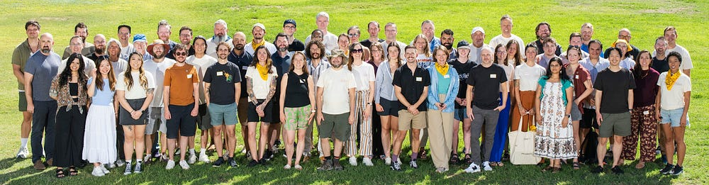
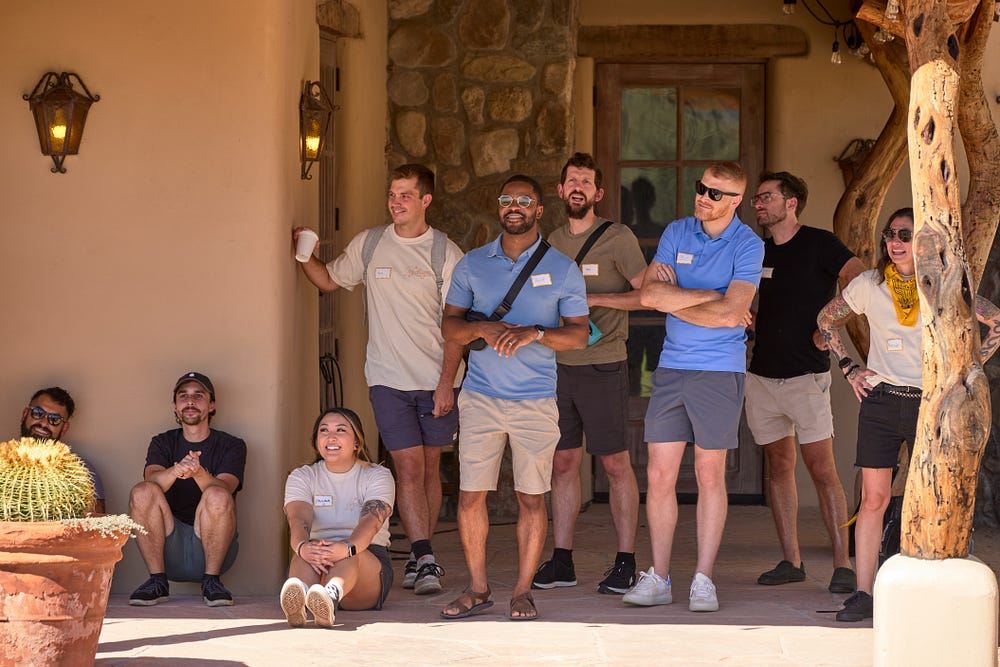
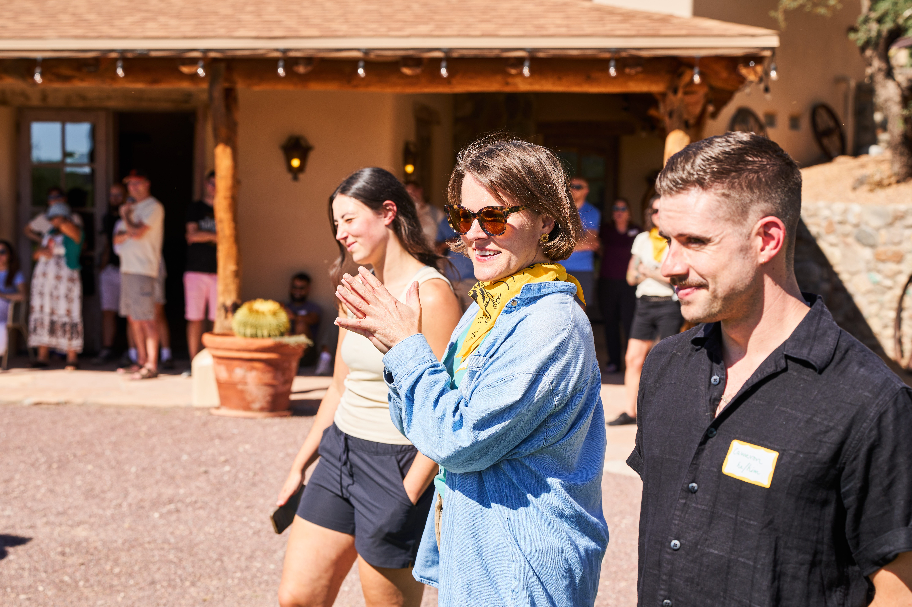
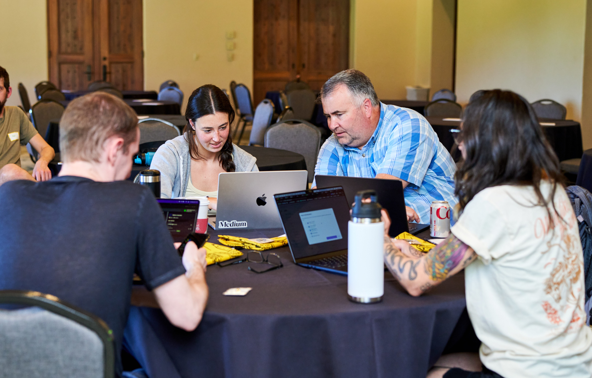
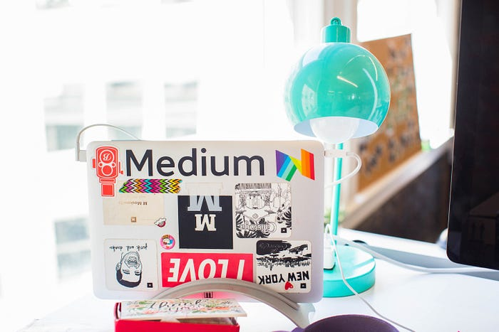

# Careers at Medium

> Help us build the best place to read and write on the internet.

**_IMPORTANT NOTE: Medium has been made aware of a scam that involves offering people jobs at Medium. Please do not engage with offers that look similar to _**[**_this_**](https://www.reddit.com/r/Scams/comments/13iivim/job_application_for_a_remote_role_accepted/)**_. All our open positions are available _**[**_here_**](https://job-boards.greenhouse.io/medium)**_._**

[View all open positions](https://job-boards.greenhouse.io/medium)

At Medium, we believe in the power of words — and we’re on a mission to bring the world’s expertise to life through memorable storytelling. Our platform rewards great writing and puts power back in the hands of readers. Medium’s subscription model means we rely on our members, not ads. We’re looking for teammates who are inspired by our mission, who are deeply thoughtful and empathetic, and who are passionate about the future of online publishing. Sound like you? Keep reading!

_Note: Medium only hires and communicates via greenhouse.io, our third-party recruiting platform. If you you receive job offers for Medium via LinkedIn or other platforms, it may be a scam; please verify it by contacting us at _[_help.medium.com_](http://help.medium.com/)_._

---

## Why work at Medium

### A meaningful mission

From our engineers to our content ops team, employees at Medium (aka “Medians”) are driven by passion, vision, and purpose. We believe in building a high-quality, open platform for sharing ideas — free from harassment, hate speech, and other harmful content. We strive to create a diverse, inclusive place for everyone to feel seen, safe, and supported, both on our product and within our organization.

### Remote-first culture

Collaborate with colleagues from Paris to Portland: Medium is a 100% remote workplace. We’ll provide you with what you need to do your best work, including a stipend for home office expenses, Wi-Fi reimbursement, and a local co-working space membership. (We also know how valuable it is to meet your team IRL, so we hold an all-company retreat twice a year.)

### A creative environment

We’re building a culture, not just a product. We believe in experimentation, innovation, and collaboration. We give hi5s and lightning talks and all-company presentations about the ambitious challenges we’re tackling. We share travel photos in our Slack #watercooler channel and craft fun playlists for Thursday writing hours. We question ideas in product workshops, learn from the expertise of our colleagues, and create new things together.

### Generous benefits

Comprehensive health insurance, 401(k) plans, parental leave, and unlimited paid time off are just the start. Our values show up in your benefits: We provide support for your wellbeing at home, education and professional development, financial advising, mental health support, and more.

---

## Join Our Team

[View all open positions](https://job-boards.greenhouse.io/medium)

## Learn more about Medium
