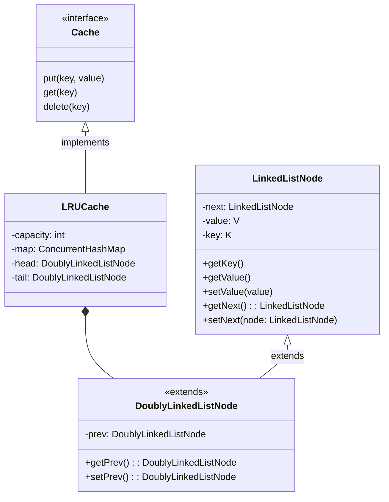

# Question
Design and implement a thread-safe LRU (Least Recently Used) cache with a fixed capacity. 
The cache should support at least two operations: get(key) and put(key, value). 
When the cache exceeds its capacity, it should evict the least-recently-used item before inserting a new one. 
Ensure that the cache handles concurrent access from multiple threads without data corruption (e.g., two threads updating or accessing the cache simultaneously). 
Use appropriate synchronization so that get and put operations are safe under concurrency, while still maintaining efficiency of the LRU operations (typically, get and put in O(1) time on average). 

# Requirements

1. Should support get and put of a Key, Value pair.
2. Should be bound by some capacity.
3. Evict least recently use in case full.

# Non-Functional Requirements

1. Handle concurrency and avoid data corruption.

# LLD

